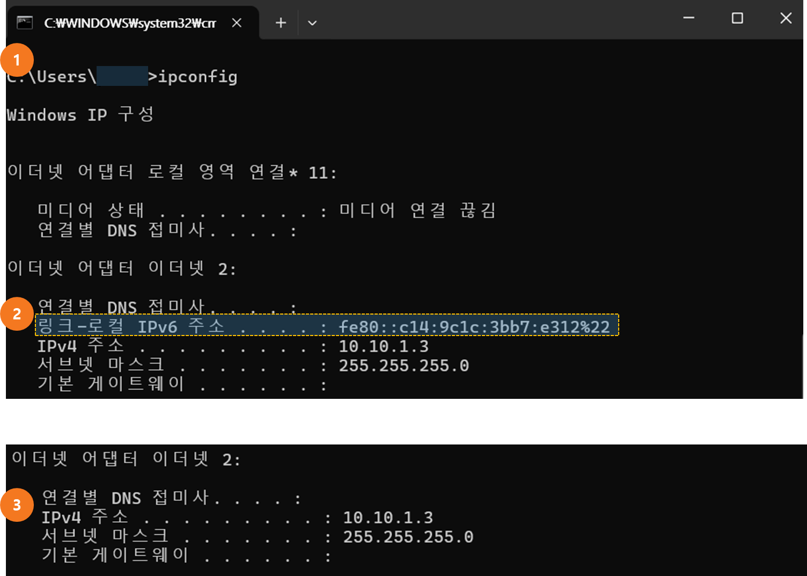

# NextCloud 데스크탑 SW 사용하여 파일 공유하기

NextCloud에서는 데스크탑용 SW를 제공하고 있습니다. 설치 가능한 운영체제는 다음과 같습니다.&#x20;

* 윈동우 10/11 (64bit)
* macOS 12+ (64bit)
* macOS 10.10+
* Linux AppImage

모바일 OS용 프로그램도 제공 하고 있습니다.&#x20;

* 구글 안드로이드&#x20;
* Apple IOS&#x20;


다운로드 링크 : [https://nextcloud.com/install/#install-clients](https://nextcloud.com/install/#install-clients)


## 1. 설치 하기&#x20;

> 윈도우 11 사용자를 기준으로 작성 되었습니다.&#x20;

<figure><figcaption></figcaption></figure>

1. 프로그램 실행 후 \[로그인] 을 선택 합니다.&#x20;
2. 서버 주소는 프로젝트 관리자에게 전달 받은 주소를 입력 합니다.&#x20;
   * 주소 형태는 https://user.bigdata-car.kr:xxxx  입니다.&#x20;
   * xxx 에 해당하는 포트 번호는 필수적으로 입력 하여야 합니다.&#x20;

<figure><figcaption></figcaption></figure>

3. 서버 주소 입력 후 로그인 절차는 웹 브라우져에서 이루어 지게 됩니다.&#x20;
4. \[로그인]을 선택 합니다.&#x20;

<figure><figcaption></figcaption></figure>

5. 프로젝트 관리자에게 전달 받은 ID와 비밀번호를 입력 합니다.&#x20;
6. 계정이 정상적이면 권한 요청단계로 넘어 갑니다.  [\[관리자 계정으로 사용자 추가 하기\]](undefined.md)
7. 연결이 되면 Account Connected 메시지와 함께 연결이 됩니다.&#x20;

## 2. 공유 폴더 설정 하기&#x20;

<figure><figcaption></figcaption></figure>

1. 서버의 파일이 저장된 자신PC 위치를 지정 할 수 있습니다.&#x20;
2. 서버의 파일을 모두 다운로드 받아 동기화 서버의 파일 중 동기화 할 대상을 선택 할 수 있습니다.&#x20;

