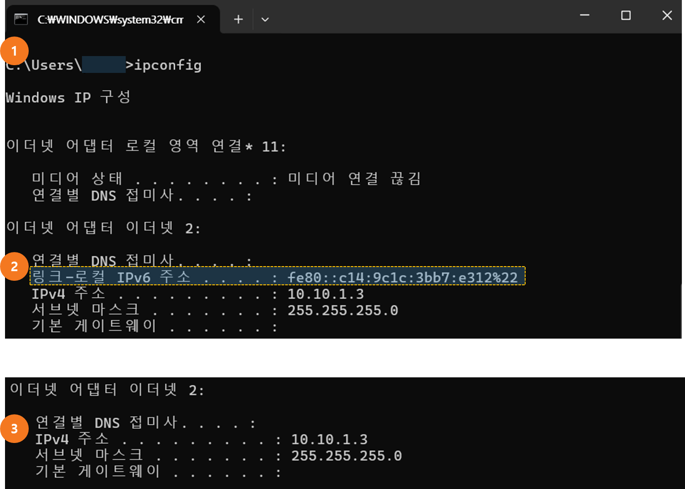

# 메뉴 설명


최초 로그인 시 환경 설정으로 시간이 소요 됩니다.&#x20;


<figure><figcaption></figcaption></figure>

사용자로 최초 로그인시 보이는 화면 입니다.&#x20;

1. 대시보드 : 현재 보고 있는 화면 입니다. \[10] 을 통해 변경 할 수 있습니다.&#x20;
2. File : 저장된 파일을 보는 탐색기 입니다. 가장 많이 사용하는 기능 입니다.&#x20;
3. Photo : \[2] FIle - Photo 폴더에 있는 이미지를 바로 볼 수 있는 기능입니다.&#x20;
4. Activity : 최근 생성/삭제/수정 된 파일의 이력을  보여 줍니다. 공유된 파일의 경우 다른 사용자가 생성/삭제/수정 한 이력도 볼 수 있습니다.&#x20;
5. Search : 저장된 파일을 찾아 볼 수 있습니다.&#x20;
6. Notification : 알림 정보를 볼 수 있습니다.&#x20;
7. Contacts&#x20;
8. Profile : 개인 정보 및 설정을 변경 할 수 있습니다.&#x20;
