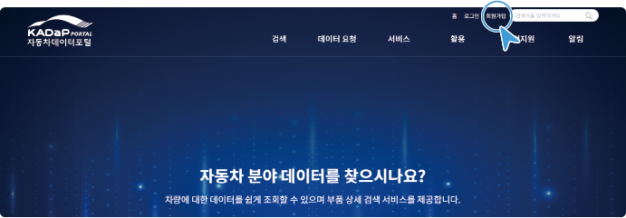
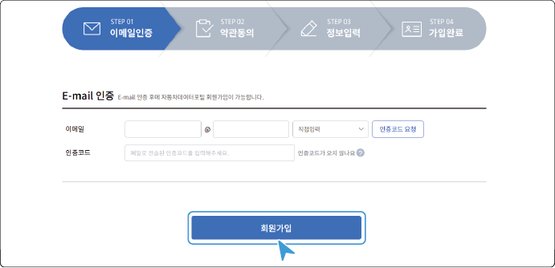
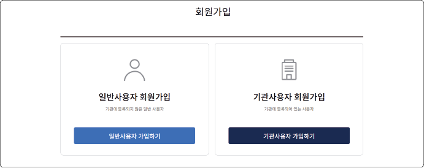
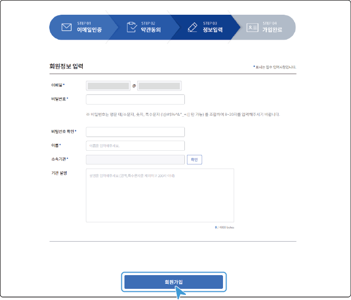
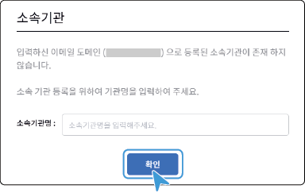

## 회원 가입하기 

자동차데이터플랫폼(KADaP)에서 제공되는 다양한 서비스를 이용하려면 회원가입이 필요합니다.

회원은 일반사용자와 기관(기업)사용자로 구분됩니다. 가입 유형에 따라 이용할 수 있는 서비스가 일부 제한됩니다.

- **일반사용자** | 네이버, 구글 등 이메일 주소로 가입하여 소속기관/기업 식별이 어려운 사용자 계정
- **기관사용자** | 소속기관/기업 이메일 주소로 가입하여 소속기관/기업 식별이 가능한 사용자 계정

[[TIP("참고")]]
- 보안상 일부 서비스는 사용자 확인이 가능한 '기관사용자'만 이용할 수 있습니다.
- 사용자는 일반사용자 및 기관사용자 동시 회원 가입이 가능합니다.
[[/TIP]]

### 회원 가입

자동차데이터플랫폼(KADaP)에 회원으로 가입하려면 다음 순서대로 진행하세요.

1. **자동차데이터플랫폼(KADaP)**([www.bigdata-car.kr](https://www.bigdata-car.kr)) > **자동차 데이터 포털**을 클릭하세요.

[[TIP("바로가기")]]

다음의 경로로 바로 접속할 수 있습니다.
- **자동차 데이터 포털**: [portal.bigdata-car.kr](https://portal.bigdata-car.kr)
[[/TIP]]

2. 오른쪽 상단의 **회원가입**을 클릭하세요.

- 회원가입 화면으로 이동합니다.

3. 회원가입 화면에서 **회원가입**을 클릭하세요.

- 이메일 인증 화면으로 이동합니다.

4. 이메일 인증을 위한 항목을 입력한 후, **회원가입**을 클릭하세요.

- **이메일**: 인증 및 사용자 계정으로 사용할 이메일 주소를 입력하세요.

  - 일반사용자로 가입 시 우측의 드롭다운 항목에서 도메인을 선택하거나, 원하는 도메인이 없으면 **직접입력**을 선택한 후 입력하세요.

   - 기관사용자로 가입 시 **직접입력**을 선택한 후 입력하세요.

- **인증코드 요청**: 이메일 주소를 입력한 후, **인증코드 요청**을 클릭하세요. 입력한 이메일 주소로 인증 알림 메일이 전송됩니다.

- **인증코드**: 이메일로 받은 인증 코드를 입력하세요.

>  **참고**

>

> 자동차데이터플랫폼(KADaP)에서는 이메일 주소를 아이디로 사용하며 등록한 이후에는 변경할 수 없습니다.

5. **일반사용자 가입하기** 또는 **기관가입자 가입하기**를 클릭하세요.

- 약관동의 화면으로 이동합니다.

6. 서비스 이용약관의 내용을 확인하세요. **서비스 이용약관에 동의합니다** 항목에 체크한 후, **이용약관 동의 후 회원가입**을 클릭하세요.

- 정보입력 화면으로 이동합니다.

7. 사용자 정보를 입력한 후, **회원가입(기업회원)**을 클릭하세요.

- **이메일**: 이메일인증 화면에서 입력한 이메일 주소가 자동으로 표시됩니다.

- **비밀번호**: 비밀번호를 입력하세요.

  - 영문 대/소문자, 숫자, 특수문자(!@#$%^&*-+:[])를 조합하여 8 ~ 20자로 입력할 수 있습니다.

- **비밀번호 확인**: 비밀번호를 한 번 더 입력하세요.

- **이름**: 사용자의 이름을 입력하세요.

- **소속기관**: 기관사용자의 경우, **확인**을 클릭하여 소속 기관의 등록 여부를 확인할 수 있습니다.

  - 등록된 기관: 기관 정보가 맞으면 **확인**을 클릭하세요.

      

  - 미등록된 기관: 소속 기관명을 입력한 후, **확인**을 클릭하세요. 관리자 확인 후 가입이 완료됩니다.

      

- **기관 설명**: 기관사용자의 경우, 소속 기관에 대한 설명을 입력할 수 있습니다.

   - 공백과 특수문자를 제외한 200자 이내로 입력할 수 있습니다.

8. 사용자의 회원가입이 완료됩니다. 자동차데이터플랫폼(KADaP)에 로그인하여 원하는 서비스를 이용할 수 있습니다.

[[TIP("주의")]]

정식 가입 절차 없이 SNS 계정으로 로그인을 하면, **추가정보 입력하기**를 통해 회원 가입을 할 수 있습니다.
- 추가정보 등록은 일반사용자 회원 가입과 동일한 절차로 진행됩니다.
- 일부 신규 서비스는 SNS 연동 제한 및 오류가 발생할 수 있으므로 [회원 가입하기](#회원-가입하기)에 따른 회원 가입 절차를 권장합니다.

