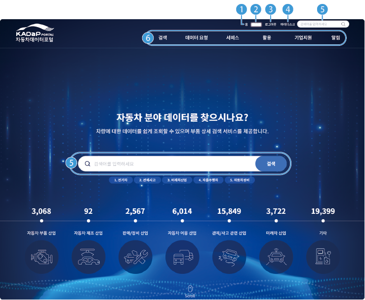

# 자동차 데이터 포털 시작

자동차 데이터 포털 사이트에 로그인하면 포털에서 제공되는 다양한 서비스를 이용할 수 있습니다.

## 자동차 데이터 포털 접속하기

자동차 데이터 포털을 시작하려면 다음 순서대로 진행하세요.

1. **자동차데이터플랫폼**([www.bigdata-car.kr](https://www.bigdata-car.kr))에 접속하세요.

2. 자동차데이터플랫폼에 로그인하세요.

- 회원가입과 로그인 방법은 [회원 가입하기](KADaPUserManualFrontmatter.md#회원-가입하기)와 [로그인하기](KADaPUserManualFrontmatter.md#로그인하기)를 참고하세요.

3. **자동차 데이터 포털**을 클릭하세요.

>  **바로가기**

>

> 다음의 경로로 바로 접속할 수 있습니다.

> - **자동차 데이터 포털**: [portal.bigdata-car.kr](https://portal.bigdata-car.kr)

## 화면 구성

자동차 데이터 포털의 메인 화면은 다음과 같이 구성됩니다.

| 번호 | 항목 | 설명 |

| --- | --- | --- |

| 1 | 홈 | 자동차 데이터 포털의 메인 화면으로 이동합니다. |

| 2 | 내 정보 | 마이페이지로 이동합니다. |

| 3 | 로그아웃 | 로그인한 계정에서 로그아웃합니다. |

| 4 | 마이디스크 | 마이디스크 페이지로 이동합니다. |

| 5 | 검색 | 검색란에 검색어를 입력하면 데이터 검색 화면으로 이동하고 결과를 확인할 수 있습니다. |

| 6 | 메뉴 | 자동차 데이터 포털의 메뉴를 표시합니다. 메뉴 위에 마우스를 올리면 하부 메뉴를 확인할 수 있습니다. |

