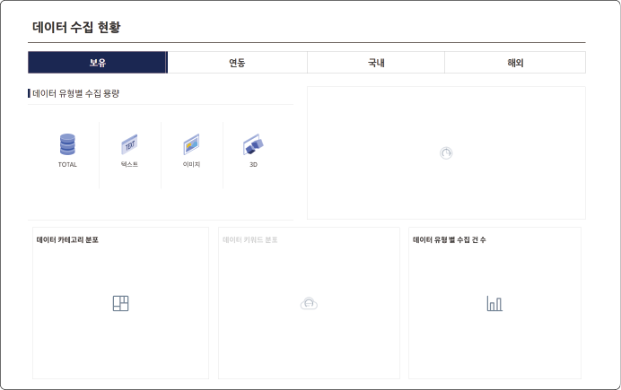

# 메뉴 구성

자동차 데이터 포털의 메뉴는 다음과 같이 구성됩니다.

## 검색

자동차 데이터 포털에서 제공되는 데이터를 검색하고 확인할 수 있습니다.

[[TIP("참고")]]

자동차 데이터 검색과 결과 확인에 대한 자세한 설명은 [데이터 검색](#데이터-검색)과 [데이터 검색 결과 확인](#데이터-검색-결과-확인)을 참고하세요.

[[/TIP]]

### 데이터 검색

`자동차 데이터 포털` > `검색` > `데이터 검색`

카테고리별로 분류된 데이터 트리에서 원하는 항목을 선택하여 검색할 수 있습니다.

- 검색란에 검색어를 입력한 후 **검색**을 클릭하거나, 왼쪽의 데이터 트리에서 검색하려는 항목을 클릭하면 검색 결과가 표시됩니다.

- 검색 결과 중 데이터를 클릭하면 상세 정보 페이지로 이동합니다.

### 데이터 맵

`자동차 데이터 포털` > `검색` > `데이터 맵`

카테고리별로 분류된 데이터 타일에서 원하는 항목을 선택하여 검색할 수 있습니다.

- 데이터 타일에서 검색하려는 항목을 클릭하면 데이터 검색 화면으로 이동하고 검색 결과가 표시됩니다.

- 검색 결과 중 데이터를 클릭하면 상세 정보 페이지로 이동합니다.

### 연관 검색

`자동차 데이터 포털` > `검색` > `연관 검색`

자동차 산업 데이터와 데이터 분류별로 연관된 데이터를 확인할 수 있습니다.

- 검색란에 검색어를 입력한 후 **검색**을 클릭하면, 검색어를 포함한 데이터와 검색어와 관련 있는 데이터의 검색 결과가 표시됩니다.

- 검색 결과 중 데이터를 클릭하면 상세 정보 페이지로 이동합니다.

### 수집 현황

`자동차 데이터 포털` > `검색` > `수집 현황`

데이터의 유형별 수집 용량을 포함하여 탭별(보유/연동/국내/해외)로 분류된 데이터 수집 현황을 확인할 수 있습니다.

[[TIP("참고")]]

- 국내와 해외 데이터는 주 1회 수집하고 AI 기술을 활용하여 등록됩니다.

- 수집 대상에 추가할 데이터 포털 및 주소를 관리자에게 전달하여 새로 반영할 수 있습니다.

[[/TIP]]

