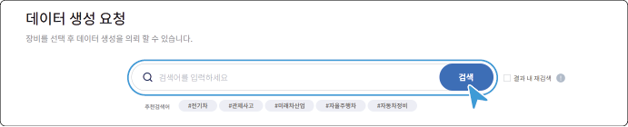
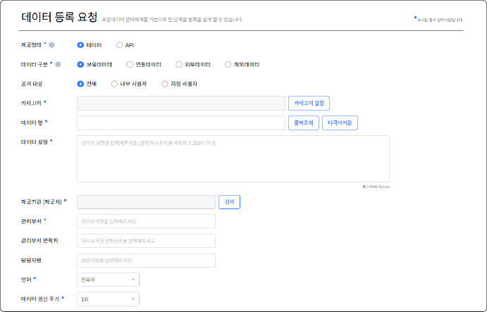

# 메뉴 구성

자동차 데이터 포털의 메뉴는 다음과 같이 구성됩니다.

## 데이터 요청

한국자동차연구원에서 보유하고 있는 장비를 활용하여 데이터 생성을 요청하거나, 기업이 보유하고 있는 데이터를 등록하여 자동차 데이터 포털에서 공유 및 판매할 수 있습니다.

### 데이터 생성 요청

`자동차 데이터 포털` > `데이터 요청` > `데이터 생성 요청`

한국자동자연구원에서 보유하고 있는 장비 목록 중에서 필요한 장비를 선택하여 데이터 생성을 요청할 수 있습니다.

1. **데이터 요청** 메뉴에서 **데이터 생성 요청**을 클릭하세요.

2. 검색란에 검색어를 입력한 후, **검색**을 클릭하세요.

- 검색어를 포함한 검색 결과가 표시됩니다.

3. 검색 결과 중 데이터 생성을 요청하려는 장비데이터를 클릭하세요.

- 데이터의 상세 정보 페이지로 이동합니다.

   - 데이터 목록으로 돌아가려면 **목록**을 클릭하세요.

4. 데이터의 상세 정보를 확인한 후, **의뢰하기**를 클릭하세요.

- **확인** 팝업창이 표시됩니다.

5. 팝업창에서 **확인**을 클릭하면 관리자에게 데이터 생성 의뢰 메일이 전송됩니다.

### 데이터 등록 요청 {#데이터-등록-요청}

`자동차 데이터 포털` > `데이터 요청` > `데이터 등록 요청`

기업이 보유하고 있는 데이터를 등록하여 공유 및 판매할 수 있습니다.

1. **데이터 요청** 메뉴에서 **데이터 등록 요청**을 클릭하세요.

2. 데이터 등록을 위한 항목을 입력하세요.

- **제공 형태**: 제공 방식을 **데이터** 또는 **API** 형태로 지정할 수 있습니다.

- **데이터 구분**: 원본 데이터 제공 시에는 **보유데이터** 또는 **연동데이터**를 선택하고, 메타 데이터 제공 시에는 **외부데이터**를 지정하세요.

- **공개 대상**: 검색 노출 대상을 **전체**, **내부 사용자**(이메일 도메인 기반) 또는 **지정 사용자**로 제한할 수 있습니다.

- **데이터 보안**: 제공 데이터의 **마이디스크 방지**, **다운로드 방지**, **안심 분석 존** 내에서 활용 여부를 지정할 수 있습니다.

- **데이터 타입**: 원본 데이터를 제공(**데이터 셋 파일**, **Object Storage**)하거나 외부 서버의 링크(**데이터서비스 링크**)를 지정할 수 있습니다.

3. **등록**을 클릭하세요.

4. 팝업창에서 **확인**을 클릭하면 관리자에게 데이터 등록 의뢰 메일이 전송됩니다.

>  **웹매뉴얼**

>

> 자세한 등록 절차는 웹 매뉴얼을 참고하세요.

> - 자동차 데이터 플랫폼(KADaP)의  > **매뉴얼** > **HTML, PDF** > **자동차 데이터 포털** > **데이터 요청** > **데이터 등록 요청**

[[TIP("참고")]]

등록 요청된 데이터는 **데이터 요청** > **요청 관리** 메뉴에서 확인할 수 있습니다.

[[/TIP]]

