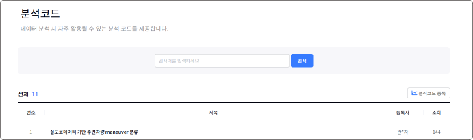

# 메뉴 구성

자동차 데이터 포털의 메뉴는 다음과 같이 구성됩니다.

## 활용

데이터 분석 시 활용할 수 있는 분석 코드와 자동차 분야에 특화된 데이터 셋을 제공합니다. 또한 다양한 시각분석 활용 사례를 확인할 수 있습니다.

### 시각분석

`자동차 데이터 포털` > `활용` > `시각분석`

데이터를 활용한 다양한 시각 분석 활용 사례를 제공합니다.

### 분석코드

`자동차 데이터 포털` > `활용` > `분석코드`

데이터 분석 시 자주 활용될 수 있는 분석 코드를 제공합니다.

### 추천 데이터 셋

`자동차 데이터 포털` > `활용` > `추천 데이터 셋`

자동차 분야 특화 데이터 셋에 대한 소개 및 특징 정보를 제공합니다.

