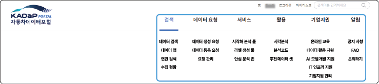
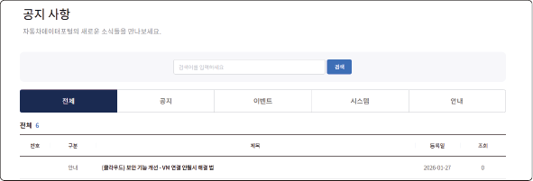
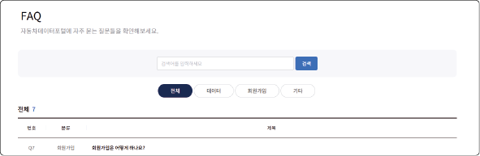
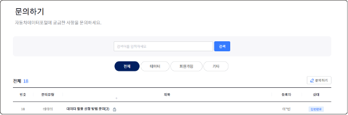

# 메뉴 구성

자동차 데이터 포털의 메뉴는 다음과 같이 구성됩니다.

## 알림

자동차 데이터 포털의 새로운 소식이나 자주 묻는 질문들을 확인할 수 있고, 궁금한 사항을 문의할 수 있습니다. 자동차 데이터 포털에 대한 궁금한 사항은 **문의하기**에 내용을 등록하여 답변을 받을 수 있습니다. 문의 및 답변의 공개 여부는 문의사항 등록 시 선택하세요.

### 공지 사항

`자동차 데이터 포털` > `알림` > `공지 사항`

자동차 데이터 포털의 시스템이나 이벤트 등과 관련된 새로운 소식을 확인할 수 있습니다.

### FAQ

`자동차 데이터 포털` > `알림` > `FAQ`

자동차 데이터 포털에서 자주 묻는 질문들을 확인할 수 있습니다.

### 문의하기

`자동차 데이터 포털` > `알림` > `문의하기`

자동차 데이터 포털에 대한 궁금한 사항을 문의할 수 있습니다.

**문의하기**를 클릭하여 내용을 등록하세요. 문의 및 답변의 공개 여부는 문의사항 등록 시 선택하세요.

