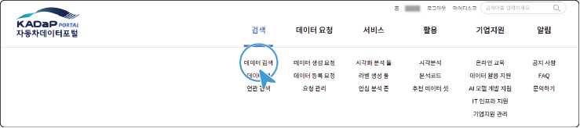
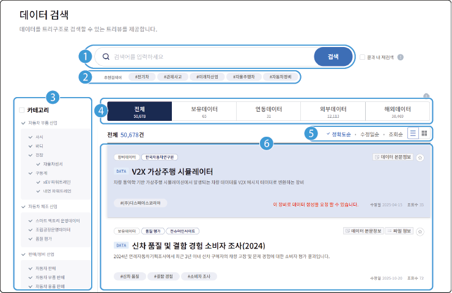

# 데이터 검색 {#데이터-검색}

자동차 데이터 포털에서 제공되는 데이터를 키워드, 결과 내 재검색, 산업 카테고리, 제공기관, 제공형태, 데이터 타입으로 검색할 수 있습니다.

**검색** 메뉴에서 **데이터 검색**을 클릭하세요. **데이터 검색** 화면으로 이동합니다.

## 화면 구성

**데이터 검색** 화면은 다음과 같이 구성됩니다.

| 번호 | 항목 | 설명 |

| --- | --- | --- |

| 1 | 검색란 | 검색어를 입력하여 데이터를 검색할 수 있습니다.<ul><li>**결과 내 재검색**: 검색 결과 내에서 추가 검색을 하려면 항목에 체크하세요. **결과 내 재검색**은 3회 제공됩니다.</li></ul> |

| 2 | 추천 검색어 | 사용자가 많이 검색한 단어나 관련 있는 단어를 표시합니다. |

| 3 | 카테고리 | 카테고리별로 분류된 데이터 트리에서 원하는 항목을 선택하면 검색 결과가 표시됩니다. (산업 분류, 제공기관, 제공형태, 데이터 타입, 키워드) |

| 4 | 분류 탭 | 원본 데이터와 메타 데이터의 관리 주체 및 수집 경로에 따른 분류를 표시합니다. |

| 5 | 정렬 메뉴 | 데이터를 원하는 기준으로 정렬할 수 있습니다. |

| 6 | 검색 결과 | 원하는 기준으로 검색한 데이터의 검색 결과를 표시합니다.<ul><li>검색 결과 중 데이터를 클릭하면 상세 정보 페이지로 이동합니다.</li></ul> |

[[TIP("참고")]]

&#x20;데이터 분류 탭의 내용은 다음과 같습니다.

&#x20;- **보유데이터**

한국자동차연구원에서 업로드한 메타 데이터와 테이터 셋의 유형별 수집 용량과 건수, 데이터의 분포도를 카테고리와 키워드 별로 확인할 수 있습니다.

- **연동데이터**

&#x20;한국자동차연구원에서 메타 데이터를 업로드하고 협약기관의 데이터 셋을 연동한 데이터의 수집 건수를 확인할 수 있습니다.

- **외부데이터**

&#x20;국내 여러 분야의 빅데이터 플랫폼에서 수집된 자동차 관련 데이터를 확인할 수 있습니다.

&#x20;- **해외데이터**

&#x20;국외 여러 국가의 다양한 분야의 빅데이터 플랫폼에서 수집된 자동차 관련 데이터를 확인할 수 있습니다.

[[/TIP]]

## 데이터 검색하기

데이터를 검색하려면 다음 순서대로 진행하세요.

1. **검색** 메뉴에서 **데이터 검색**을 클릭하세요.

- **데이터 검색** 화면으로 이동합니다.

2. 검색란에 검색어를 입력한 후 **검색**을 클릭하거나, 왼쪽의 데이터 트리에서 검색하려는 항목을 클릭하세요.

- 검색 결과가 표시됩니다.

  - **카테고리**: 자동차 산업계 분야

  - **제공기관**: 데이터를 제공하는 기관

  - **제공형태**: 제공되는 데이터의 형태 (DATA 또는 API)

  - **데이터타입**: 제공되는 데이터의 타입 (데이터 셋, 데이터 서비스, 또는 Object storage)

  - **키워드**: 자동차 분야와 관련 있는 키워드

