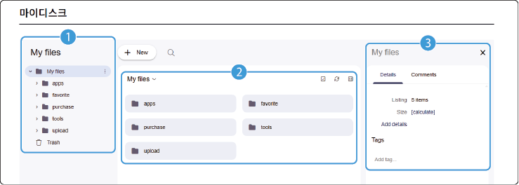

# 데이터 검색 결과 마이디스크 복사

## 마이디스크

자동차 데이터 포털에서는 데이터 활용을 위해 개인 저장 공간인 마이디스크를 제공합니다. 검색 결과에서 마이디스크 저장을 선택하거나, 구매한 데이터 또는 사용자가 직접 업로드한 데이터를 저장하여 자동차데이터플랫폼(KADaP)에서 제공하는 다른 서비스들과 연계(Mount)하여 활용할 수 있습니다.

자동차 데이터 포털 화면에서 **마이디스크**를 클릭하세요. **마이디스크** 화면으로 이동합니다.

>  **바로가기**

>

> 다음의 경로로 바로 접속할 수 있습니다.

> - **마이디스크**: [mydisk.bigdata-car.kr](https://mydisk.bigdata-car.kr)

### 화면 구성

마이디스크 화면은 다음과 같이 구성됩니다.

| 번호 | 항목 | 설명 |

| --- | --- | --- |

| 1 | My files | My files 마이디스크로 저장한 데이터 파일, 구매한 데이터, 서비스 툴, 데이터 개별등록 시 업로드한 파일 등이 폴더별 속성에 맞게 저장됩니다. My files 하부 폴더는 디폴트로 생성되어 있습니다. |

| 2 | 보기 설정 | 파일 선택 옵션, 목록의 정렬이나 보기 옵션, 컬럼 설정 옵션, 파일 필터링 옵션 등을 선택할 수 있습니다.<ul><li>폴더나 파일을 선택한 후, 마우스 오른쪽 버튼을 클릭하면 컨텍스트 메뉴가 표시됩니다. 컨텍스트 메뉴에서 다양한 기능을 사용할 수 있습니다.</li></ul> |

| 3 | 상세 정보 | 마이디스크 내 폴더 또는 파일에 대한 상세 내용을 확인하고, 부가 설명을 입력할 수 있습니다. |

[[TIP("참고")]]

My files 폴더 내용은 다음과 같습니다.

* **app**: 마켓플레이스 'App'과 연동되는 폴더

* **favorite**: 자동차 데이터 포털에서 '마이디스크 저장'과 연동되는 폴더

* **purchase**: 자동차 데이터 포털에서 '구매 데이터'와 연동되는 폴더

* **tools**: 자동차 데이터 플랫폼에서 제공되는 '툴'과 연동되는 폴더 (인공지능개발솔루션IDE, 자동차지식에이젼트Agent 등)

* **upload**: 자동차 데이터 포털에서 '데이터 등록' 시 연동되는 폴더

[[/TIP]]

