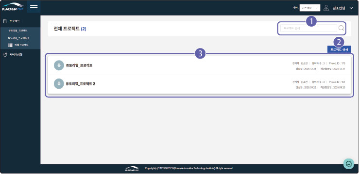
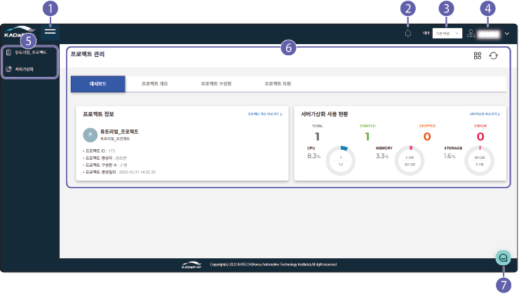



# 클라우드 서비스 사용

자동차 산업 클라우드 서비스의 화면은 다음과 같이 구성됩니다.

## 전체 프로젝트 화면 구성

현재 사용중인 전체 프로젝트 목록을 확인할 수 있습니다. 전체 프로젝트 화면은 다음과 같이 구성됩니다.

| 번호 | 항목 | 설명 |

| --- | --- | --- |

| 1 | 검색창 | 프로젝트명을 입력해 검색할 수 있습니다. |

| 2 | 프로젝트 생성 | 클라우드에서 프로젝트를 생성할 수 있습니다. 프로젝트 생성에 대한 자세한 설명은 [프로젝트 생성하기](#프로젝트-생성하기)를 참고하세요. |

| 3 | 프로젝트 목록 | 등록된 전체 프로젝트 목록을 확인할 수 있습니다.<ul><li>프로젝트 목록에는 직접 생성한 프로젝트와 다른 프로젝트 관리자가 구성원으로 추가한 프로젝트가 표시됩니다.</li></ul> |

### 프로젝트 생성하기 {#프로젝트-생성하기}

클라우드에서 서버를 생성하려면 먼저 프로젝트를 생성해야 합니다.

>**주의**

> 

>   - 프로젝트 생성은 클라우드 서비스 신청 시 지정한 프로젝트 책임자만 생성할 수 있습니다.

>   - 프로젝트는 기본 1개만 생성 가능하며, 관리자에게 요청하여 추가할 수 있습니다.

>     - 로그인한 사용자가 프로젝트 책임자가 아니거나 생성 가능 수량(1개)를 초과하면 프로젝트 생성 버튼이 비활성화됩니다. 사용자 권한과 생성된 프로젝트 수를 확인하세요.

프로젝트를 생성하려면 다음 순서대로 진행하세요.

1. 클라우드 메인 페이지에서 **프로젝트**를 클릭하세요.

2. 프로젝트 목록 페이지가 나타나면 **프로젝트 생성**을 클릭하세요.

3. 프로젝트 생성창이 나타나면 프로젝트명을 입력하고 **프로젝트 생성**을 클릭하세요.

프로젝트가 생성되면 프로젝트 목록에 표시됩니다.

## 프로젝트 관리 화면 구성

프로젝트를 선택하면 프로젝트 관리 화면으로 이동합니다. 프로젝트 관리 화면의 각 항목별 기능을 설명합니다.

| 번호 | 항목 | 설명 |

| --- | --- | --- |

| 1 | 왼쪽 메뉴 숨김 | 왼쪽 메뉴를 숨겨 상세 화면을 크게 표시합니다. |

| 2 | 알람 | 클라우드 서버 사용량 알람이 표시됩니다.<ul><li>**알람 더보기+**를 클릭하면 서버 사용량에 따라 발생할 알람 이벤트를 설정할 수 있습니다.</li></ul> |

| 3 | 테마 | 클라우드 화면의 배경 색상을 변경할 수 있습니다. |

| 4 | 내 정보 | 로그인한 사용자 정보를 확인하고 로그아웃할 수 있습니다.<ul><li>**로그아웃**: 로그인한 계정에서 로그아웃합니다.</li><li>**나의 정보**: 자동차 데이터 포털의 마이페이지로 이동해 가입 정보를 확인할 수 있습니다.</li></ul> |

| 5 | 클라우드 메뉴 | 클라우드의 메뉴를 선택합니다.<ul><li>**프로젝트**: 사용자에게 할당된 프로젝트가 표시됩니다.</li><li>**서버 가상화**: 프로젝트에서 사용하는 서버와 디스크를 관리할 수 있습니다.</li></ul>|

| 6 | 메뉴 상세 화면 | 선택한 클라우드 메뉴의 상세 화면이 표시됩니다.<ul><li> : 프로젝트 전체 목록으로 이동합니다.</li><li>: 상세 화면의 정보를 새로고침합니다.</li></ul>|

| 7 | 질의 응답 | 클라우드 사용 중 궁금한 사항을 관리자에게 직접 문의할 수 있습니다. 질의 응답창에 문의 사항을 입력하면 관리자가 문의 순서대로 답변합니다. |

