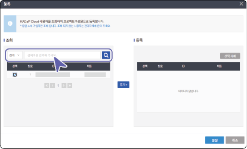
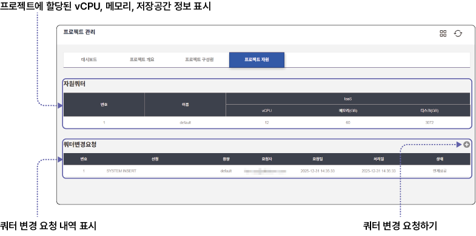

## 프로젝트 관리 화면 구성

프로젝트를 선택하면 프로젝트 관리 화면으로 이동합니다. 프로젝트 관리 화면의 각 항목별 기능을 설명합니다.

| 번호 | 항목 | 설명 |
| --- | --- | --- |
| 1 | 왼쪽 메뉴 숨김 | 왼쪽 메뉴를 숨겨 상세 화면을 크게 표시합니다. |
| 2 | 알람 | 클라우드 서버 사용량 알람이 표시됩니다.<ul><li>**알람 더보기+**를 클릭하면 서버 사용량에 따라 발생할 알람 이벤트를 설정할 수 있습니다.</li></ul> |
| 3 | 테마 | 클라우드 화면의 배경 색상을 변경할 수 있습니다. |
| 4 | 내 정보 | 로그인한 사용자 정보를 확인하고 로그아웃할 수 있습니다.<ul><li>**로그아웃**: 로그인한 계정에서 로그아웃합니다.</li><li>**나의 정보**: 자동차 데이터 포털의 마이페이지로 이동해 가입 정보를 확인할 수 있습니다.</li></ul> |
| 5 | 클라우드 메뉴 | 클라우드의 메뉴를 선택합니다.<ul><li>**프로젝트**: 사용자에게 할당된 프로젝트가 표시됩니다.</li><li>**서버 가상화**: 프로젝트에서 사용하는 서버와 디스크를 관리할 수 있습니다.</li></ul>|
| 6 | 메뉴 상세 화면 | 선택한 클라우드 메뉴의 상세 화면이 표시됩니다.<ul><li> : 프로젝트 전체 목록으로 이동합니다.</li><li>: 상세 화면의 정보를 새로고침합니다.</li></ul>|
| 7 | 질의 응답 | 클라우드 사용 중 궁금한 사항을 관리자에게 직접 문의할 수 있습니다. 질의 응답창에 문의 사항을 입력하면 관리자가 문의 순서대로 답변합니다. |

## 프로젝트 관리하기

프로젝트가 생성되면 프로젝트 관리 페이지에서 상세 정보를 확인할 수 있습니다.

프로젝트 정보를 확인하거나 관리하려면 다음 순서대로 진행하세요.

1. 클라우드 메인 페이지에서 **프로젝트**를 클릭하세요.

2. 프로젝트 목록에서 확인할 프로젝트를 클릭하세요.

3. 프로젝트 관리 페이지에서 각 상세 정보 탭을 클릭하세요.

### 대시보드

대시보드에서는 프로젝트 정보 및 제공된 컴퓨팅 자원의 사용 현황을 한 눈에 확인할 수 있습니다.

### 프로젝트 개요

프로젝트 생성자, 프로젝트 ID, 프로젝트 참여자 목록 등을 확인하고 프로젝트를 삭제할 수 있습니다.

**프로젝트 상세 정보**

- **생성자**: 프로젝트를 생성한 책임자 이름이 표시됩니다.

- **Project ID**: 프로젝트 ID가 표시됩니다.

- **프로젝트 참여자 수**: 프로젝트에 할당된 전체 참여자 수가 표시됩니다.

- **설명**: 프로젝트 설명이 표시됩니다. 을 클릭하면 설명을 수정할 수 있습니다.

- **방화벽**: 방화벽에 프로젝트 등록 여부를 표시합니다. 방화벽은 기본적으로 등록이 완료된 상태이며, **등록 필요**가 표시되는 경우 버튼을 클릭합니다. 방화벽에 프로젝트ID가 수동으로 등록되며 **등록 완료**로 변경됩니다.

- : 프로젝트 및 참여자의 방화벽 등록 정보를 새로고침합니다.

-  : 프로젝트를 삭제합니다. 프로젝트 삭제는 프로젝트 책임자만 할 수 있습니다. 프로젝트를 삭제하면 프로젝트 안에 생성된 서버가 모두 삭제됩니다.

**프로젝트 참여자 정보**

- 방화벽에 **등록 필요**가 표시되는 경우 버튼을 클릭합니다. 방화벽에 프로젝트ID가 수동으로 등록되며 **등록 완료**로 변경됩니다.

- 프로젝트 참여자는 프로젝트 구성원 탭에서 등록하거나 삭제할 수 있습니다.

>  **주의**

>

> 서버에 접속하려면 프로젝트 ID, 사용자 ID, 서버 IP가 모두 방화벽에 등록되어 있어야 합니다. 해당 항목의 **등록 필요**를 클릭하면 방화벽에 등록됩니다.

### 프로젝트 구성원

프로젝트의 구성원을 확인하고 구성원을 등록하거나 삭제할 수 있습니다.

**구성원 추가**

프로젝트에 구성원을 추가할 수 있습니다.

>  **주의**

>

> - 프로젝트에 구성원 추가는 프로젝트 책임자만 할 수 있습니다.

> - 프로젝트 구성원 추가 시 프로젝트 책임자와 같은 소속(동일한 이메일 도메인 주소)만 조회할 수 있습니다. 다른 기관(타 도메인) 사용자를 프로젝트에 등록하려면 관리자 메일 (admin@bigdata-car.kr)로 문의하세요.

프로젝트에 구성원을 추가하려면 다음 순서대로 진행하세요.

1. 프로젝트 구성원 탭 페이지에서 **등록**을 클릭하세요.

2. 구성원 등록창이 나타나면 추가할 사용자를 조회하세요.

- 이미 구성원으로 등록된 사용자는 조회되지 않습니다.

3. 조회 목록에서 체크박스를 클릭하고 **추가**를 클릭하세요.

4. 등록 목록에 선택한 사용자 정보가 표시되면 **생성**을 클릭하세요.

- 등록 목록의 사용자 정보를 삭제하려면 **선택 삭제**를 클릭합니다.

선택한 사용자가 프로젝트 구성원 목록에 표시됩니다.

### 프로젝트 자원 {#프로젝트-자원}

프로젝트에 할당된 컴퓨팅 자원 정보를 확인하고 자원 할당량(쿼터)를 변경 신청할 수 있습니다.

**프로젝트 쿼터 변경**

프로젝트에 할당되는 자원 쿼터를 변경할 수 있습니다.

> **주의**

>

> 프로젝트 쿼터 변경은 프로젝트 책임자만 신청할 수 있습니다.

프로젝트의 자원 쿼터를 변경하려면 다음 순서대로 진행하세요.

1. 프로젝트 자원 탭 페이지에서 쿼터 변경 요청의 을 클릭하세요.

2. 용량 변경 요청창이 나타나면 변경할 용량 항목을 선택하세요.

3. 변경 요청 사유 항목에 프로젝트 쿼터 추가 이유를 입력하고 **저장**을 클릭하세요.

사용자의 쿼터 변경 신청 내역을 관리자가 검토한 후 승인합니다. 관리자 승인이 완료되면 변경된 쿼터가 프로젝트에 적용됩니다.

