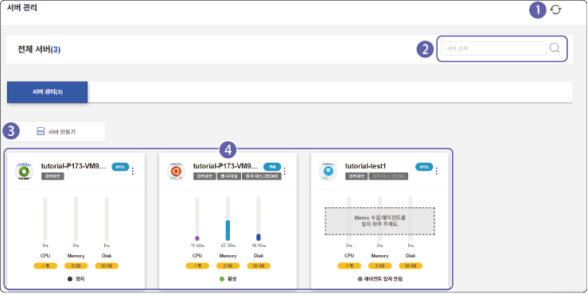
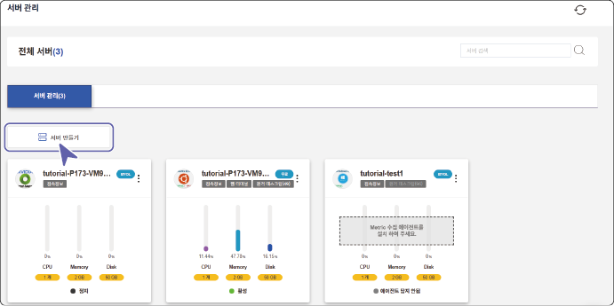
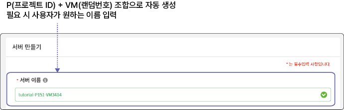
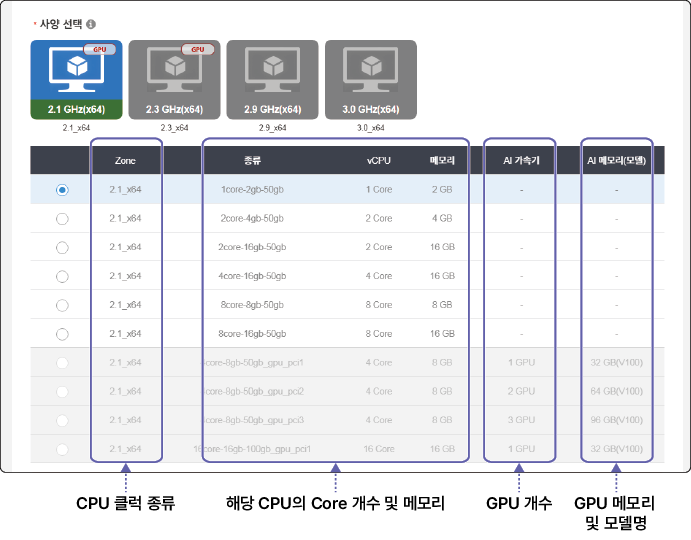
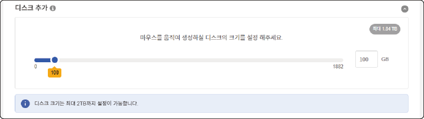
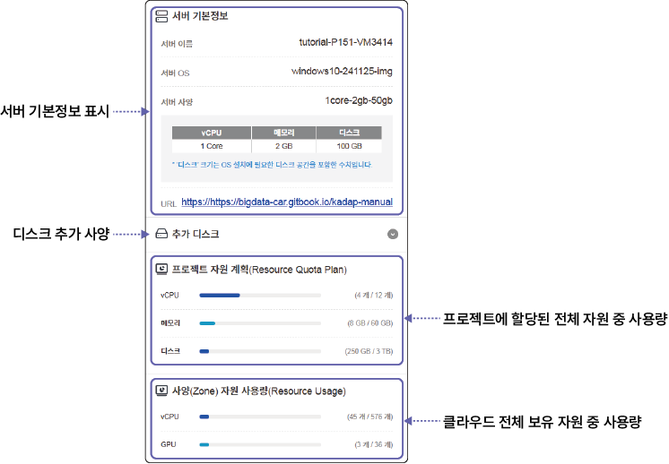

# 서버 생성 및 관리하기

서버 가상화 메뉴에서는 프로젝트에서 사용할 서버를 생성하고 관리할 수 있습니다.

## 화면 구성

사용자가 생성한 전체 서버 목록을 확인할 수 있습니다. 전체 서버 화면은 다음과 같이 구성됩니다.

| 번호 | 항목 | 설명 |

| --- | --- | --- |

| 1 | 새로고침 | 서버 목록을 새로고침합니다. |

| 2 | 검색창 | 서버명을 입력해 검색할 수 있습니다. |

| 3 | 서버 만들기 | 프로젝트에서 사용할 서버를 생성할 수 있습니다. |

| 4 | 서버 목록 | 등록된 전체 서버 목록을 확인할 수 있습니다.<ul><li>각 서버의 정보는 카드 형태로 표시되며, 서버 이름을 클릭하면 상세 페이지로 이동합니다.</li></ul> |

## 서버 생성하기 {#서버-생성하기}

서버를 생성하려면 다음 순서대로 진행하세요.

1. 클라우드 메인 페이지에서 **프로젝트**를 클릭하세요.

2. 프로젝트 목록에서 서버를 생성할 프로젝트를 선택하세요.

- 프로젝트를 선택한 후에 왼쪽 메뉴에서 서버 가상화 메뉴를 선택할 수 있습니다.

3. **서버가상화** 메뉴에서 **서버 관리**를 클릭하세요.

4. 서버 관리 페이지에서 **서버 만들기**를 클릭하세요.

5. 서버 만들기 페이지에서 상세 항목을 입력하고 **서버 생성**을 클릭하세요.

- [*]가 표시된 항목은 필수 입력 항목이므로 반드시 입력하세요.

- **서버 이름 지정**

- **OS 선택**

  

&#x20; - **OS**: 운영체제(OS)를 선택할 수 있습니다.

&#x20; - **DevTools**: 개발과 관련된 OS를 선택합니다.

&#x20; - **Simulation**: 시뮬레이션 툴이 설치된 OS를 선택합니다.

 -  : 원격 데스크탑(GUI) 기반 접속 환경 제공

 -  : 터미널(CLI) 기반 접속 환경 제공

 -  : 웹 브라우저(Web) 기반 접속 환경 제공

 -  : GPU 드라이버가 설치된 환경 제공

>  **참고**

>

> GPU 드라이버는 사용자가 직접 설치할 수 있습니다.

- **사양 선택**

&#x20; 서버 사양(Zone)을 선택한 후 서버의 하드웨어 사양을 설정합니다.

&#x20; 

- **OS 디스크 설정**

&#x20; OS가 설치될 디스크의 크기를 설정합니다.

&#x20; 

&#x20; -  OS 디스크는 윈도우의 C 드라이브에 해당합니다.

&#x20; -  최대 2 TB 이내에서 디스크 크기를 설정할 수 있습니다.

- **디스크 추가**

&#x20; 추가 저장공간이 필요한 경우 디스크 크기를 설정합니다.

&#x20; 

&#x20; -  추가 저장공간은 윈도우의 D 드라이브에 해당합니다.

&#x20; -  디스크 추가는 선택 사항으로 서버 사용 중 추가할 수 있습니다. 자세한 설명은 [디스크 생성하기](#디스크-생성하기)를 참고하세요.

- **서버 생성 정보**

&#x20; 서버 생성 정보를 요약해서 표시합니다.

&#x20; 

>  **참고**

>

> - 프로젝트 자원 계획에 여유가 있어도 서버 사양(Zone)의 여유 자원이 없으면 서버를 생성할 수 없습니다.

> - 사양 선택 시 프로젝트의 여유 자원에 따라 선택할 수 있는 항목이 제한됩니다. 여유 자원 이상의 사양은 항목이 비활성되어 선택할 수 없습니다.

