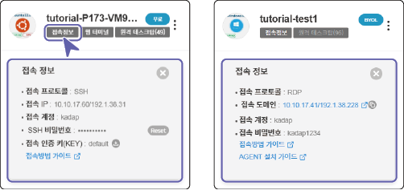
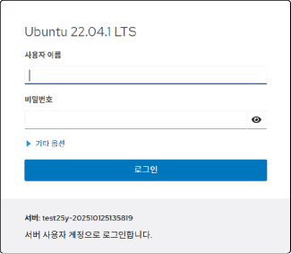
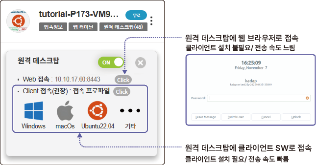

# 서버 접속하기

생성한 서버에 접속하는 방법을 설명합니다. 서버에는 다음 방법으로 접속할 수 있습니다.

| 항목 | VPN 접속 | 프로그램 설치 | 키파일 활용 |
| --- | --- | --- | --- |
| SSH Web 접속 (클라이언트) | ○ | ✗ | ✗ |
| SSH Web 접속 (웹 브라우저) | ✗ | ✗ | ✗ |

## 접속 정보 확인 {#접속-정보-확인}

카드 정보의 **접속 정보**를 클릭하면 서버의 접속 정보를 확인할 수 있습니다.

- **접속 프로토콜**: 접속 프로토콜 방식을 표시합니다.

- **접속 IP**: 서버의 외부/내부 IP가 표시됩니다.

- **접속 계정**: 접속 계정 정보가 표시됩니다.

- **SSH 비밀번호**: **Reset**을 클릭해 초기 비밀번호를 변경할 수 있습니다.

- **접속 인증 키(KEY)**: 를 클릭해 키페어를 다운로드할 수 있습니다. 키페어는 서버에 접속할 때 사용하는 인증키를 말합니다.

- **접속 방법 가이드**: 서버에 접속하는 상세 절차를 확인할 수 있습니다.

- **AGENT 설치 가이드**: 모니터링 에이전트 프로그램 다운로드 및 설치 절차를 확인할 수 있습니다.

- 모니터링 에이전트가 설치되지 않으면 서버 사용량 모니터링이 실행되지 않습니다.

## 키페어 사용

카드 정보에서  > **키페어 다운로드**를 클릭하면 키페어를 다운로드할 수 있습니다. 키페어는 서버에 접속할 때 사용하는 인증키로 SSH 프로그램을 설치해 가상 서버에 접속할 때 사용자 인증에 사용합니다.

- **서버 > 접속 정보 > 접속 인증 키(KEY)** 항목이나 서버 상세 페이지의 **키페어**에서도 pem 파일을 다운로드할 수 있습니다.

## 콘솔 (VNC) 접속

카드 정보에서  > **콘솔 (VNC) 접속**을 클릭하면 가상 콘솔에 접속할 수 있습니다. 가상 콘솔은 OS 부팅 단계 및 에러 발생 시 이력 확인을 위해 사용됩니다.

## 웹 콘솔 (VPN) 접속 {#웹-콘솔-vpn-접속}

카드 정보에서  > **웹 콘솔 (VPN) 접속**을 클릭하면 웹 콘솔에 접속할 수 있습니다. 서버의 웹 기반 환경에 접속해 시스템 로그, 서비스, 네트워크, 스토리지, 사용자 관리를 할 수 있습니다.

- 웹 콘솔 접속 시 입력하는 로그인 정보는 가상 서버 로그인 정보와 동일합니다.

 

## 웹 터미널 접속 {#웹-터미널-접속}

카드 정보의 **웹 터미널**을 클릭하면 서버의 접속 정보를 확인해 웹 터미널로 접속할 수 있습니다.

**웹 터미널 화면 설명**

서버에 접속되면 웹 터미널 화면이 나타납니다. 웹 터미널 화면은 다음과 같이 구성됩니다.

>  **참고**

>

> 웹 기반 SSL을 사용해 접속하는 경우 접속 안전성이 낮습니다. 이는 웹 기반 서비스의 일반적인 특성으로 웹 터미널 접속은 간단한 작업을 진행하는 경우에만 이용하는 것을 권장합니다.

## 원격 데스크탑 연결 {#원격-데스크탑-연결}

카드 정보의 **원격 데스크탑**을 클릭하면 클라우드에 생성한 서버에 원격 데스크탑(GUI) 형태로 접속할 수 있습니다.

>  **참고**

>

> - 원격 데스크탑은 Amazon DCV 라이선스를 사용합니다. Amazon DCV는 고성능 원격 디스플레이 프로토콜로 클라우드에서 모든 장치로 원격 데스크톱이나 애플리케이션 스트리밍을 사용할 수 있습니다.

> - 원격 데스크탑 잔여 수량이 0으로 표시된다면 보유 라이선스가 모두 사용중인 상태이므로 원격 데스크탑 기능을 사용할 수 없습니다.

원격 데스크탑에 연결하려면 다음 순서대로 진행하세요.

1. 원격 데스크탑 접속창의 토글 버튼을 **ON**으로 변경하세요.

- SSH 웹 접속 IP와 포트 정보를 확인할 수 있습니다.

2. 접속 접보창에서 Web 접속 항목의 **Click** 또는 Client 접속 항목의 **Click**을 클릭해 접속하세요.

- **클라이언트 접속**

**Windows**, **macOs**, **ubuntu**를 클릭하면 각 OS별로 원격 데스크탑 접속 (DCV 뷰어) 프로그램이 자동으로 다운로드됩니다. **기타**를 클릭하면 다양한 OS별 최신 접속 프로그램을 다운로드할 수 있습니다.

- 프로그램을 실행해 원격 데스크탑에 클라이언으로 접속할 수 있습니다.

>  **참고**

>

> 원격 데스크탑을 **ON**으로 설정한 후 1시간 동안 사용량이 없으면 **OFF**로 자동 변경됩니다. OFF 상태에서는 원격 데스크탑과 연결은 종료되지만 가상 서버는 종료되지 않습니다.

> - 다시 원격 데스크탑을 사용하려면 **ON**으로 변경한 후 접속해 사용하세요.

