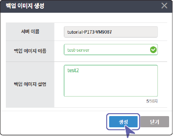

# 서버 백업하기

서버가 정지된 상태에서 현재 서버 설정을 스냅샷 이미지로 저장해 백업할 수 있습니다.

현재 사용중인 서버를 백업하려면 다음 순서대로 진행하세요.

1. 전체 서버 목록에서 백업할 서버 항목의  > **정지**를 클릭하세요.

- 서버 상세 페이지 상단의 을 클릭해도 서버를 정지할 수 있습니다.

- 서버가 정지 상태가 아닌 경우 백업 이미지 생성 메뉴는 비활성화됩니다.

2. 서버가 정지되면  > **백업 이미지 생성**을 클릭하세요.

3. 백업 이미지 생성창이 나타나면 백업 이미지 이름과 설명을 입력하고 **생성**을 클릭하세요.

- 생성한 백업 이미지는 **서버가상화** > **백업 이미지 관리** > **서버 백업 이미지** 탭에 추가됩니다.

