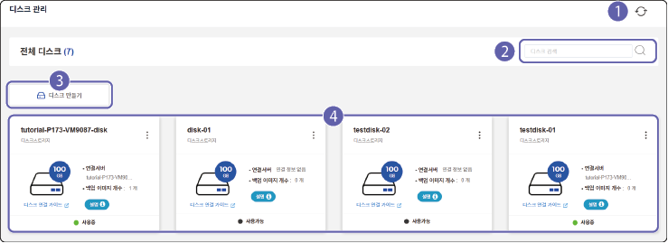
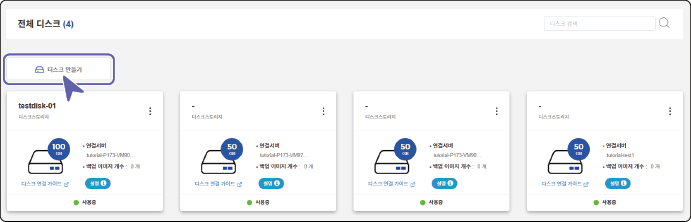
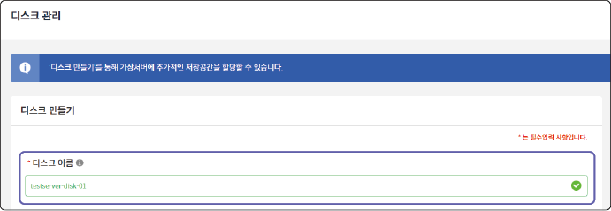
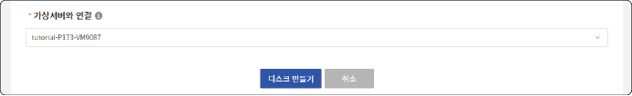
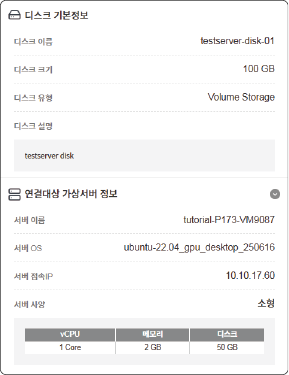
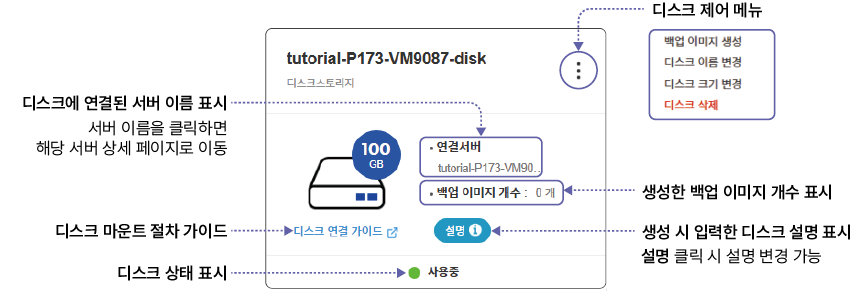
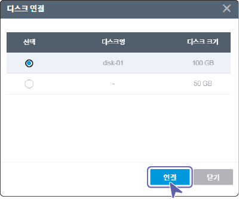

# 디스크 생성 및 관리하기

서버에 연결해 작업 데이터를 저장하는 가상 디스크를 생성할 수 있습니다. 하나의 서버에 여러 개의 가상 디스크를 연결해 관리할 수 있습니다.

## 화면 구성 {#화면-구성}

사용자가 생성한 전체 디스크 목록을 확인할 수 있습니다. 전체 디스크 화면은 다음과 같이 구성됩니다.

| 번호 | 항목 | 설명 |

| --- | --- | --- |

| 1 | 새로고침 | 디스크 목록을 새로고침합니다. |

| 2 | 검색창 | 디스크명을 입력해 검색할 수 있습니다. |

| 3 | 디스크 만들기 | 프로젝트에서 사용할 디스크를 생성할 수 있습니다. |

| 4 | 디스크 목록 | 등록된 전체 디스크 목록을 확인할 수 있습니다.<ul><li>각 디스크의 정보는 카드 형태로 표시됩니다.</li></ul> |

## 디스크 생성하기 {#디스크-생성하기}

디스크를 생성하려면 다음 순서대로 진행하세요.

1. 클라우드 메인 페이지에서 **프로젝트**를 클릭하세요.

2. 프로젝트 목록에서 디스크를 생성할 프로젝트를 선택하세요.

- 프로젝트를 선택해야 왼쪽 메뉴에서 서버 가상화를 선택할 수 있습니다.

3. 서버가상화 메뉴에서 **디스크 관리**를 클릭하세요.

4. 디스크 관리 페이지에서 **디스크 만들기**를 클릭하세요.

5. 디스크 만들기 페이지에서 상세 항목을 입력하고 **디스크 만들기**를 클릭하세요.

- [*]가 표시된 항목은 필수 입력 항목이므로 반드시 입력하세요.

- **디스크 이름**

&#x20; 사용할 디스크 이름을 지정합니다.

&#x20; - disk - 00 조합으로 자동 입력됩니다. 필요 시 사용자가 원하는 이름을 입력할 수 있습니다.

&#x20;

&#x20; 

- **디스크 크기**

&#x20; 생성할 저장 공간 크기를 설정합니다.

&#x20; - 프로젝트 사용 가능 디스크 정보에서 사용중인 공간과 남은 공간을 확인할 수 있습니다. 남은 공간 내에서 디스크 크기를 입력합니다.

&#x20; - 최대 2 TB 이내에서 디스크 크기를 설정할 수 있습니다.

&#x20; 

- **가상 서버와 연결**

&#x20; 생성한 디스크와 연결할 서버를 목록에서 선택합니다.

&#x20; 

- **디스크 생성 정보**

&#x20; 디스크 생성 정보와 연결 서버 정보를 요약해서 표시합니다.

&#x20; 

## 디스크 관리하기

디스크 관리 페이지에서 사용자가 생성한 전체 디스크 목록을 확인하고 관리할 수 있습니다.

### 디스크 상세 정보 및 메뉴 설명

디스크 목록에 표시되는 정보와 제어 메뉴를 설명합니다.

>  **참고**

>

> 디스크는 카드 정보 외에 별도의 상세 정보 페이지가 없습니다.

- **디스크 제어 메뉴**

&#x20; 디스크 제어 메뉴를 표시합니다.

&#x20; - **백업 이미지 생성**: 현재 디스크 설정을 백업 이미지로 저장할 수 있습니다.

&#x20; - **디스크 이름 변경**: 디스크 이름을 변경할 수 있습니다.

&#x20; - **디스크 크기 변경**: 디스크 용량을 변경할 수 있습니다. 디스크가 서버에 연결되지 않은 상태에만 용량 변경이 가능합니다.

&#x20; - **디스크 삭제**: 사용가능 상태의 디스크를 삭제할 수 있습니다.

 - 디스크와 서버의 연결이 해제된 경우에만 삭제할 수 있습니다. 디스크 연결 해제에 대한 자세한 설명은 [디스크 연결 정보](#디스크-연결-정보)를 참고하세요.

 - 삭제한 디스크는 복구할 수 없습니다. 디스크 삭제 전 백업 이미지를 생성하거나 필요한 데이터를 별도로 저장하세요.

## 디스크 연결하기

생성한 디스크를 서버에 연결해 사용할 수 있습니다.

디스크를 연결하려면 다음 순서대로 진행하세요.

1. 서버 상세 페이지에서  > **디스크 연결**을 클릭하세요.

2. 디스크 연결창이 나타나면 연결할 디스크를 선택하고 **연결**을 클릭하세요.

- 서버에 디스크가 연결되면 해당 디스크 정보가 **서버 상세 페이지** > **디스크 연결 정보**에 표시되며, 디스크 목록의 디스크 정보에는 연결 서버 정보가 표시됩니다.

