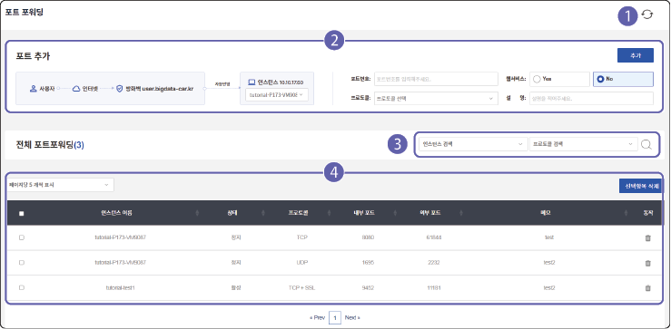

## 포트 포워딩하기 {#포트-포워딩하기}

외부 네트워크의 사용자가 정해진 포트를 통해 서버에 접속할 수 있도록 포트 포워딩을 설정할 수 있습니다. 서버에서 외부 사용자나 클라이언트에게 제공할 서비스나 웹 애플리케이션 등을 개발한 경우 특정 포트를 지정해 외부 접속이 가능하도록 설정할 수 있습니다.

> **주의** 

>

> 포트 포워딩을 설정해 VPN 접속 없이 서버에 접속하면 보안상 위험할 수 있습니다. 포트 포워딩은 반드시 필요한 경우에만 사용하세요.

### 화면 구성

등록한 포트 포워딩 목록을 확인할 수 있습니다. 포트 포워딩 화면은 다음과 같이 구성됩니다.

| 번호 | 항목 | 설명 |
| --- | --- | --- |
| 1 | 새로고침 | 포트 포워딩 목록을 새로고침합니다. |
| 2 | 포트 추가 | 가상 서버(인스턴스)에 포트 포워딩 정보를 설정할 수 있습니다.<ul><li>포트 포워딩 추가에 대한 자세한 설명은 [포트 추가하기](#포트-추가하기)를 참고하세요.</li></ul> |
| 3 | 검색창 | 서버명이나 프로젝트명을 입력해 검색할 수 있습니다. |
| 4 | 포트 목록 | 등록된 전체 포트 포워딩 목록을 확인할 수 있습니다.<ul><li>삭제할 항목의 를 클릭하면 포트 포워딩을 삭제할 수 있습니다. <ul><li>또는 삭제할 항목의 체크 박스를 선택하고 **선택항목 삭제**를 클릭해도 포트 포워딩을 삭제할 수 있습니다.</li></ul></li></ul> |

### 포트 추가하기 {#포트-추가하기}

특정 서버에 포트 포워딩을 설정하려면 다음 순서대로 진행하세요.

1. 클라우드 메인 페이지에서 **프로젝트**를 클릭하세요.

2. 프로젝트 목록에서 원하는 프로젝트를 선택하세요.

3. 서버가상화 메뉴에서 **포트 포워딩**을 클릭하세요.

4. 포트 포워딩 페이지에서 포트 추가 항목을 설정하고 **추가**를 클릭하세요.

- **인스턴스 목록**

   포트 포워딩을 설정할 가상 서버(인스턴스)를 선택합니다.

- **포트 포워딩 정보**

   포트 포워딩 상세 정보를 설정합니다.

   - **포트번호**: 포트 포워딩에 사용할 포트 번호를 입력합니다.

   - **웹서비스**: 해당 포트를 웹 서비스용으로 사용할 지 설정합니다. 웹 서비스를 사용하려면 **YES**를 선택합니다. YES를 선택하면 통신 프로토콜이 **TCP + SSL**로 자동 지정됩니다. 이 프로토콜을 이용해 보안이 강화된 HTTP/HTTPS 기반 웹 트래픽 서비스를 제공할 수 있습니다.

   - **프로토콜**: 해당 포트에서 사용할 통신 프로토콜(TCP/UDP)를 선택합니다.

   - **설명**: 포트 포워딩의 설명을 입력합니다.

5. 포트 추가 확인창이 나타나면 **예**를 클릭하세요.

6. 포트 추가 완료창이 나타나면 **확인**을 클릭하세요.

