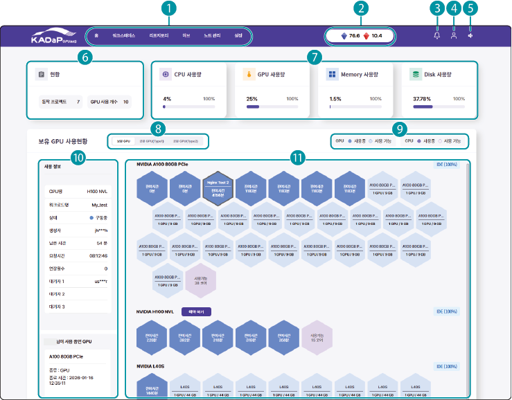

# 인공지능 개발 플랫폼 서비스 사용

인공지능 개발 플랫폼에 로그인 후 할당된 워크스페이스 내에서 워크로드를 생성해 실행할 수 있습니다. 워크로드 실행에 필요한 소스코드, 데이터셋 및 모델 경로를 리포지토리에 등록해 사용할 수 있습니다.

## 홈 화면 구성

인공지능 개발 플랫폼의 홈 화면은 다음과 같이 구성됩니다. 각 항목별 기능을 설명합니다.

| 번호 | 항목 | 설명 |
| --- | --- | --- |
| 1 | 인공지능 개발 플랫폼 메인 메뉴 | 인공지능 개발 플랫폼의 메뉴를 선택합니다.<ul><li>**홈**: 인공지능 개발 플랫폼 대시보드 화면으로 이동합니다.</li><li>**워크스페이스**: 워크스페이스를 추가하고 관리할 수 있습니다.</li><li>**리포지토리**: 프라이빗 레지스트리 이미지, 소스 코드, 데이터셋, 모델, 스토리지를 추가하고 관리할 수 있습니다.</li><li>**허브**: 인공지능 개발 플랫폼에서 제공하는 Object Detection 모델로 워크로드를 생성할 수 있습니다.</li><li>**노드 관리**: 사용자가 추가한 노드 목록을 확인하고 관리할 수 있습니다.</li><li>**설정**: 외부 저장소 접근 시 사용되는 크레덴셜을 추가하고 관리할 수 있습니다.</li></ul>
| 2 | 내 포인트 | 자동차데이터플랫폼(KADaP)에서 사용할 수 있는 포인트를 표시합니다. GPU 자원을 사용할 때 사용 항목별로 포인트가 차감됩니다.<ul><li>포인트: 자동차데이터플랫폼(KADaP)에서 무료로 제공하는 포인트로 자동차데이터플랫폼(KADaP) 회원으로 가입하고 로그인, 포털 검색 등 사용자 활동으로 적립.</li><li>포인트: 협약을 통해 제공하는 포인트로 공유 GPU(Type2) 사용 시 차감.</li><li>**내 포인트**를 클릭하면 **자동차 데이터 포털 > 마이디스크 > 포인트 페이지**로 이동합니다.</li></ul> |
| 3 | 알림 | 인공지능 개발 플랫폼 알림 내역을 확인할 수 있습니다.<ul><li>각 탭별로 해당 항목에서 발생한 알림 내역이 표시되며, 탭의 배지로 알림 개수를 표시합니다. **읽지 않은 알림**을 설정하면 사용자가 확인하지 않은 알림 항목만 표시됩니다.</li></ul> |
| 4 | 내 정보 | 로그인한 사용자 정보를 확인하고 로그아웃할 수 있습니다.<ul><li>**마이페이지**: 사용자 정보를 확인하고 비밀번호를 변경할 수 있습니다.</li><li>**로그아웃**: 현재 로그인한 계정을 로그아웃합니다.</li></ul> |
| 5 | 공지사항 | 관리자가 게시한 공지사항을 확인할 수 있습니다. |
| 6 | GPU 사용 현황 | 현재 구동되는 프로젝트 및 GPU 자원 사용 현황을 표시합니다. |
| 7 | 자원 사용 현황 | 전체 인공지능 개발 플랫폼 자원 중 CPU, GPU, 메모리, 가상 디스크 자원 사용 현황을 표시합니다. |
| 8 | 자원 존 선택 탭 | 자원 존을 선택해 존별로 자원 사용 현황을 확인할 수 있습니다. |
| 9 | GPU/CPU 사용 상태 표시 기준 | 자원 존의 GPU/CPU 사용 상태 기준이 표시됩니다. |
| 10 | GPU 사용 정보 | GPU 자원 목록에서 특정 GPU를 선택하면 현재 사용 정보가 표시되며, 하단에는 사용자가 사용 중인 GPU 정보가 표시됩니다. |
| 11 | GPU 슬롯 목록 | 선택한 자원 존의 GPU 목록이 표시됩니다. <ul><li>GPU 슬롯을 선택하면 사용 정보의 **워크로드 생성**을 클릭해 워크로드를 바로 생성할 수 있습니다.</li><li>각 GPU 슬롯 목록 오른쪽에 현재 인공지능 개발 플랫폼 실행 모드가 표시됩니다.<ul><li>**IDE**: Web IDE를 활용하여 사용자가 AI 개발을 수행하는 모드</li><li>**Batch**: 개발된 코드를 업로드해 분산 학습을 수행하는 모드</li></li></ul></ul>|

