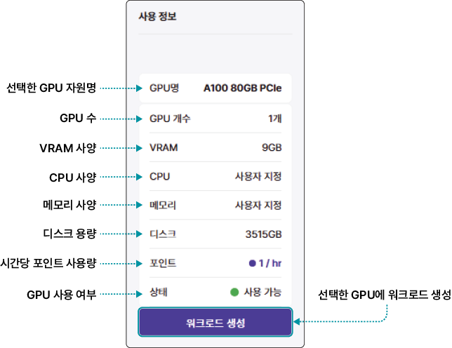
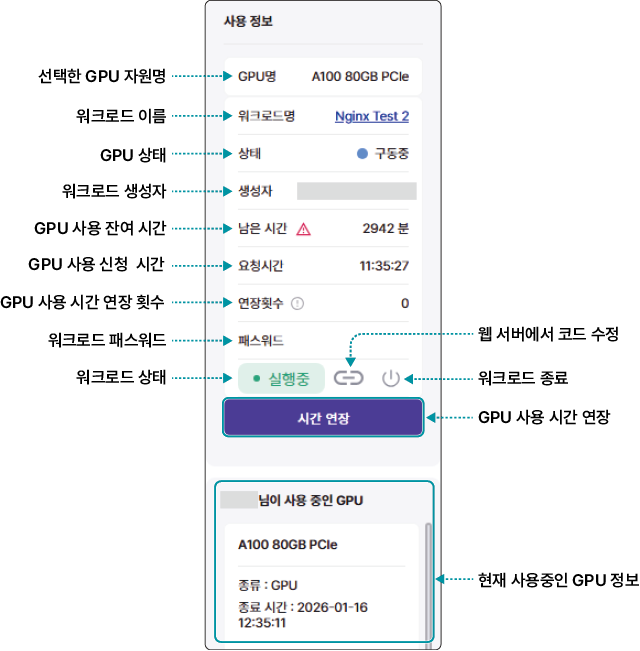
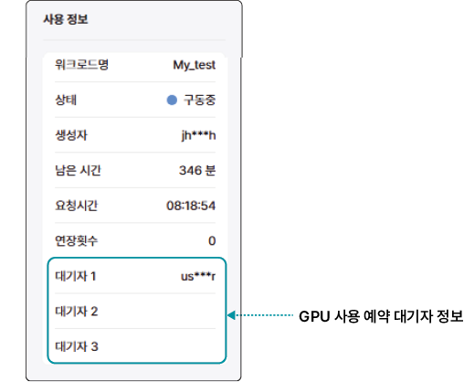
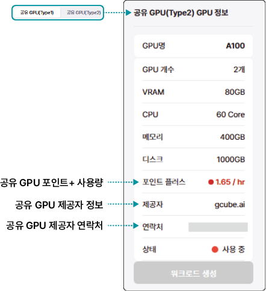

# 워크로드 사용 정보 확인하기

인공지능 개발 플랫폼 대시보드의 GPU 슬롯 목록에서 GPU 슬롯을 클릭하면 왼쪽에서 상세 사용 정보를 확인할 수 있습니다.

[[TIP("참고")]]
사용자가 사용 중인 GPU의 정보와 다른 사용자가 사용 중인 GPU를 클릭했을 때 표시되는 항목이 다릅니다.
[[/TIP]]

[TOC]

## 보유 GPU 워크로드 생성시 정보 확인 하기 

보유 GPU 탭에는 자동차데이터플랫폼(KADaP)에서 보유한 GPU 목록이 표시됩니다. GPU 슬롯을 클릭하면 슬롯 상태에 따라 다음과 같이 상세 정보가 표시됩니다.

### 사용 가능한 GPU 슬롯 정보

### 내가 사용 중인 GPU 슬롯 정보

[[TIP("참고")]]
- 워크로드명의 링크를 클릭하면 워크로드 상세 페이지로 이동합니다.
 - 남은 시간의 에 마우스를 올리면 사용 툴팁이 표시됩니다.
 - GPU 사용 시간 연장에 대한 자세한 설명은 [GPU 사용 연장하기](#gpu-사용-연장하기)를 참고하세요.
[[/TIP]]

### 다른 사용자가 사용 중인 GPU 슬롯 정보

[[TIP("참고")]]
GPU 사용 예약을 신청하면 대기자 목록에 예약 순서대로 추가됩니다. GPU 사용 예약에 대한 자세한 설명은 [GPU 사용 예약하기](https://wikidocs.net/375266)을 참고하세요.
[[/TIP]]

## 공유 GPU 워크로드 생성시 정보 확인 하기 

공유 GPU 탭에는 제공자(기관) 정보 및 연락처가 추가로 표시 됩니다. 

