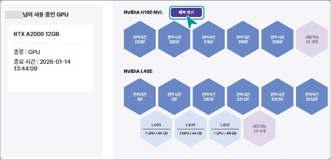

### 워크로드 사용 예약하기 {#gpu-사용-예약하기}

현재 다른 사용자가 사용 중인 GPU의 사용 예약을 할 수 있습니다. 다른 사용자의 워크로드가 종료되면 예약한 워크로드가 생성되어 실행됩니다.

GPU 사용 연장을 신청하려면 다음 순서대로 진행하세요.

1. 인공지능 개발 플랫폼 홈 화면에서 사용하려는 GPU 항목의 **예약하기**를 클릭하세요.

2. 워크로드 예약창이 나타나면 생성할 워크로드 정보를 입력하거나 선택하세요.

- 워크로드 생성 예약창은 워크로드 바로 생성하기 화면과 동일합니다. 자세한 설명은 [워크로드 바로 생성하기](#워크로드-바로-생성하기)를 참고하세요.

- 예약창의 **워크로드 상세 설정**을 클릭하면 **워크스페이스** > **워크로드** > **워크로드 생성** 페이지로 이동합니다.

3. **워크로드 예약**을 클릭하세요.

- GPU 워크로드 생성예약이 완료되면 선택한 GPU 사용 정보의 대기자 항목에 사용자 정보가 표시됩니다. 대기자는 최대 3명까지 표시되며 신청 순서대로 등록됩니다.

> **참고**

>

>워크로드 생성 예약을 취소하려면 워크로드 목록에서 대기중 항목의 를 클릭하세요.

