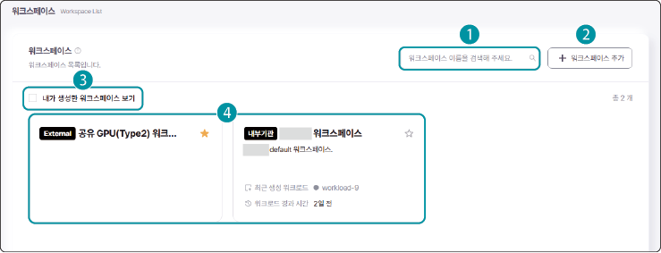
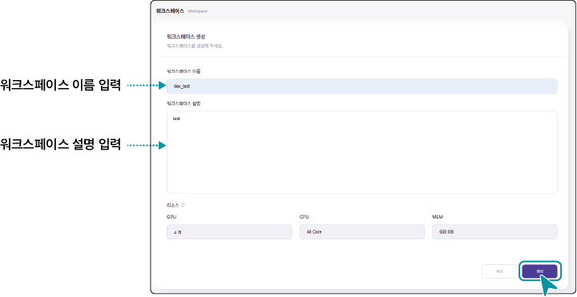

# 워크스페이스 관리하기

[TOC]
인공지능 개발 플랫폼에 로그인하면 사용자의 기본 워크스페이스 1개가 자동 할당됩니다. 기본워크스페이스의 리소스는 관리자가 설정한 기본 사양으로 적용됩니다.

[[TIP("참고")]]
- 워크스페이스에서는 워크로드를 생성하고 상세 정보를 확인할 수 있습니다. 
- 또한 워크스페이스를 공유해 다른 구성원과 협업하며 AI 모델을 개발하고 테스트할 수 있습니다. (2026.07월 현재 보유 GPU & 공유 GPU Type1 워크스페이스만 가능합니다. )
[[/TIP]]

## 워크스페이스 목록 화면 구성

인공지능 개발 플랫폼 홈 화면에서 메인 메뉴의 **워크스페이스**를 클릭하면 워크스페이스 목록을 확인할 수 있습니다.

| 번호 | 항목 | 설명 |
| --- | --- | --- |
| 1 | 검색창 | 워크스페이스 이름을 입력해 검색합니다. |
| 2 | + 워크스페이스 추가 | 새로운 워크스페이스를 생성합니다. |
| 3 | 내가 생성한 워크스페이스 보기 | 워크스페이스 목록에 내가 생성한 워크로드만 표시합니다. |
| 4 | 워크스페이스 목록 | 워크스페이스 상세 정보를 표시합니다. <ul><li>워크스페이스 정보: 자원 존, 워크스페이스 이름 및 설명, 최근 생성한 워크로드 정보를 표시합니다.</li><li>:워크스페이스에 핀을 설정합니다. 핀을 설정하면 정렬 순서에 상관없이 항상 목록 최상단에 표시됩니다.</li></ul> |

## 워크스페이스 추가

워크스페이스는 사용자별로 1개씩 할당 됩니다. 

워크스페이스를 추가하려면 관리자에게 요청하거나, 기존 워크스페이스를 삭제하고 새로 생성하세요.
 

[[TIP("참고")]]
현재 사용 중인 워크스페이스 외에 추가적으로 워크스페이스가 필요한 경우, 관리자에게 메일로 문의해 추가할 수 있습니다. (관리자 메일 주소: admin@bigdata-car.kr)
[[/TIP]]

워크스페이스를 추가하려면 다음 순서대로 진행하세요.

1. 인공지능 개발 플랫폼 홈 화면에서 메인 메뉴의 **워크스페이스**를 클릭하세요.

2. 워크스페이스 목록 페이지에서 **+ 워크스페이스 추가**를 클릭하세요.

3. 워크스페이스 생성 페이지가 나타나면 상세 정보를 입력하고 **생성**을 클릭하세요.

- 워크스페이스 이름과 워크스페이스 설명은 필수 항목이므로 반드시 입력해야 합니다.

- 워크스페이스의 리소스는 관리자가 설정한 사양으로 적용되어 수정할 수 없습니다.

- 관리자가 승인이 완료된 후에만 워크스페이스 추가 생성이 가능하며, 생성이 완료되면 워크스페이스 목록에 추가됩니다.

- 관리자 승인이 완료되지 않은 경우 생성 불가 안내 메시지가 오른쪽 상단에 나타납니다.

## 워크스페이스 상세 정보 확인

워크스페이스의 상세 정보를 확인하고 수정하거나 삭제할 수 있습니다.

워크스페이스 정보를 확인하려면 다음 순서대로 진행하세요.

1. 인공지능 개발 플랫폼 홈 화면에서 메인 메뉴의 워크스페이스를 클릭하세요.

2. 워크스페이스 목록 페이지가 나타나면 확인할 **워크스페이스**를 클릭하세요.

3. 상단의 서브 메뉴에서 **상세정보**를 클릭하세요.

4. 워크스페이스 상세 정보 페이지에서 원하는 정보를 확인하세요.

[[TIP("주의")]]
워크스페이스 내에 워크로드가 1개라도 있으면 워크스페이스를 삭제할 수 없습니다. 워크스페이스를 삭제하려면 먼저 워크스페이스 내의 워크로드를 모두 삭제하세요.
[[/TIP]]

