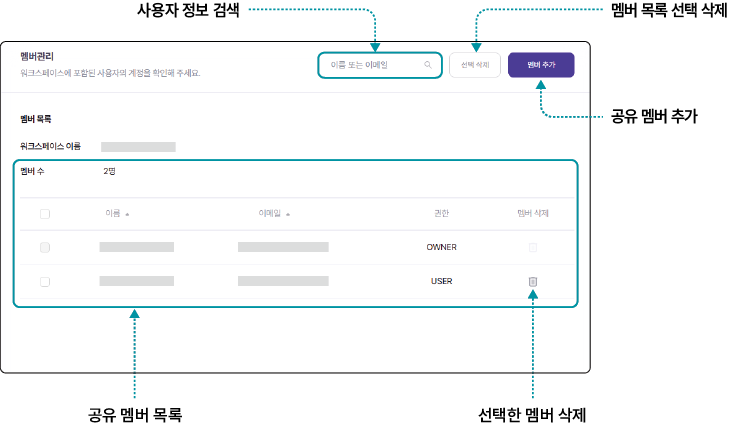
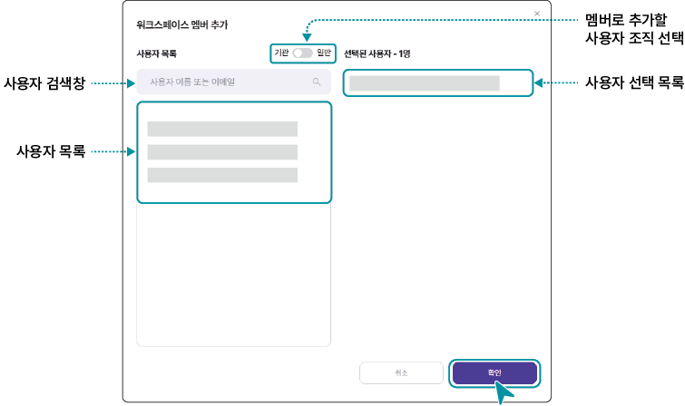

# 워크스페이스 설정하기

현재 사용 중인 워크스페이스의 데이터를 공유할 멤버를 추가하거나 삭제하고, 관리자에게 리소스를 요청하는 등 워크스페이스 설정을 관리할 수 있습니다.

## 멤버 관리

사용자의 리포지토리를 공유할 멤버를 추가하거나 삭제할 수 있습니다. 추가된 멤버들과 소스 코드, 데이터셋 경로, 모델 정보를 공유하고 협업할 수 있습니다.

워크스페이스에 멤버를 추가하려면 다음 순서대로 진행하세요.

1. 인공지능 개발 플랫폼 홈 화면에서 메인 메뉴의 **워크스페이스**를 클릭하세요.

2. 워크스페이스 목록 페이지가 나타나면 멤버 관리를 진행할 워크스페이스를 클릭하세요.

3. 상단의 서브 메뉴에서 **워크스페이스 설정**을 클릭하세요.

4. 워크스페이스 설정 페이지에서 왼쪽의 **멤버 관리**를 클릭하세요.

5. 멤버 관리 페이지에서 멤버를 추가하거나 삭제하세요.

- 워크스페이스의 소유자는 삭제할 수 없으며 추가한 멤버만 삭제할 수 있습니다.

**멤버 추가**

워크스페이스에 멤버를 추가하려면 다음 순서대로 진행하세요.

1. 멤버 관리 페이지에서 **멤버 추가**를 클릭하세요.

2. 워크스페이스 멤버 추가창이 나타나면 추가할 사용자를 검색하거나 목록에서 선택하세요.

- 사용자 조직을 선택하면 해당 조직의 사용자만 확인할 수 있습니다.

  - **기관**: 사용자와 동일한 기관에 소속된 사용자로 이메일의 도메인이 동일한 경우 자동으로 사용자 목록에 표시됩니다.

  - **일반**: 사용자와 다른 조직에 소속된 사용자로 사용자의 전체 이메일 주소를 입력해 검색하면 사용자 목록에 표시됩니다.

3. 추가할 사용자를 확인하고 **확인**을 클릭하세요.

- 멤버 추가를 완료하면 선택한 사용자에게 초대 알림이 전송됩니다. 알림을 수신한 사용자가 초대를 수락하면 추가가 완료됩니다.

## 공유 리포지토리

워크스페이스 멤버와 공유할 소스코드와 데이터셋, 모델 경로를 추가할 수 있습니다.

> **참고**
>
> 리포지토리 메뉴에서 소스코드 및 데이터셋, 모델 경로를 추가할 수 있습니다.
> - 리포지토리에 해당 항목을 추가하는 자세한 설명은 [리포지토리 추가 및 관리하기](#리포지토리-추가-및-관리하기)를 참고하세요.

워크스페이스에 데이터를 등록하려면 다음 순서대로 진행하세요.

1. 인공지능 개발 플랫폼 홈 화면에서 메인 메뉴의 **워크스페이스**를 클릭하세요.
2. 워크스페이스 목록 페이지가 나타나면 데이터 경로를 추가할 워크스페이스를 클릭하세요.
3. 상단의 서브 메뉴에서 **워크스페이스 설정**을 클릭하세요.
4. 워크스페이스 설정 페이지에서 왼쪽의 **공유 리포지토리**를 클릭하세요.
5. 공유 리포지토리 페이지에서 추가할 항목을 선택해 등록하세요.

   

**공유 리포지토리 경로 추가**

> **참고**
>
> 공유 리포지토리 경로를 추가하는 방법은 소스코드, 데이터셋, 모델 경로 모두 동일합니다. 공유 소스코드를 예시로 추가 절차를 설명합니다.

공유 리포지토리 경로를 추가하려면 다음 순서대로 진행하세요.

1. 공유 리포지토리 페이지에서 **+ 공유 소스코드 추가**를 클릭하세요.
2. 공유 소스코드 추가창이 나타나면 소스코드 목록에서 소스코드를 선택하세요.
   - 소스코드를 새로 등록하려면 **+소스코드 생성**을 클릭합니다. 소스코드 바로 생성 화면에서 소스코드를 등록할 수 있습니다.

   

3. 기본 마운트 경로를 입력하고 **확인**을 클릭하세요.

## 리소스 요청

워크스페이스 사용 중 리소스가 부족한 경우 관리자에게 워크스페이스의 리소스를 추가 요청할 수 있습니다.

워크스페이스의 리소스를 추가 요청하려면 다음 순서대로 진행하세요.

1. 인공지능 개발 플랫폼 홈 화면에서 메인 메뉴의 **워크스페이스**를 클릭하세요.
2. 워크스페이스 목록 페이지가 나타나면 리소스를 요청할 워크스페이스를 클릭하세요.
3. 상단의 서브 메뉴에서 **워크스페이스 설정**을 클릭하세요.
4. 워크스페이스 설정 페이지에서 왼쪽의 **리소스 요청**을 클릭하세요.
5. 리소스 요청 페이지에서 요청할 리소스 항목과 요청사유를 입력하고 **리소스 요청**을 클릭하세요.
   - 관리자가 리소스 요청을 승인하면 신청한 시간 동안 워크스페이스에서 추가 리소스를 사용할 수 있습니다.

   

> **참고**
>
> 관리자 승인 전 대기 상태에서는 추가로 리소스 요청을 할 수 없습니다.

## 알림 설정

워크스페이스 사용 중 사용자가 수신할 알림 항목을 설정할 수 있습니다.

워크스페이스의 알림을 설정하려면 다음 순서대로 진행하세요.

1. 인공지능 개발 플랫폼 홈 화면에서 메인 메뉴의 **워크스페이스**를 클릭하세요.
2. 워크스페이스 목록 페이지가 나타나면 알림을 설정할 워크스페이스를 클릭하세요.
3. 상단의 서브 메뉴에서 **워크스페이스 설정**을 클릭하세요.
4. 워크스페이스 설정 페이지에서 왼쪽의 **알림 설정**을 클릭하세요.
   - 각 항목의 알림을 수신할 방법을 설정합니다.

   

   - **이미지 커밋 등록 알림** 항목을 설정하면 워크로드 종료 후 컨테이너 이미지 저장 시 알림이 전송됩니다.

