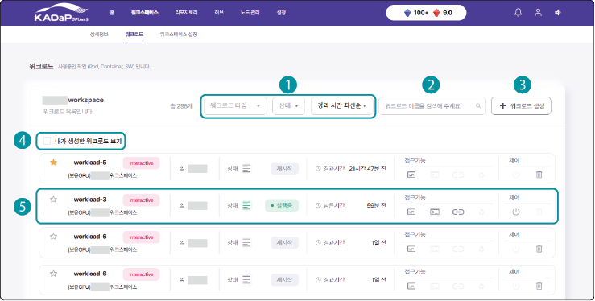
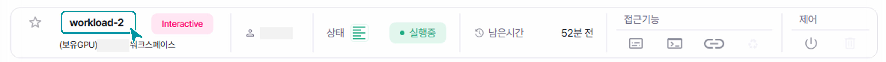
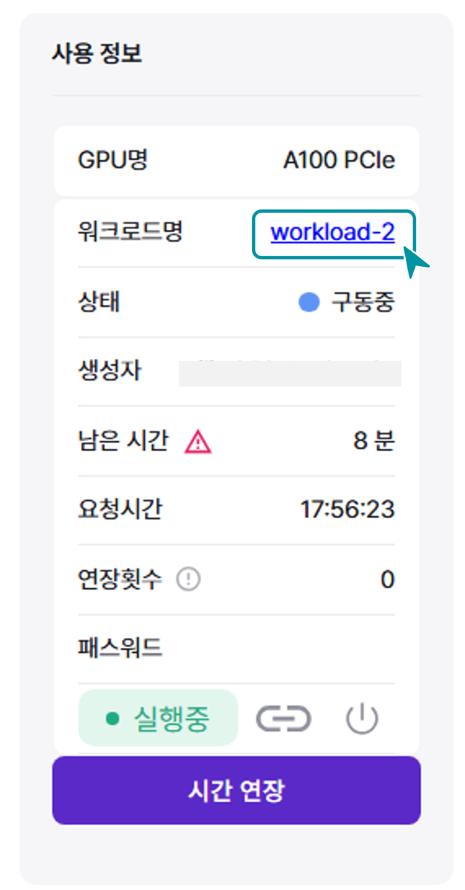
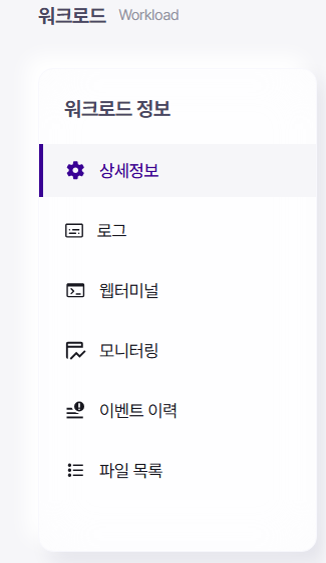
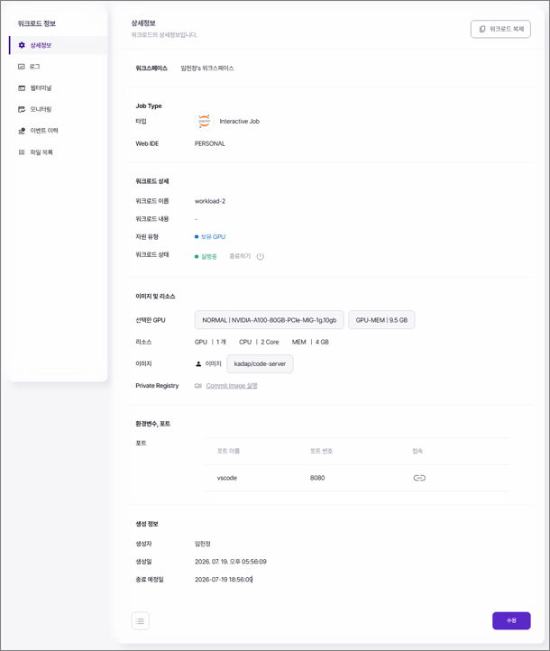
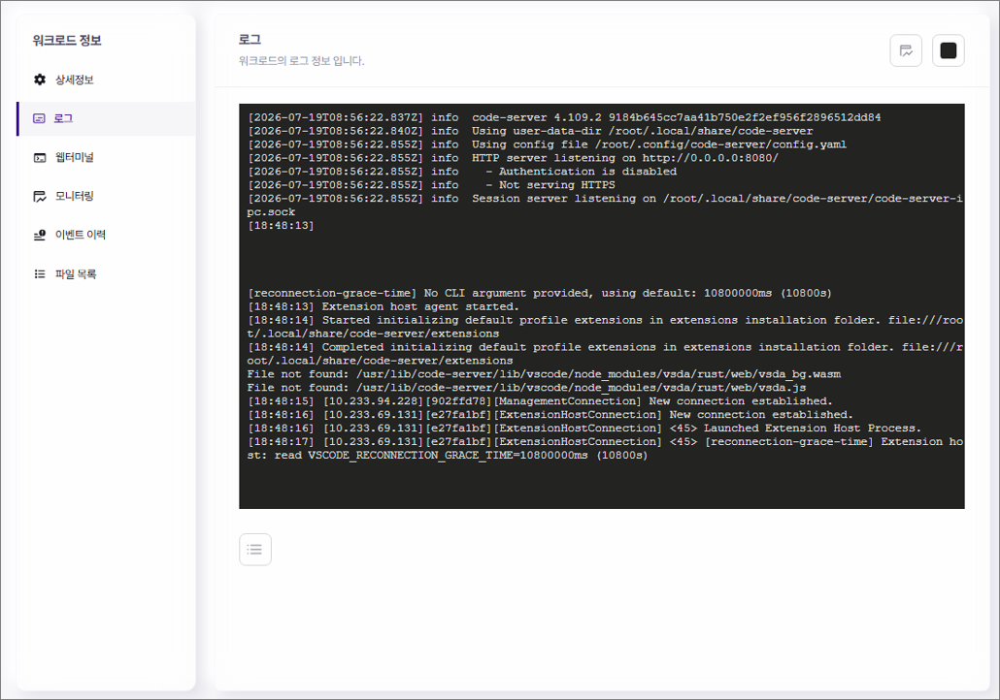
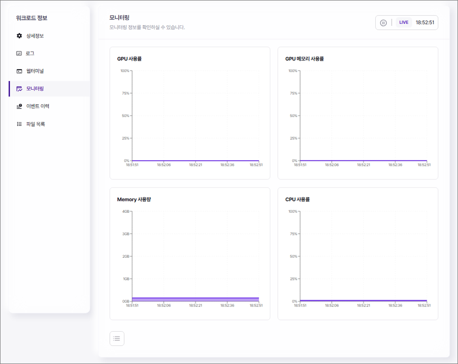
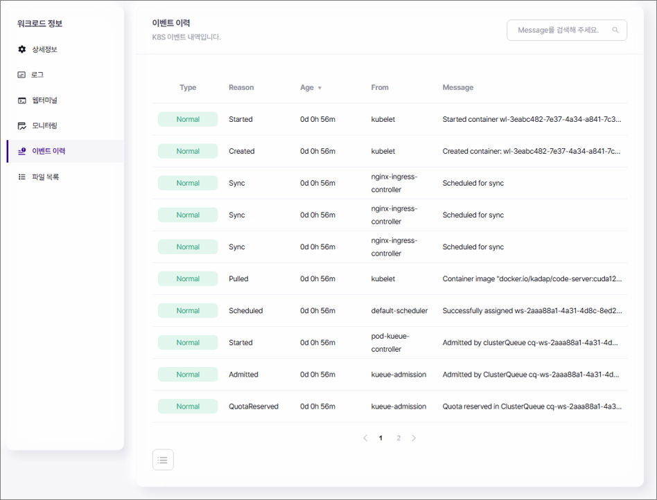

# 워크로드 관리하기

생성한 워크로드의 상세 정보를 확인하고 로그, 모니터링, 이벤트 이력을 확인할 수 있습니다. 구동중인 워크로드에서는 웹터미널 접속창을 실행할 수 있고, 파일 목록에서 데이터를 업로드하고 확인할 수 있습니다.

[TOC]

## 워크로드 목록 확인

사용자가 생성한 워크로드나 다른 사용자가 공유한 워크로드 목록을 확인할 수 있습니다.

[[TIP("참고")]]
생성한 워크로드 종류에 따라 워크로드를 제어할 수 있는 상세 항목이 달라집니다.
[[/TIP]]

| 번호 | 항목 | 설명 |
| --- | --- | --- |
| 1 | 워크로드 목록 필터 | 목록 필터를 선택해 워크로드 목록에 적용합니다.<ul><li>**워크로드 타입**: 워크로드의 Job 종류별로 표시</li><li>**상태**: 워크로드의 실행, 대기, 에러, 종료 상태 기준으로 표시</li><li>경과 시간 순서: 워크로드 생성 후 종료 시간 기준으로 최신순/과거순으로 표시</li></ul> |
| 2 | 검색창 | 워크로드 이름을 입력해 검색합니다. |
| 3 | + 워크로드 생성 | 새로운 워크로드를 생성합니다. |
| 4 | 내가 생성한 워크로드 보기 | 워크로드 목록에 내가 생성한 워크로드만 표시합니다. |
| 5 | 워크로드 상세 항목 | 워크로드 상세 정보를 표시합니다.<ul><li>: 워크로드에 핀을 설정합니다. 핀이 설정되면 정렬 순서에 상관없이 항상 목록 최상단에 표시됩니다. 핀은 최대 6개까지 설정할 수 있습니다.</li><li>워크로드 정보: 워크로드 이름, Job 종류, 워크스페이스 이름을 표시합니다.</li><li>생성자: 워크로드 생성자 이름을 표시합니다.</li><li>상태: 상태 아이콘을 클릭하면 이벤트 내역 페이지로 이동합니다.</li><ul><li>**대기중**: 워크로드가 생성되어 실행 대기중입니다.</li><li>**실행중**: 현재 워크로드가 구동중입니다.</li><li>**재시작**: 워크로드가 종료되어 해당 워크로드 정보로 워크로드를 생성할 수 있습니다. 재시작을 클릭하면 워크로드 생성 페이지로 이동합니다.</li></ul><li>시간 정보: 워크로드 종료 후 경과 시간과 실행중인 워크로드의 남은 시간을 표시합니다.</li><li>접근 기능: 워크로드의 상세 정보를 표시합니다.<ul><li>: 워크로드의 로그 페이지로 이동합니다.</li><li>: 워크로드의 웹터미널 페이지로 이동합니다. 웹터미널 아이콘은 실행중인 경우에만 활성화됩니다.</li><li>: 워크로드에 연결합니다.. 연결된 포트가 여러 개인 경우 포트 목록이 표시됩니다.</li><li>: 워크로드의 배치 작업을 실행할 수 있습니다.</li></ul><li>제어: 실행중 상태의 워크로드를 제어합니다.<ul><li>: 워크로드를 종료합니다.</li><li>: 워크로드를 삭제합니다.</li></ul></li></ul> |

## 워크로드 관리 기능

워크로드 목록에서 **워크로드 이름**를 선택하면 상세 정보 및 여러 관리 기능을 활용 할 수 있습니다. 

### 상세 정보

워크로드 정보 페이지에서 왼쪽의 **상세정보**를 클릭하세요.

- 워크로드 복제: **워크로드 복제**를 클릭하면 현재 설정으로 워크로드를 생성할 수 있습니다.

- 워크로드 종료/삭제: **종료하기** 를 클릭하면 구동중인 워크로드를 종료할 수 있습니다. 워크로드의 종료 시점에는 삭제 버튼으로 변경됩니다.

- 워크로드의 컨테이너 이미지 생성: **Commit Image 실행**을 클릭하면 구동중인 워크로드의 설정을 컨테이너 이미지로 저장할 수 있습니다. Container Image 생성창이 나타나면 이름과 태그를 입력하고 **생성**을 클릭합니다.

  - 저장한 컨테이너 이미지는 **리포지토리** > **프라이빗 레지스트리** 목록에 추가됩니다.

- 워크로드 서버 접속: 을 클릭하면 워크로드의 포트로 연결되며 코드를 작성하거나 수정해 실행할 수 있습니다.

- 워크로드 수정: **수정**을 클릭해 워크로드 설정을 변경할 수 있습니다. **저장**을 클릭해 완료합니다.

- 워크로드 삭제: **삭제**를 클릭해 종료된 워크로드를 삭제할 수 있습니다. 삭제 확인창이 나타나면 **확인**을 클릭해 삭제합니다.

### 로그

워크로드의 로그 정보에서 상태 및 오류를 확인할 수 있습니다.

워크로드 정보 페이지에서 왼쪽의 **로그**를 클릭하세요.

- 워크로드의 로그 이력이 표시됩니다.

- 을 클릭하면 모니터링 그래프가 오른쪽에 표시됩니다.

- 을 클릭하면 로그창의 배경색을 변경할 수 있습니다.

[[TIP("참고")]]
Batch Job 워크로드의 경우 로그창에 게이지 바가 표시됩니다. 게이지 바는 현재 워크로드의 작업 예상 시간 정보를 제공합니다.
[[/TIP]]

### 웹터미널

웹터미널에서 실시간으로 애플리케이션을 제어하고 디버깅할 수 있습니다. 또한 워크로드의 실행 상태, 결과, 작업 진행 상황을 확인할 수 있습니다.

[[TIP("참고")]]
 워크로드의 웹터미널 메뉴는 실행중인 워크로드에만 표시됩니다.
[[/TIP]]

워크로드 정보 페이지에서 왼쪽의 **웹터미널**을 클릭하세요.

웹터미널 접속창이 나타나면 직접 명령어를 입력해 실행하세요.

- 서버에 접속해 원하는 작업을 실행할 수 있습니다.

[[TIP("참고")]]
- Batch Job 워크로드의 경우 웹터미널에 게이지 바가 표시됩니다.
- 게이지 바는 현재 워크로드의 작업 예상 시간 정보를 제공합니다.
[[/TIP]]

### 모니터링

구동중인 워크로드의 실시간 사용률을 모니터링할 수 있으며, 종료된 워크로드의 자원 사용률 모니터링 이력을 확인할 수 있습니다.

워크로드 정보 페이지에서 왼쪽의 **모니터링**을 클릭하세요.

모니터링 항목에서 워크로드의 자원 사용률을 확인하세요.

- : 구동중인 워크로드의 실시간 모니터링을 정지합니다. 실시간 모니터링을 정지하면 기간을 설정해 자원 사용률을 조회할 수 있습니다.

- : 실시간 모니터링을 다시 시작합니다.

### 이벤트 이력

워크로드 K8s 컨테이너의 이벤트 발생 내역을 확인할 수 있습니다.

워크로드 정보 페이지에서 왼쪽의 **이벤트 이력**을 클릭하세요.

이벤트 내역에서 K8s 이벤트 메시지를 확인하세요.

- 검색창에 이벤트 메시지를 입력해 이벤트를 검색할 수 있습니다.

### 파일 목록 

구동중인 워크로드의 파일 목록에서는 애플리케이션의 구성과 파일 상태를 확인할 수 있습니다. 워크로드 구동 중 필요한 파일을 업로드하고 저장한 파일을 확인할 수 있습니다.

[[TIP("참고")]]
워크로드의 파일 목록 메뉴는 실행중인 워크로드에만 표시됩니다.
[[/TIP]]

워크로드 정보 페이지에서 왼쪽의 **파일 목록**을 클릭하세요.

파일 목록 페이지에서 워크로드에 사용되는 파일을 업로드하거나 다운로드하세요.

- 워크로드에 사용할 파일을 폴더를 생성해 업로드할 수 있습니다.

- 워크로드에서 사용한 데이터는 아래 경로에 저장됩니다. **전체** > **root** > **자동차데이터플랫폼(KADaP)** > **MyDisk**

**추가 메뉴**

마이디스크에 폴더를 추가하거나 삭제할 수 있습니다.

-  > **폴더 추가**를 클릭하면 디렉토리에 폴더를 추가할 수 있습니다. 단, 최하위 폴더 안에서는 새로운 폴더를 생성할 수 없습니다.

-  > **삭제**를 클릭하면 선택한 폴더나 파일을 삭제할 수 있습니다.

[[TIP("참고")]]
 스토리지 타입을 **On-premise 스토리지**로 선택한 경우 파일 업로드 및 삭제, 폴더 추가 기능을 사용할 수 없습니다.
[[/TIP]]

