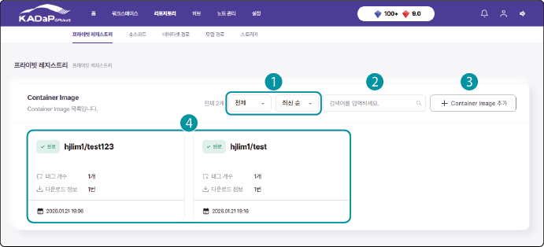
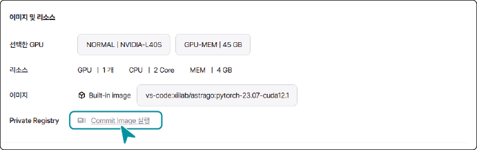

# 리포지토리 추가 - 프라이빗 레지스트리 

[TOC]

사용자 리포지토리에 저장된 Container Image 목록입니다. 

저장된 이미지는 워크로드 생성시 선택하여 기존과 동일한 워크로드를 빠르게 생성하고 실행할 수 있습니다.

## 프라이빗 레지스트리 목록 화면 구성

사용자가 추가한 프라이빗 레지스트리 목록을 확인할 수 있습니다. 프라이빗 레지스트리 목록 화면은 다음과 같이 구성됩니다.

| 번호 | 항목 | 설명 |
| --- | --- | --- |
| 1 | 프라이빗 레지스트리 목록 필터 | 목록 필터를 선택해 프라이빗 레지스트리 목록에 적용합니다.<ul><li>상태: 프라이빗 레지스트리의 진행 중, 완료 상태 기준으로 표시</li><li>생성 시간 순서: 프라이빗 레지스트리 생성 시간 기준으로 최신순/과거순으로 표시</li> |
| 2 | 검색창 | 프라이빗 레지스트리 이름을 입력해 검색합니다. |
| 3 | + Container Image 추가 | 워크로드의 설정을 가져와 Container Image를 생성합니다. |
| 4 | Container Image 목록 | Container Image 목록에는 이름과 태그 개수, 다운로드 정보, 생성 시간이 표시됩니다. <ul><li>Container Image 상세 페이지에서는 기본 정보와 태그를 확인하고 이미지 정보를 수정하거나 삭제할 수 있습니다. 또한 선택한 태그의 로그를 조회하거나 삭제할 수 있습니다.</li></ul> |

## 워크로드를 Container Image로 저장

워크로드는 다음 세 가지 방법으로 Container image로 저장 하여 재활용 할 수 있습니다.

1. 사용자가 워크로드 생성 시 **종료 시 이미지 저장**을 설정하면 워크로드가 종료된 후 Container image로 저장됩니다.

2. 구동중인 워크로드의 상세 페이지에서 **프라이빗 레지스트리** > **Commit Image 실행**을 클릭해 저장하면 Container image로 저장됩니다.

3. 프라이빗 레지스트리 페이지에서 **Container Image 추가**를 클릭해 기존 워크로드 정보를 불러와 Container image로 저장할 수 있습니다.

### 워크로드 생성 페이지에서 종료 시 이미지 저장 설정

워크로드 생성 페이지에서 종료 시 이미지 저장을 설정하려면 다음 순서대로 진행하세요.

1. 워크로드 생성 페이지에서 **이미지** > **종료 시 이미지로 저장**을 설정하세요.

2. 저장할 이미지 이름과 이미지 태그를 입력하세요.

3. 필수 정보를 설정하고 **워크로드 생성**을 클릭하세요.

 - 설정한 시간 동안 워크로드가 실행되고, 워크로드 종료 시 입력한 정보로 Container image가 저장됩니다. 저장된 이미지는 **리포지토리** > **프라이빗 레지스트리** 목록에 추가됩니다.

### 워크로드 상세 페이지에서 Commit Image 실행

워크로드 상세 페이지에서 Commit Image 실행하려면 다음 순서대로 진행하세요.

1. 워크로드 상세 페이지에서 **프라이빗 레지스트리** > **Commit Image 실행**을 클릭하세요.

2. Container Image 생성창이 나타나면 이름과 태그를 입력하고 **생성**을 클릭하세요.

- 저장된 이미지는 **리포지토리** > **프라이빗 레지스트리** 목록에 추가됩니다.

### 프라이빗 레지스트리 페이지에서 Container Image 추가

프라이빗 레지스트리 페이지에서 Container Image를 추가하려면 다음 순서대로 진행하세요.

1. 인공지능 개발 플랫폼 홈 화면에서 메인 메뉴의 **리포지토리**를 클릭하세요.

2. 상단의 서브 메뉴에서 **프라이빗 레지스트리**를 클릭하세요.

3. 프라이빗 레지스트리 페이지에서 **+ Container Image 추가**를 클릭하세요.

4. Container Image 생성창이 나타나면 워크스페이스를 선택하고 **다음**을 클릭하세요.

5. 워크로드 목록 중에서 추가할 Container Image를 선택하고 **다음**을 클릭하세요.

6. Container Image의 이름과 태그를 입력하고 **생성**을 클릭하세요.

- 저장된 이미지는 **리포지토리** > **프라이빗 레지스트리**목록에 추가됩니다.

## 저장된 Container Image(레지스트리) 활용하여 워크로드 생성하기

사용자가 Container image를 저장해두면 기존과 동일한 워크로드를 실행할 수 있어 개발을 빠르고 효율적으로 진행할 수 있습니다. 또한 테스트 결과가 반영된 Container image를 버전별로 저장해 버전 이력을 관리할 수도 있습니다.

사용자가 저장한 Container image를 활용해 워크로드를 생성하려면 다음 순서대로 진행하세요.

1. 인공지능 개발 플랫폼 홈 화면에서 메인 메뉴의 **워크스페이스**를 클릭하세요.

2. 워크스페이스 목록 페이지가 나타나면 워크로드를 생성할 워크스페이스를 클릭하세요.

3. 상단의 서브 메뉴에서 **워크로드**를 클릭하세요.

4. 워크로드 목록 페이지에서 **+ 워크로드 생성**을 클릭하세요.

5. 워크로드 생성 페이지에서 **이미지** > **Private Image**을 선택하세요.

6. 저장된 Container image 이름과 태그를 선택하고 URL을 입력하세요.

7. 워크로드 생성 페이지에서 상세 항목을 설정하고 **워크로드 생성**을 클릭하세요.

  - 사용자가 저장한 Container image로 워크로드가 생성되어 실행됩니다.

