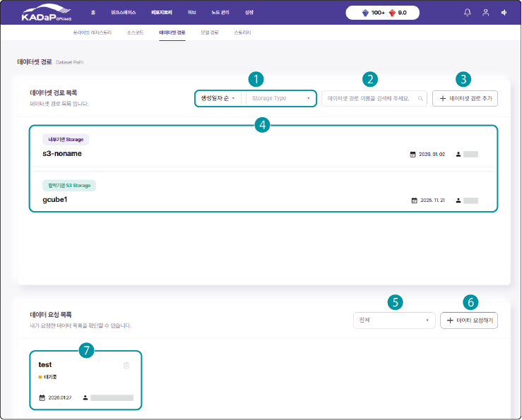
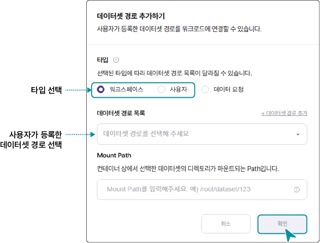

# 리포지토리 추가 - 데이터셋 경로

[TOC]

AI 모델을 개발하거나 테스트할 때 외부 저장소에 저장된 데이터셋을 연결하여 활용 할 수 있습니다. 

[[TIP("주의")]]

- 데이터셋 경로 추가(네트워크 연결) = 데이터 경로는 연결만 된 상태로 학습시 네트워크상 이동됩니다. 따라서, 사용자와 서버의 네트워크환경에 영향을 받습니다. 

-  데이터 요청 하기(로컬 서버 복사) = 외부 데이터를 로컬 서버내 복사 신청하여  사용 할 수 있습니다. 저장공간의 상황에 따라 승인이 지연 될 수 있습니다. 

[[/TIP]]

## 화면 구성

사용자가 추가한 데이터셋 경로 목록을 확인할 수 있습니다. 데이터셋 경로 목록 화면은 다음과 같이 구성됩니다.

| 번호 | 항목 | 설명 |
| --- | --- | --- |
| 1 | 데이터셋 경로 목록 필터 | 목록 필터를 선택해 데이터셋 경로 목록에 적용합니다.<ul><li>생성일자 순, 이름 순으로 표시</li> <li>Storage type 종류별로 표시</li></ul> |
| 2 | 검색창 | 데이터셋 경로 이름을 입력해 검색합니다. |
| 3 | + 데이터셋 경로 추가 | 데이터가 저장되어 있는 데이터셋 경로를 추가합니다. |
| 4 | 데이터셋 경로 목록 | 데이터셋 경로 목록에는 Storage type과 데이터셋 경로 이름, 생성 정보가 표시됩니다. <ul><li>데이터셋 경로 상세 정보 페이지에서는 기본 정보, 설정 내용, 생성 정보와 워크로드 정보가 표시됩니다. 또한 데이터셋 경로의 정보를 수정하거나 삭제할 수 있습니다.</li></ul> |
| 5 | 데이터 요청목록 필터 | 목록 필터를 선택해 데이터 요청 목록에 적용합니다.<ul><li>상태: 데이터 요청의 처리 상태 기준으로 표시</li></ul> |
| 6 | + 데이터 요청하기 | 자동차데이터플랫폼(KADaP)이 보유한 데이터 중 필요한 데이터의 사용 신청을 합니다. |
| 7 | 데이터 요청 목록 | 사용자가 요청한 데이터 요청 항목의 처리 상태, 생성 정보가 표시됩니다.<ul><li>항목을 클릭하면 팝업창으로 요청 상세 내역이 표시되며, 요청 정보를 수정할 수 있습니다.</li> <li>를 클릭하면 데이터 요청을 삭제할 수 있습니다.</li></ul>|

## 데이터셋 경로 추가 - 네트워크 연결

[[TIP("주의")]]
사전 등록된 **스토리지**만 추가 할 수 있습니다. (리포지토리 - 스토리지 에서 등록 하세요.)
[[/TIP]]

저장소의 데이터셋 경로를 등록해 워크로드 생성 시 적용할 수 있습니다.

데이터셋 경로를 추가하려면 다음 순서대로 진행하세요.

1. 인공지능 개발 플랫폼 홈 화면에서 메인 메뉴의 **리포지토리**를 클릭하세요.

2. 상단의 서브 메뉴에서 **데이터셋 경로**를 클릭하세요.

3. 데이터셋 경로 목록 페이지에서 **+ 데이터셋 경로 추가**를 클릭하세요.

4. 데이터가 저장되어 있는 저장소 타입을 선택하세요.

5. 선택한 저장소에 따라 상세 항목을 입력하고 **추가**를 클릭하세요.

| 번호 | 항목 | 설명 |
| --- | --- | --- |
| 1 | 스토리지 목록 | 데이터를 업로드하거나 연결할 스토리지 목록을 선택합니다.<ul><li>내부기관을 선택한 경우 데이터를 업로드할 자동차데이터플랫폼(KADaP) 내부 스토리지를 선택합니다.</li><li>S3 스토리지를 선택한 경우 등록한 버킷 폴더 중 사용할 항목을 선택합니다.</li></ul> |
| 2 | 데이터셋 경로 이름 | 사용할 데이터셋 경로 이름을 입력합니다. |
| 3 | Default mount path | 워크로드가 실행될 때 연결할 컨테이너 내부 경로를 입력합니다. |
| 4 | 파일 업로드 | 사용자 PC에 저장되어 있는 데이터 파일을 드래그하거나 **파일 선택**을 클릭해 업로드합니다.<ul><li>최대 2 GB 크기의 데이터 파일을 업로드할 수 있습니다.</li></ul> |
| 5 | Server IP | 데이터가 저장된 외부 NFS 스토리지 서버의 IP 주소를 입력합니다. |
| 6 | Server Path | 데이터가 저장된 외부 NFS 스토리지 서버의 디렉토리 경로를 입력합니다. |

[[TIP("참고")]]
- 데이터셋 경로를 등록하면 **워크스페이스** > **공유 리포지토리**에 추가해 워크스페이스에 등록한 멤버와 공유할 수 있으며, 워크로드 생성 시 적용할 수 있습니다.
 - **내부기관 스토리지**를 선택한 경우, 왼쪽의 **파일 목록** 메뉴를 사용할 수 있습니다. 선택한 경로에 저장된 파일을 확인하고, 파일을 업로드하거나 다운로드할 수 있습니다.  파일 목록에 대한 자세한 설명은 [파일 목록](#파일-목록)을 참고하세요.
[[/TIP]]

## 데이터 요청 하기 - 로컬 서버 복사

외부 저장소의 데이터를 인공지능개발솔루션 서버 **로컬스토리지**에 복사하여 사용 할 수 있습니다. 

[[TIP("참고")]]
제한된 저장공간으로 인하여 신청 수 관리자 승인이 필요합니다.   관리자 요청이 승인된 후에 요청한 데이터를 다운로드해 사용할 수 있습니다.
[[/TIP]]

인공지능 개발 플랫폼의 데이터를 요청하려면 다음 순서대로 진행하세요.

1. 인공지능 개발 플랫폼 홈 화면에서 메인 메뉴의 **리포지토리**를 클릭하세요.

2. 상단의 서브 메뉴에서 **데이터셋 경로**를 클릭하세요.

3. 데이터셋 경로 목록 페이지에서 **+ 데이터 요청하기**를 클릭하세요.

4. 데이터 요청하기 창에서 상세 항목을 설정하고 **요청하기**를 클릭하세요.

| 번호 | 항목 | 설명 |
| --- | --- | --- |
| 1 | S3 스토리지 | 인공지능 개발 플랫폼의 S3 스토리지를 선택합니다. |
| 2 | Local 스토리지 | 인공지능 개발 플랫폼의 로컬 스토리지를 선택합니다. |
| 3 | S3 버킷 경로 | 선택한 S3 스토리지 내부의 버킷 경로를 선택합니다. |
| 4 | 요청 기간 | 데이터를 사용할 시작일/종료일을 달력에서 선택합니다.<ul><li>최대 일주일 동안 신청한 데이터를 다운로드할 수 있습니다.</li></ul> |
| 5 | 데이터 이름 | 사용할 데이터 이름을 입력하세요. |
| 6 | Default mount path | 워크로드가 실행될 때 연결할 컨테이너 내부 경로를 입력합니다. |
| 7 | 설명 | 데이터 요청 사유를 입력합니다. |

[[TIP("참고")]]
관리자가 데이터 요청을 승인하면 상태 항목이 **승인됨**으로 변경되고, 신청한 경로의 데이터를 다운로드해 사용할 수 있습니다.
[[/TIP]]

## 데이터셋 활용

데이터셋 경로를 추가하면 **워크스페이스** > **공유 리포지토리**에 추가해 워크스페이스에 등록한 멤버와 공유할 수 있으며 워크로드 생성 시 적용할 수 있습니다.

### 공유 리포지토리에 추가해 멤버와 공유

워크스페이스에 추가된 멤버들과 데이터셋 경로를 공유할 수 있습니다.

공유 리포지토리에 데이터셋 경로를 추가하려면 다음 순서대로 진행하세요.

1. 인공지능 개발 플랫폼 홈 화면에서 메인 메뉴의 **워크스페이스**를 클릭하세요.

2. 워크스페이스 목록 페이지가 나타나면 데이터셋 경로를 추가할 워크스페이스를 클릭하세요.

3. 상단의 서브 메뉴에서 **워크스페이스 설정**을 클릭하세요.

4. 워크스페이스 정보 페이지에서 왼쪽의 **공유 리포지토리**를 클릭하세요.

5. 공유 리포지토리 페이지에서 **+ 공유 데이터셋 경로 추가**를 클릭하세요.

6. 공유 데이터셋 경로 추가창이 나타나면 등록한 데이터셋 경로를 선택하고 기본 마운트 경로를 입력한 후 **확인**을 클릭하세요.

### 워크로드 생성 시 적용

사용자가 저장한 데이터셋 경로를 활용해 워크로드를 생성하려면 다음 순서대로 진행하세요.

1. 인공지능 개발 플랫폼 홈 화면에서 메인 메뉴의 **워크스페이스**를 클릭하세요.

2. 워크스페이스 목록 페이지가 나타나면 워크로드를 생성할 워크스페이스를 클릭하세요.

3. 상단의 서브 메뉴에서 **워크로드**를 클릭하세요.

4. 워크로드 목록 페이지에서 **+ 워크로드 생성**을 클릭하세요.

5. Task에서 **+ 데이터셋 경로 추가**를 클릭하세요.

6. 데이터셋 경로 추가창이 나타나면 **타입** > **워크스페이스**나 **사용자**를 선택하세요.

 - **데이터 요청**을 선택하는 경우 **승인됨** 상태의 데이터 요청만 적용할 수 있습니다.

7. 데이터셋 경로 목록에서 적용할 데이터셋 경로를 선택하고 상세 항목 설정 후 **확인**을 클릭하세요.

8. 워크로드 생성 페이지에서 상세 항목을 설정하고 **워크로드 생성**을 클릭하세요.

- 사용자가 등록한 경로의 데이터셋 경로가 워크로드에 연결되어 실행됩니다.

