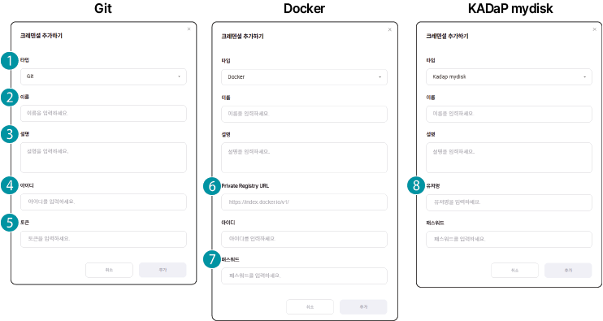

#### 크레덴셜 목록 화면 구성

사용자가 추가한 크레덴셜 목록을 확인할 수 있습니다. 크레덴셜 목록 화면은 다음과 같이 구성됩니다.

| 번호 | 항목 | 설명 |
| --- | --- | --- |
| 1 | + 크레덴셜 추가 | 외부 저장소나 마이디스크 연결 시 사용하는 크레덴셜을 추가합니다. |
| 2 | 스토리지 목록 | 크레덴셜 목록에는 크레덴셜 이름과 설명, 생성 정보가 표시됩니다.<ul><li>크레덴셜 상세 페이지에서는 기본 정보, 설정 내용, 생성 정보가 표시됩니다. 또한 크레덴셜 정보를 수정하거나 삭제할 수 있습니다.</li></ul> |

### 크레덴셜 추가하기 {#크레덴셜-추가하기}

인공지능 개발 플랫폼와 연동해 사용할 저장소의 크레덴셜을 추가할 수 있습니다.

크레덴셜을 추가하려면 다음 순서대로 진행하세요.

1. 인공지능 개발 플랫폼 홈 화면에서 메인 메뉴의 **설정**을 클릭하세요.

2. 상단의 서브 메뉴에서 **크레덴셜**을 클릭하세요.

3. 크레덴셜 목록 페이지에서 **+ 크레덴셜 추가**를 클릭하세요.

4. 크레덴셜 추가창이 나타나면 상세 항목을 설정하고 **추가**를 클릭하세요.

| 번호 | 항목 | 설명 |
| --- | --- | --- |
| 1 | 타입 | 외부 저장소 타입을 선택합니다.<ul><li>Git: 사용자 소스코드 및 데이터 저장</li><li>Docker: 사용자 컨테이너 이미지 저장</li><li>KADaP mydisk: 사용자가 마이디스크에 저장한 데이터에 접근</li></ul> |
| 2 | 이름 | 사용할 크레덴셜 이름을 입력합니다. |
| 3 | 설명 | 크레덴셜에 대한 설명을 입력합니다. |
| 4 | 아이디 | 선택한 저장소에서 사용하는 사용자 계정을 입력합니다. |
| 5 | 토큰 | Git에서 발급받은 개인 액세스 토큰을 입력합니다. |
| 6 | 프라이빗 레지스트리 URL | Docker에서 컨테이너 이미지가 저장된 url을 입력합니다. |
| 7 | 패스워드 | 외부저장소 접속 시 적용할 패스워드를 입력합니다. <ul><li>Docker: 로그인 비밀번호나 발급받은 액세스 토큰을 입력합니다.</li><li>자동차데이터플랫폼(KADaP) mydisk: 자동차데이터플랫폼(KADaP) 로그인 비밀번호를 입력합니다.</li></ul> |
| 8 | 유저명 | 자동차데이터플랫폼(KADaP)에 등록한 사용자 이메일 계정을 입력합니다. |

### 외부 저장소의 크레덴셜 생성하기

> **주의** 

>

>외부 저장소의 크레덴셜을 생성한 후 반드시 크레덴셜 정보를 저장해두세요. 크레덴셜 정보는 보안을 위해 생성 시에만 표시되며 다시 확인할 수 없습니다.

#### Git에서 크레덴셜 발급

사용할 Git 사이트의 **Personal access token** 메뉴에서 토큰을 생성합니다.

- 토큰 생성에 대한 자세한 설명은 해당 사이트의 도움말을 참고하세요.

#### Docker에서 크레덴셜 발급

사용할 Docker 사이트의 **Security** 메뉴에서 토큰을 생성합니다.

- 토큰 생성에 대한 자세한 설명은 해당 사이트의 도움말을 참고하세요.

#### WebDAV에서 마이디스크 크레덴셜 발급

자동차데이터플랫폼(KADaP) Portal의 마이디스크는 WebDAV 프로토콜을 지원합니다. WebDAV(Web Distributed Authoring and Versioning)는 자동차데이터플랫폼(KADaP)의 마이디스크를 별도의 연결 프로그램 없이 사용자 PC의 확장 드라이브로 연결해 사용할 수 있습니다.

WebDAV에서 마이디스크 크레덴셜을 발급하려면 다음 순서대로 진행하세요.

1. **자동차데이터플랫폼(KADaP) 포털** > **마이디스크**를 클릭하세요.

2. 마이디스크 페이지에서 왼쪽 하단의 **사용자 이름** > **Connect app**을 클릭하세요.

3. WebDAV Authrization 페이지에서 **Accept**를 클릭하세요.

4. WebDAV Credential 페이지에서 발급된 크레덴셜 정보를 복사해 저장하세요.

- 크레덴셜 정보는 분실하지 않도록 반드시 저장해두세요.

### 크레덴셜 활용하기

크레덴셜 정보를 등록해 놓으면 소스코드를 추가하거나 워크로드 생성 시 적용할 수 있습니다.

- **리포지토리** > **소스코드** > **소스코드 추가** > **크레덴셜** > **Private Repository**선택 시 적용

- 소스코드 추가에 대한 자세한 설명은 [소스코드 경로 추가](#소스코드-경로-추가)를 참고하세요.

- 워크로드 생성 시 적용

- **이미지** > **Public Image**또는**Private Image**선택 시 적용

- **소스코드 추가** > **직접 입력**시 적용

- 워크로드 생성 시 각 항목에 대한 자세한 설명은 [워크로드 생성하기](#워크로드-생성하기)를 참고하세요.

