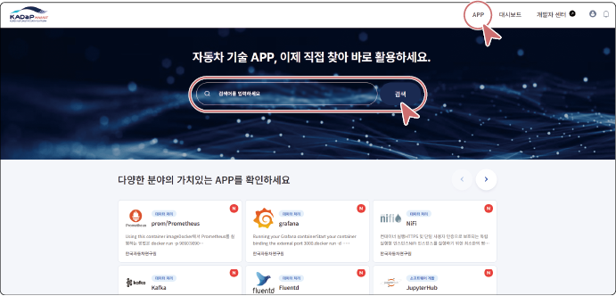
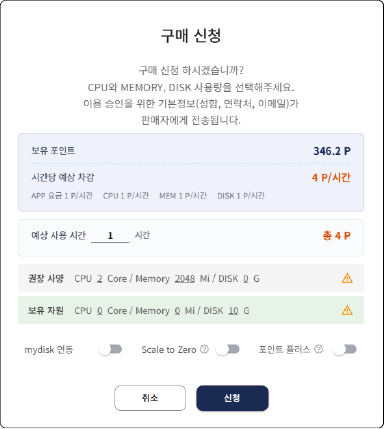
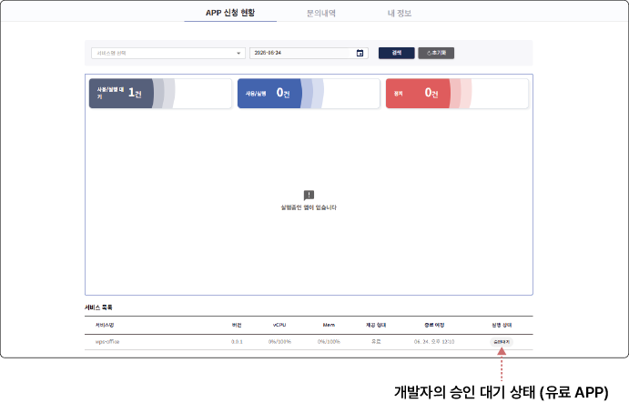



## APP 사용하기 (신청/실행)

사용자는 SaaS 마켓 플레이스에 등록된 APP을 검색하고, 사용 신청할 수 있습니다.

### APP 사용 신청하기

APP 사용하려면 다음 순서대로 진행하세요.

#### APP 검색

1. APP 마켓 플레이스 검색창 또는 **APP** 메뉴에서 원하는 APP을 검색하세요.

- 키워드 검색, 카테고리 선택, 정렬 옵션(인기순, 최신순)을 활용해 원하는 APP을 빠르게 찾을 수 있습니다.

2. 검색 결과에서 원하는 APP을 클릭하세요.

- APP 상세 페이지로 이동하며, 해당 APP의 상세 정보, 도커 정보, 요금제 정보를 확인할 수 있습니다.

#### APP 사용 신청

1. APP 상세 페이지에서 **이용 신청**을 클릭하세요.

2. **구매 신청** 화면에서 다음 항목을 설정하고 **신청**을 클릭하세요.

- **보유 포인트**: 현재 보유한 포인트와 포인트 플러스를 확인합니다.

- **시간당 예상 차감**: 선택한 APP의 시간당 예상 차감 포인트를 확인합니다.

- **예상 사용 시간**: 사용 예정 시간을 입력하여 총 차감 포인트를 예상할 수 있습니다.

- **권장 사양**: CPU, Memory, DISK 권장 사양을 확인합니다.

- **보유 자원**: 현재 할당된 CPU, Memory, DISK 자원을 확인합니다.

- **mydisk 연동**: 포털의 마이디스크와 연동할지 선택합니다.

- **Scale to Zero**: 사용자가 없을 때 절전 모드로 전환합니다. 포인트 차감이 50% 감소합니다.

- **포인트 플러스**: 보유 자원 제약 없이 사용합니다. 관리자가 지정한 포인트 플러스 단가로 차감됩니다.

APP 이용 신청이 완료되었고, 해당 APP 개발자의 승인 절차가 진행됩니다.

>  **참고**

>

> 무료 APP은 이용 신청 즉시 사용할 수 있습니다. 유료 APP은 개발자의 승인 이후에 이용할 수 있습니다.

#### APP 이용 신청 상태 확인

**마이페이지** > **APP 신청 현황**에서 신청한 APP의 목록과 상태를 확인할 수 있습니다.

- **사용/실행 대기**: APP 승인은 완료되었으나, 사용자가 아직 실행하지 않은 건수를 표시합니다.

- **사용/실행**: APP을 정상적으로 사용할 수 있는 건수를 표시합니다.

- **정지**: 포인트 부족 또는 사용자 요청에 의해 APP이 정지된 건수를 표시합니다.

- **서비스 목록**

&#x20; - **실행**: APP을 사용할 수 있습니다.

&#x20; - **실행 대기**: APP 승인은 완료되었고, 사용자 실행 대기 상태입니다.

&#x20; - **승인 대기**: 개발자의 이용 승인 대기 상태입니다.

>  **참고**

>

> 사용 신청한 APP의 승인 여부는 이메일을 통해 안내됩니다.

