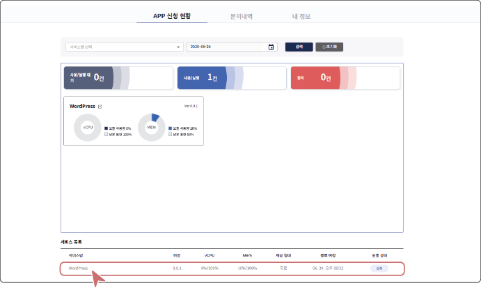
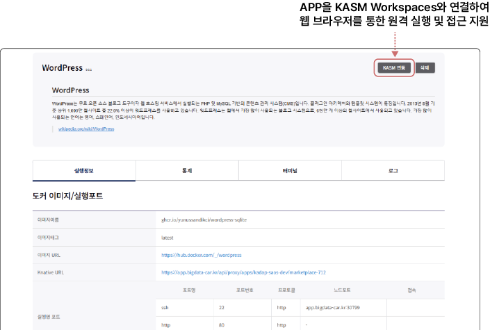
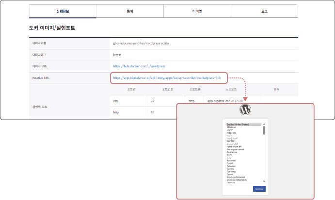
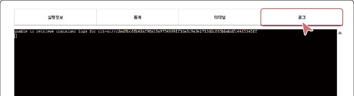

## APP 사용하기 (신청/실행)

### APP 실행하기

무료 APP은 이용 신청 즉시 사용할 수 있고, 유료 APP은 개발자의 승인 이후에 이용할 수 있습니다.

APP을 실행하려면 다음 순서대로 진행하세요.

1. **마이페이지** > **APP 신청 현황**에서 사용할 APP을 클릭하세요.

2. 상세 화면에서 실행정보를 확인하세요.

- **실행정보** 탭에서 APP의 도커 이미지 정보, 접속 URL, 실행 포트 구성(SSH·HTTP·HTTPS), CPU 및 메모리 할당 현황 등 APP 구동에 필요한 상세 정보를 확인할 수 있습니다.

3. **실행정보** 탭의 Knative URL을 클릭하여 해당 APP에 접속하세요.

>  **참고**

>

> 유료 APP은 사용 승인이 완료된 후 Knative URL이 활성화됩니다.

### APP 실행 모니터링 및 제어하기

실행 중인 APP의 리소스 사용 현황을 통계로 확인하고, 터미널을 통한 직접 제어 및 로그 조회를 통해 APP의 이용 상태를 확인할 수 있습니다.

##### 통계

날짜별로 APP의 vCPU 및 메모리(MEM) 사용량과 잔여 용량을 도넛 차트로 시각화하여 리소스 현황을 확인할 수 있습니다.

#### 터미널

실행 중인 APP 컨테이너에 직접 접속하여 명령어를 입력하고 제어할 수 있는 웹 기반 환경을 제공합니다.

#### 로그

APP 실행 시 발생하는 시스템 로그를 실시간으로 확인할 수 있으며, 오류 및 동작 상태를 추적하는 데 활용합니다.

