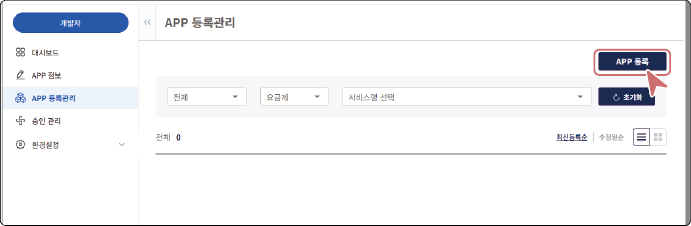
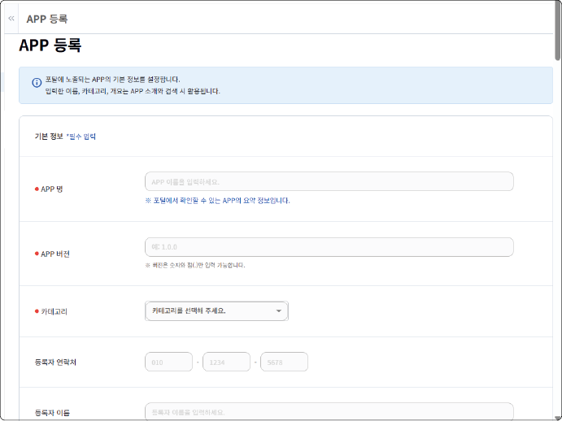
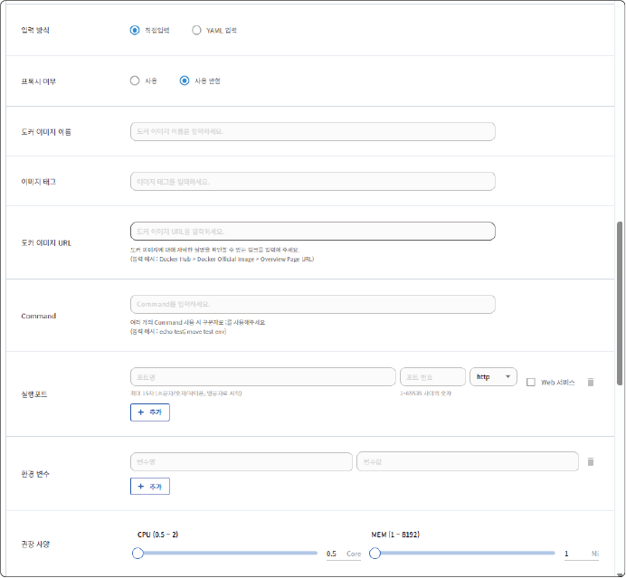
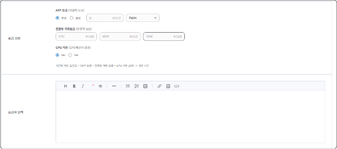
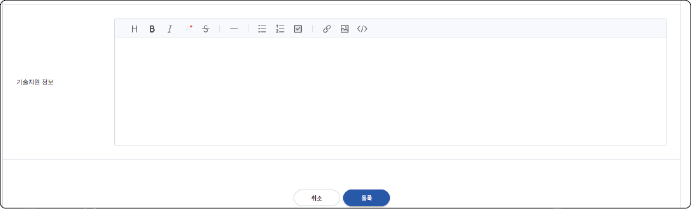
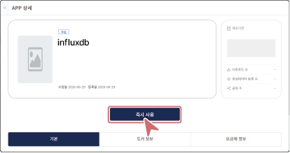

## APP 등록하기 {#app-등록하기}

APP을 SaaS 마켓 플레이스에 등록하여 사용자에게 공개할 수 있습니다. 등록된 APP은 승인 과정을 거쳐 공개되며, 사용자는 해당 APP에 대해 이용 신청을 진행할 수 있습니다.

>  **참고**

>

> APP 등록과 관리는 **개발자 센터**에서 수행하며, **개발자 센터**를 이용하려면 개발자 권한이 필요합니다. 개발자 권한 신청은 [개발자 등록](#saas-개발자-등록)을 참고하세요.

APP을 SaaS 마켓 플레이스에 등록하려면 다음 순서대로 진행하세요.

1. **APP 등록관리** > **APP 등록**을 클릭하세요.

2. APP 기본 정보를 입력하세요.

3. APP 기술 정보를 입력하세요.

- **입력 방식**

   APP 설정 정보를 입력하는 방식을 선택합니다. **직접입력** 선택 시 각 항목을 개별 필드에 입력하고, **YAML 입력** 선택 시 Knative 기반의 YAML 코드 입력창이 표시되어 설정 정보를 한 번에 입력할 수 있습니다.

- **프록시 여부**

   APP에 프록시 서버 사용 여부를 설정합니다.

&#x20; 

- **도커 이미지 이름**

   배포할 APP의 도커 이미지 이름을 입력합니다.

- **이미지 태그**

   배포할 도커 이미지의 버전 태그를 입력합니다.

- **도커 이미지 URL**

   Docker Hub 등 도커 이미지의 상세 정보를 확인할 수 있는 링크를 입력합니다.

&#x20; 

- **Command**

   컨테이너 실행 시 수행할 명령어를 입력하며, 여러 개의 명령어는 세미콜론(;)으로 구분합니다.

&#x20; 

- **실행포트**

   APP이 사용할 포트명, 포트 번호, 프로토콜을 설정하며, 포트는 최대 15자로 입력합니다.

&#x20; 

- **환경 변수**

   컨테이너 실행 시 필요한 환경 변수의 변수명과 변수값을 설정합니다.

&#x20; 

- **권장 사양**

   APP 실행에 권장되는 CPU(0.5~2 Core) 및 메모리(1~8192 Mi) 사양을 설정합니다.

4. APP 이용 요금 및 컴퓨팅 자원 요금을 설정하세요.

시간당 차감 포인트는 (APP 요금 + 컴퓨팅 자원 요금 + GPU 자원 요금) × 사용 시간으로 산정됩니다.

- **APP 요금 (개발자 보상)**

  무료 또는 유료로 설정할 수 있습니다. 유료 선택 시 시간당 포인트를 입력하고, 포인트 유형을 Point 또는 Point+ 중에서 선택할 수 있습니다.

- **컴퓨팅 자원 요금 (운영자 보상)**

   APP 실행에 사용되는 CPU·MEM·DISK 자원에 대한 시간당 요금을 입력합니다.

- **GPU 지원 (GPU 제공자 보상)** 

  GPU 자원 사용 여부를 설정하며, Yes 선택 시 GPU 자원 요금이 포인트 산정에 포함됩니다.

5. 요금제 내용을 입력하세요.

- APP의 상세 화면에 표시될 요금제 내용을 에디터를 통해 직접 작성합니다. 작성한 내용은 요금제 정보의 요금제 상세 항목에 표시됩니다.

6. 기술지원 정보를 입력하세요.

- APP 이용 중 발생할 수 있는 문의나 장애에 대한 기술지원 방법 등을 입력합니다. 작성한 내용은 사용자의 APP 상세 화면 내 기술지원 정보 항목에 표시됩니다.

7. 모든 정보를 입력한 후 **등록** 버튼을 클릭하세요.

- APP 등록이 완료되었습니다.

>  **참고**

>

> **즉시 사용** 기능을 통해 APP 등록 후 실제 배포 전에 작동 여부를 테스트할 수 있습니다.

>

> 

