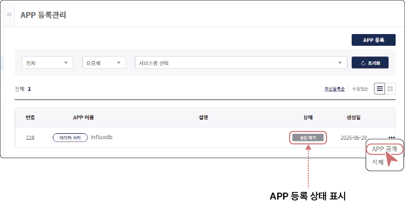

### APP 등록 상태 확인 및 공개하기

APP 등록 상태는 **개발자 센터** > **APP 등록관리** 목록에서 확인할 수 있습니다. 개발자가 APP을 공개하면 **승인 대기** 상태로 전환되며, 관리자의 검토 및 승인 후 SaaS 마켓 플레이스에 공개됩니다. 공개된 APP은 사용자가 이용 신청을 할 수 있습니다.

- **승인 대기**: APP 등록 신청 후 관리자 승인을 기다리는 상태입니다.

- **반려**: 관리자가 APP 등록을 반려한 상태이며, 반려 사유를 확인 후 수정하여 재신청이 가능합니다.

- **공개**: 사용자에게 APP이 공개된 상태입니다.

- **비공개** (개발자): APP 등록은 완료되었으나 개발자가 공개하지 않은 상태입니다.

- **비공개** (관리자): 개발자가 공개한 APP을 관리자가 필요에 따라 비공개로 설정한 상태입니다.

