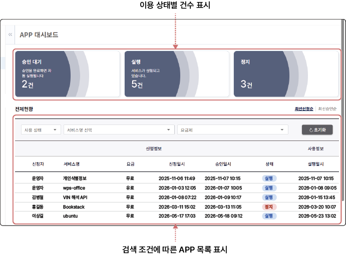
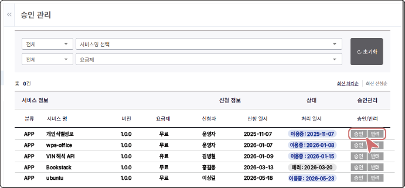
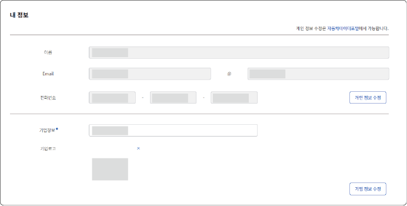

\### APP 수정 및 삭제하기

등록된 APP의 정보를 수정하거나 삭제할 수 있습니다.

\#### APP 수정

1\. \*\*APP 등록 관리\*\* 목록에서 수정할 APP을 클릭한 후, APP 상세 페이지 하단의 \*\*수정\*\*을 클릭하세요.

&#x20;  !\[APP 수정 화면](./../../assets/04-market-app/13831.png)

2\. 수정할 내용을 변경한 후, \*\*수정\*\*을 클릭하세요.

&#x20;  - 수정된 APP도 관리자의 검토 및 승인 후 SaaS 마켓 플레이스에 반영됩니다.

\#### APP 삭제

\*\*APP 등록 관리\*\* 목록에서 삭제할 APP의 더보기 (!\[Icon\_Cloud\_13\_fmt.png](./../../assets/04-market-app/Icon\_Cloud\_13\_fmt.png)) > \*\*삭제\*\*를 클릭하세요.

!\[APP 삭제 화면](./../../assets/04-market-app/13853.png)

> !\[13905.png](./../../assets/04-market-app/13905.png) \*\*주의\*\*

>

> 

> 이용 중인 사용자가 있는 APP을 삭제할 경우, 해당 사용자의 APP 서비스가 즉시 중단될 수 있습니다. 삭제 전 이용 중인 사용자에게 사전 안내 후 진행하세요.

### APP 정보 확인하기 {#saas-app-정보-확인하기}

개발자가 등록한 APP의 승인 대기, 실행, 정지 건수와 APP 이용 신청자의 신청 정보 및 사용 정보를 확인할 수 있습니다.

### APP 승인 관리하기 {#saas-app-승인-관리하기}

사용자가 이용 신청한 APP 목록을 확인하고 승인 또는 반려할 수 있습니다. 서비스명, 요금제, 상태 조건으로 목록을 검색할 수 있으며, 승인 시 사용자의 APP 이용이 즉시 시작됩니다.

### 대시보드 확인하기 {#saas-개발자-대시보드}

대시보드에서는 개발자가 등록한 APP 목록과 이용 상태를 확인할 수 있습니다.

### 내 정보 수정하기 (환경설정) {#saas-내-정보-수정하기}

**환경설정** > **내 정보** 메뉴에서 개발자 개인 정보와 기업 정보를 수정할 수 있습니다. 개인 정보 수정은 자동차 데이터 포털 사이트로 이동하여 진행합니다.

