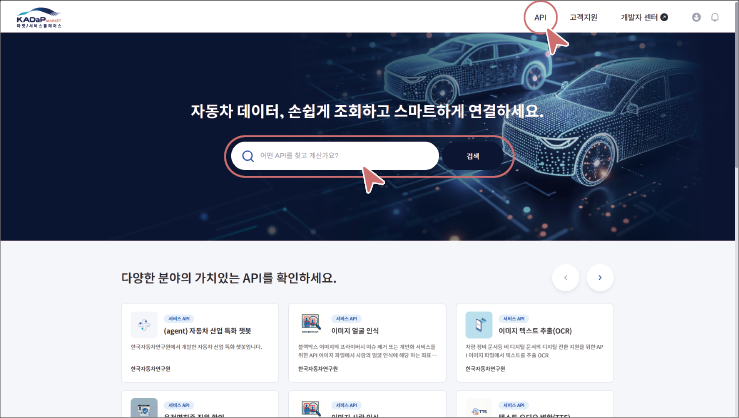
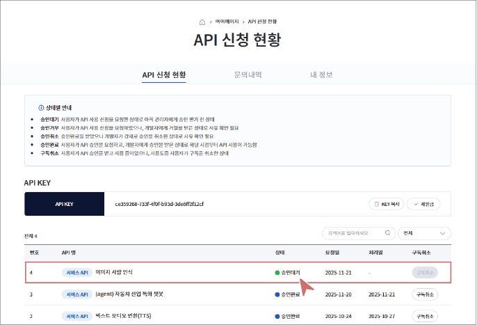

## API 사용하기

사용자는 API 마켓 플레이스에서 원하는 API의 사용을 신청할 수 있습니다. 사용 승인은 해당 API 개발자의 승인을 받아야 하며, 승인 이후에만 실제 API 호출이 가능합니다.

### API 신청하기

API 사용하려면 다음 순서대로 진행하세요.

#### API 검색

1. API 마켓 플레이스 검색창 또는 **API** 메뉴에서 원하는 API를 검색하세요.

- 키워드 검색, 카테고리 선택, 정렬 옵션(인기순, 최신순)을 활용해 원하는 API를 빠르게 찾을 수 있습니다.

2. 검색 결과에서 원하는 API를 클릭하세요.

- API 상세 페이지로 이동하며, 해당 API에서 제공하는 기능과 사용 조건 등을 확인할 수 있습니다.

#### API 사용 신청

1. API 상세 페이지에서 **사용 신청하기**를 클릭하세요.

2. 요금제를 선택한 후, **확인**을 클릭하세요.

- 실제 요금이 차감되는 방식이 아니며, API 사용 건수를 확인하기 위한 옵션입니다.

API 사용 신청이 완료되었고, 해당 API 개발자의 승인 절차가 진행됩니다.

>  **참고**

>

> 개발자 본인이 등록한 API는 사용 신청할 수 없습니다.

#### API 사용 신청 상태 확인

**마이페이지** > **API 신청 현황**에서 신청한 API의 승인 상태를 확인할 수 있으며, 승인 완료된 API는 바로 호출하여 사용할 수 있습니다.

>  **참고**

>

> 사용 신청한 API의 승인 여부는 이메일과 알림을 통해 안내됩니다.

