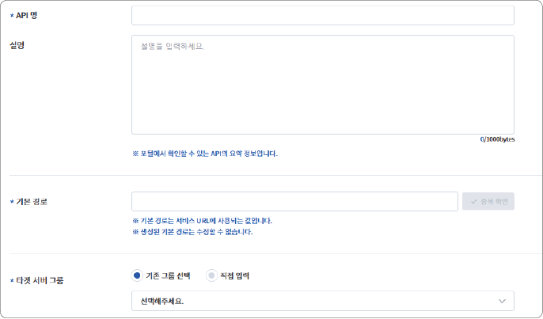

### API 생성하기(API 관리) {#api-생성하기api-관리}

#### 기본 설정

API 등록 시 필요한 기본 정보를 입력하는 단계입니다. 이 단계에서 정의한 설정은 이후 API 관리와 연결 과정에서 주요 기준으로 활용됩니다.

1. **API 관리** 메뉴를 클릭한 후, **API 생성**을 클릭하세요.

- 기본 설정 화면으로 이동합니다.

>  **참고**

>

> **API 빠른 생성** 기능을 사용하면 필수 항목만 입력하여 API를 간편하게 생성할 수 있습니다.

2. 등록할 API의 기본 정보를 입력하세요.

- **API 명/설명**: API의 이름과 설명을 입력합니다.

- **기본 경로**: 서비스 URL로써 API를 등록할 때 사용자에게 노출할 URL을 입력합니다.

- **타겟 서버 그룹**

  - **기존 그룹 선택**: API가 연결될 타겟 서버 그룹을 선택합니다.

  - **직접 입력**: 등록된 서버가 아닌 경우 서버 정보를 입력하고 **추가**를 클릭하세요. API 생성과 동시에 타겟 서버 그룹 메뉴에 자동으로 등록됩니다.

- **카테고리**: API를 구분하기 위해 카테고리를 선택합니다. 선택한 카테고리는 포털에서 해시태그로 표시되고, 검색 시에도 활용됩니다. 카테고리는 관리자가 사전에 생성한 목록으로 제공됩니다.

- **해시태그**: API를 설명하는 키워드를 입력합니다. 주제나 기능별로 해시태그를 등록하면 API 검색과 분류에 활용됩니다.

- 에디터 영역: 등록할 API의 개요 및 필요성, 설계 및 알고리즘 등과 같은 정보를 입력합니다. **샘플**을 클릭하면 이 에디터 영역에서 입력한 정보가 포털의 어느 위치에 노출되는지 확인할 수 있습니다.

- API의 **데이터 기본 정보** 영역에 노출할 정보를 입력합니다.

3. 기본 설정 정보를 모두 입력한 후, **다음**을 클릭하세요.

- 고급 설정 화면으로 이동합니다.

#### 고급 정보 설정

기본 정보 외에 추가 제어가 필요한 경우, 고급 설정을 통해 사용량 제한과 요청 제어를 설정할 수 있습니다.

1. 고급 설정은 기본값이 적용되어 있으므로 필요한 항목만 선택하여 수정하세요.

- **CORS**: 외부 도메인에서 API 호출을 허용할지 설정합니다. 필요 시 허용할 Origin, Method, Header 등을 지정합니다.

- **요금제**: **요금제 관리** 메뉴에서 설정한 항목을 사용합니다.

- **요청 제어**: API 호출 시 특정 헤더를 반드시 포함하도록 설정할 수 있습니다. 기본값은 **사용안함**이며, **사용**으로 설정하면 API 호출 시 지정한 헤더 또는 쿼리 파라미터가 포함되지 않은 경우 여기에서 입력한 값을 자동으로 추가합니다.

2. 고급 설정 정보를 모두 입력한 후, **저장**을 클릭하세요.

API 생성이 완료되었습니다. 생성된 API는 **API 관리** 메뉴에서 등록한 API명으로 확인할 수 있습니다. 다음 절차에 따라 메서드를 등록하세요.

