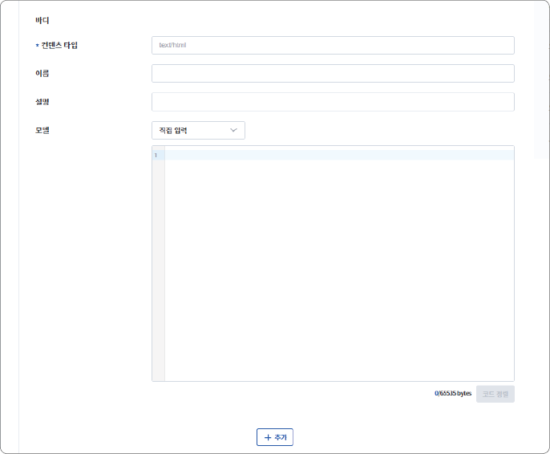
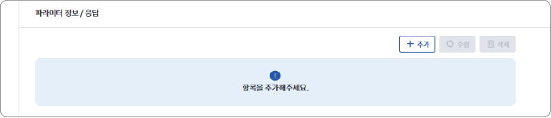
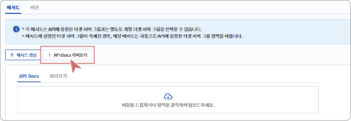

### 메서드 등록하기

메서드(Method)는 API 요청 시 서버가 수행해야 할 동작을 지정하는 규칙입니다. 데이터 조회(GET), 생성(POST), 수정(PUT/PATCH), 삭제(DELETE) 등의 메서드를 사용하며, 각 메서드는 요청 목적을 명확히 구분해 서버가 올바르게 동작하도록 합니다.

API 상세 페이지 하단의 **메서드 생성**을 클릭하면, 메서드 세팅 정보 화면으로 이동합니다.

#### 세팅 정보 설정

메서드 등록은 API의 엔드포인트별 동작 방식을 정의하는 단계입니다. 각 메서드에서 경로, 타겟 경로, 타겟 서버 그룹 등을 설정할 수 있으며, 이를 통해 API 호출 시 어떤 요청이 수행될지 결정됩니다.

1. 메서드의 세팅 정보를 입력하세요.

- **이름/설명**: 메서드의 이름과 설명을 입력합니다.

- **경로**: 엔드포인트의 경로를 입력합니다. 사용자에게 노출되는 경로로 실제 API의 경로와 일치하지 않아도 무방합니다.

- **메서드**: GET, POST, PUT, DELETE 등의 요청 방식을 선택합니다.

- **API KEY 필요**: API 호출 시 API KEY를 헤더 또는 파라미터로 전달하여 권한을 검증합니다.

- **타겟 경로**: 타겟 경로에 요청을 전달할 실제 서버의 경로를 입력합니다.

- **타겟 서버 그룹**: API에 설정된 그룹을 그대로 사용할 수도 있고, 필요시 개별적으로 설정할 수 있습니다.

2. 세팅 정보 입력이 완료되면, **다음** 또는 **파라미터** 탭을 클릭하세요.

- 파라미터 설정 화면으로 이동합니다.

#### 파라미터 설정

요청 파라미터는 API 호출 시 클라이언트가 전달하는 입력값을 정의하는 단계입니다. 필수 여부, 데이터 타입, 배열 여부 등을 설정할 수 있으며, 이는 API 요청을 검증하고 일관성있는 동작을 보장하기 위해 필요합니다.

1. 요청 파라미터 정보를 입력하세요.

- **파라미터 타입**: 파라미터가 전달되는 위치(쿼리, 헤더, 쿠키, 경로)를 선택합니다.

- **이름/설명**: 실제 요청 시 사용될 파라미터 Key 값과 설명을 입력합니다.

- **타입**: 데이터 타입(String, Number)을 선택합니다.

- **Required/Array**: 해당 파라미터가 반드시 포함되어야 하는지, 여러 값을 배열 형태로 받을지 설정합니다.

- **추가**를 클릭하면 입력한 내용이 새로운 파라미터로 생성됩니다.

2. 요청 바디 정보를 입력하세요.

- 요청 바디는 필수 입력 항목이 아닙니다. 필요한 경우에만 컨텐츠 타입, JSON 스키마 등을 입력하여 요청 구조와 사용 방법을 명확히 정의할 수 있습니다.

>  **참고**

>

> 요청 바디 모델은 OpenAPI Specification(OAS)의 scheme 구조로 작성해야 합니다.

- **컨텐츠 타입**: 실제 요청에 사용되는 MIME 타입을 입력합니다.

- **이름/설명**: 요청 바디의 식별 이름과 설명을 입력합니다. 이름은 스키마 이름으로도 활용됩니다.

- **모델**: 요청 본문의 구조를 JSON Schema 형식으로 입력합니다. Type, Properties, Required, default, example 등의 항목을 포함할 수 있습니다. 작성한 모델은 OAS의 requestBody → content → schema 영역에 반영됩니다.

3. 응답 정보를 입력하세요.

- 요청 바디는 필수 입력 항목이 아닙니다. 필요한 경우 상태 코드, 응답 필드, 데이터 타입, JSON 스키마 등을 지정하여 API 응답 형식을 관리할 수 있습니다.

4. 모든 정보를 입력한 후, **저장**을 클릭하세요.

메서드 생성이 완료되었습니다. 다음 절차에 따라 API 버전을 등록하세요.

#### API Docs 가져오기

이미 작성된 API 문서를 업로드하면 문서에 정의된 경로, 메서드, 요청/응답 구조 등을 불러와 메서드를 자동으로 생성할 수 있습니다.

