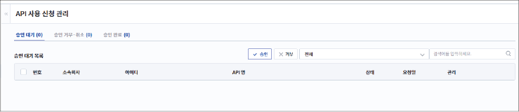
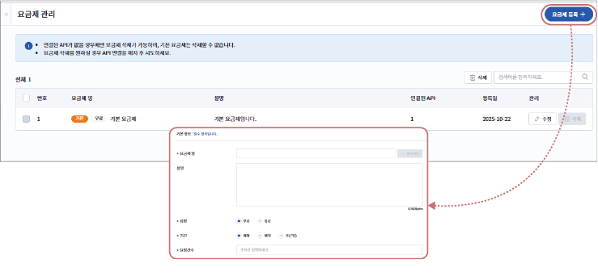
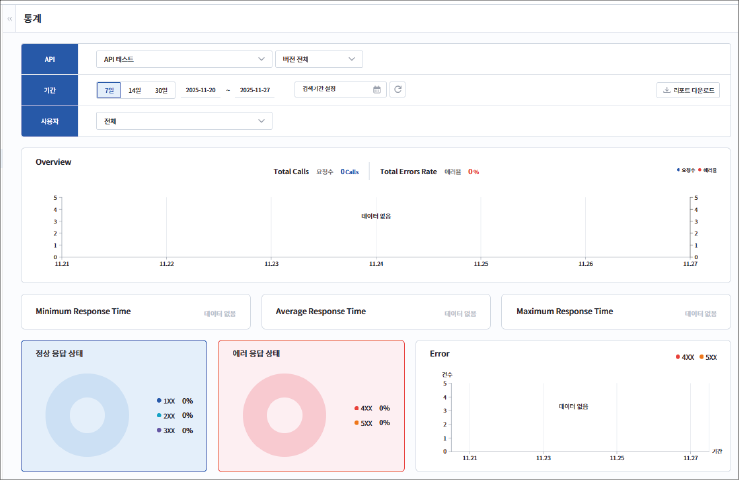

## API 관리하기

### 대시보드 사용하기 {#api-대시보드-사용하기}

등록된 전체 API의 호출 현황, 응답 코드 비율, 에러 발생 현황, 사용 신청 내역 등 API 운영 상태를 확인할 수 있습니다.

| 번호 | 항목 | 설명 |

|---|------|------|

| 1 | 전체 호출 현황 | 시간 및 기간대별 API 호출 건수(요청 수)와 에러 발생 비율을 그래프로 보여줍니다. |

| 2 | 응답 시간 | <ul><li>**Minimum Response Time**: 선택한 시간 및 기간 동안 가장 빠르게 응답한 API 호출의 응답 시간을 보여줍니다.</li><li>**Average Response Time**: 전체 호출의 평균 응답 시간을 표시하여 API 성능 상태를 확인할 수 있습니다.</li><li>**Maximum Response Time**: 선택한 시간 및 기간 중 가장 오래 걸린 API 호출의 응답 시간을 나타냅니다. API 성능 저하나 장애 가능성을 확인하는 데 유용합니다.</li></ul> |

| 3 | 응답 코드 비율/오류 건수 | <ul><li>**정상 응답 상태**: 정상적으로 처리된 응답 코드 비율을 표시합니다.</li><li>**에러 응답 상태**: API 호출에서 발생한 클라이언트 및 서버 오류 응답 비율을 보여줍니다.</li><li>**Error**: 시간 및 기간대별 에러 발생 건수를 그래프로 표시하여 에러 발생 추이를 확인합니다.</li></ul> |

| 4 | 사용 신청 현황 (최근 7일 기준) | 최근 7일 기준으로 API 사용 신청 건수와 승인 대기 중인 건수를 보여줍니다.<ul><li>**더보기**: **API 사용 신청 관리** 메뉴로 이동합니다. ([API 사용 신청 관리하기](#api-사용-신청-관리하기) 참조)</li></ul> |

| 5 | API Insight | 각 API의 상세 성능 및 호출 정보를 요약해 보여줍니다.<ul><li>**API**: API 호출 횟수가 많은 순으로 API 목록을 표시합니다.</li><li>**Endpoints**: 각 API의 엔드포인트별 호출 횟수가 많은 순으로 목록을 표시합니다.</li><li>**더보기**: **통계** 메뉴로 이동합니다. ([API 호출 통계 확인하기](#api-호출-통계-확인하기) 참조)</li></ul> |

### API 사용 신청 관리하기 {#api-사용-신청-관리하기}

사용자가 신청한 API 사용 요청 목록을 확인할 수 있습니다. 개발자는 신청 정보를 확인한 후 해당 사용자가 API를 호출할 수 있도록 승인을 하거나, 필요 시 신청을 거부할 수 있습니다. 승인된 사용자는 해당 API를 호출할 수 있게 됩니다.

### Model 관리하기 {#model-관리하기}

API 요청 또는 응답에 사용되는 데이터 모델(구조)을 생성하고 관리할 수 있습니다. JSON Schema 기반으로 필드 이름, 자료형, 필수 여부 등을 정의할 수 있으며, API 생성 시 작성된 모델을 재사용하면 API 요청과 응답 영역에 매핑됨으로써 일관된 데이터 구조를 유지할 수 있습니다.

### 요금제 관리하기 {#요금제-관리하기}

API 이용에 필요한 요금제를 생성하고 관리할 수 있습니다. 요금제 이름, 유형, 제공 기간, 요청 건수 등을 설정하여 API 사용 정책을 체계적으로 운영할 수 있습니다.

- **기간**: 요금제가 적용되는 기간을 선택합니다.

- **요청건수**: 요금제 기간 동안 API를 호출할 수 있는 요청 횟수를 입력합니다.

### API 호출 통계 확인하기 {#api-호출-통계-확인하기}

특정 API의 버전별 호출량, 응답 상태 코드, 에러 발생 비율 등을 조회할 수 있습니다.

- **자체 호출**: 개발자가 API 등록 후 정상 동작 여부를 확인하기 위해 수행한 테스트 호출 통계를 보여줍니다.

- **테스트 호출**: API DOCS에서 실행한 테스트 호출에 대한 통계를 보여줍니다.

- **리포트 다운로드**: 검색된 통계 데이터를 CSV 형식으로 내려받을 수 있습니다.

