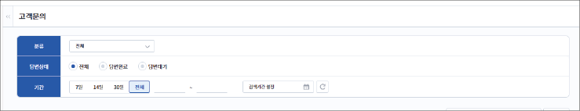
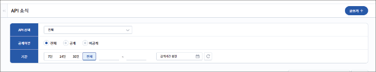

## 환경 설정하기 {#환경-설정하기}

### 내 정보 수정하기

내 정보를 조회할 수 있으며, 정보 수정은 자동차 데이터 포털에서 가능합니다. 화면 하단의 **정보 수정**을 클릭하면 자동차 데이터 포털로 이동합니다.

## 고객 지원하기 {#고객-지원하기}

### 고객 문의 관리하기

사용자가 등록한 문의사항을 조회하고 관리할 수 있습니다. 문의 유형, 답변 상태, 기간 등 다양한 조건으로 문의를 필터링하여 필요한 정보를 빠르게 확인할 수 있습니다.

### API 소식 등록하기

API 관련 공지, 업데이트 정보, 변경 사항 등을 등록하고 관리할 수 있습니다. 개발자는 API별 또는 전체 API를 대상으로 공지를 작성할 수 있으며, 사용자는 게시된 소식을 알림을 통해서 확인할 수 있습니다.

