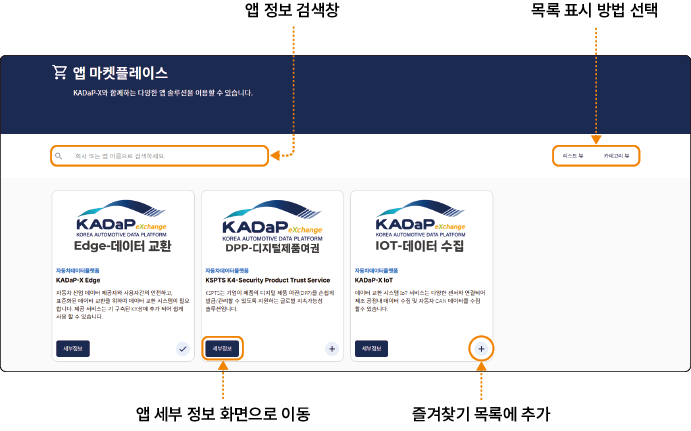

## 마켓 플레이스 사용하기

서비스 제공자 역할의 사용자는 마켓 플레이스에 앱을 출시할 수 있으며, 소비자 역할의 사용자는 마켓 플레이스에서 원하는 앱을 구독할 수 있습니다.

### 앱 상세 정보 확인하기

마켓 플레이스에 등록된 앱의 세부 정보를 확인할 수 있습니다.

앱의 세부 정보를 확인하려면 다음 순서대로 진행하세요.

1. 데이터 교환 시스템 포털 홈 화면에서 메인 메뉴의 **마켓 플레이스** > **앱 마켓 플레이스**를 클릭하세요.

2. 앱 마켓 플레이스 화면에서 확인할 앱의 **세부정보**를 클릭하세요.

3. 앱 세부 정보 화면에서 앱 정보를 확인하세요.

- 앱 기본 정보: 앱의 사용 예시, 지원 언어, 가격 정보 및 앱 상태를 표시합니다.

- **설명**: 앱에서 제공하는 서비스에 대한 설명을 표시합니다.

- **개인정보처리방침**: 앱에서 수집하거나 처리, 저장하는 데이터 항목을 표시합니다.

- **문서**: 앱의 이용 약관, 데이터 모델 등의 첨부 문서를 다운로드할 수 있습니다.

- **기술 사용자**: 앱을 사용할 기술 사용자의 사용자 권한을 표시합니다.

- **앱 공급자 정보**: 앱을 등록한 공급자의 홈페이지 및 연락처를 표시합니다.

### 앱 구독 신청하기

사용자는 앱 세부 정보를 확인하고 구독 신청을 할 수 있습니다. 서비스 제공자 승인 후 구독이 활성화되어 선택한 앱을 사용할 수 있습니다.

앱의 구독 신청을 하려면 다음 순서대로 진행하세요.

1. 데이터 교환 시스템 포털 홈 화면에서 메인 메뉴의 **마켓 플레이스** > **앱 마켓 플레이스**를 클릭하세요.

2. 앱 마켓 플레이스 화면에서 확인할 앱의 **세부정보**를 클릭하세요.

3. 앱 세부 정보 화면에서 앱 정보를 확인하고 **구독**을 클릭하세요.

4. 앱 구독 요청 창이 나타나면 상세 설명을 읽고 **확인**을 클릭하세요.

- 앱 구독 요청이 완료되면 앱 서비스 제공자에게 요청이 전달됩니다. 구독 프로세스는 최대 5일 정도 소요되며 프로세스가 완료되면 앱 구독의 다음 단계 진행을 위해 포털의 알림이 표시됩니다.

>  **참고**

>

> 앱 구독 취소는 각 업체별로 지정되는 회사 관리자만 실행할 수 있습니다. 앱 구독을 취소하려면 사용자가 속한 조직의 회사 관리자에게 문의하세요.

