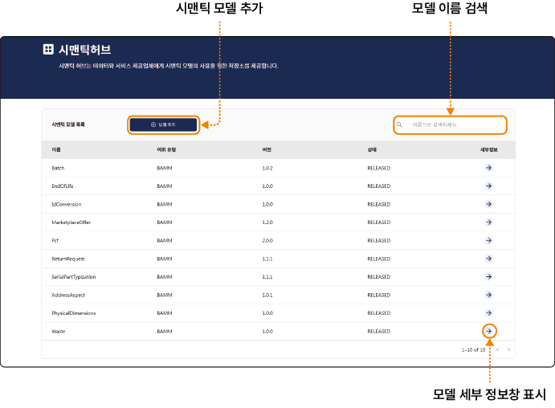

## 데이터 관리하기

데이터 교환 시스템에서는 BAMM(Bayer Aspect Meta Model)을 활용하여 데이터를 표준 규격(AAS, Asset Administration Shell)의 시맨틱 모델로 변환해 저장합니다.

### 모델 상세 정보 확인하기

포털에 등록된 시맨틱 모델의 상세 정보를 확인할 수 있습니다.

시맨틱 모델의 세부 정보를 확인하려면 다음 순서대로 진행하세요.

1. 데이터 교환 시스템 포털 홈 화면에서 메인 메뉴의 **데이터 관리** > **시맨틱 허브**를 클릭하세요.

2. 시맨틱 허브 화면에서 확인할 모델 세부정보 항목의 를 클릭하세요.

3. Aspect 모델 정보 창에서 세부 정보를 확인하세요.

- **Aspect 모델 세부정보**: 모델의 이름, 버전, 상태와 모델 URN(Uniform Resource Name)을 확인할 수 있습니다.

- **Aspect 모델 다이어그램**: 모델의 데이터의 계층 구조와 속성을 확인할 수 있습니다.

  - **확대**/**축소**/**원본**/**중앙**을 클릭해 다이어그램 크기나 위치를 변경해 볼 수 있습니다.

  - 를 클릭하면 새로운 창에서 전체 화면 이미지로 확인할 수 있습니다.

 - **Aspect 모델 다운로드**: 모델 관련 문서를 파일로 다운로드할 수 있습니다.

   - **문서**: 시맨틱 모델의 구조와 속성 등이 정리된 문서를 다운로드합니다.

   - **JSON 스키마**: JSON 데이터의 구조를 정의한 문서를 다운로드합니다.

   - **예제 PAYLOAD JSON**: 해당 모델 규격으로 작성된 샘플 데이터 파일을 다운로드합니다.

   - **TTL 파일**: BAMM 기반 시맨틱 모델의 원본 소스 코드를 다운로드합니다.

   - **AAS 파일/AAS XML**: AAS 규격으로 변환된 AASX 파일과 XML 파일 중 원하는 포맷을 선택해 다운로드할 수 있습니다. AASX 포맷은 서브모델과 관련 문서를 포함한 패키지 압축 파일이며, XML 포맷은 데이터 구조와 상세 정의를 포함한 텍스트 파일입니다.

### 시맨틱 모델 추가하기

포털에 사용할 시맨틱 모델을 추가할 수 있습니다.

시맨틱 모델을 추가하려면 다음 순서대로 진행하세요.

1. 데이터 교환 시스템 포털 홈 화면에서 메인 메뉴의 **데이터 관리** > **시맨틱 허브**를 클릭하세요.

2. 시맨틱 허브 화면에서 확인할 모델 세부정보 항목의 **+ 모델 추가**를 클릭하세요.

3. 모델 추가 창이 나타나면 모델 상태를 선택하세요.

- **Draft**: 서비스 제공자가 모델 테스트용으로 업로드할 때 사용합니다.

- **Release**: 모델 정의가 완료되어 실제 사용할 모델을 등록합니다.

4. 사용할 Submodel을 BAMM 형식으로 입력하고 **추가**를 클릭하세요.

- BAMM 포맷은 다른 시맨틱 모델 정보를 참고해 입력하세요.

