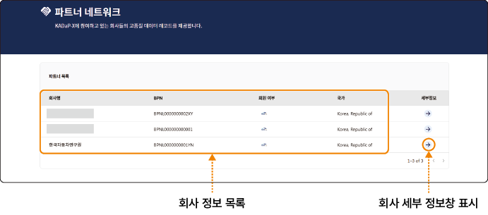

## 파트너 네트워크 확인하기

데이터 교환 시스템 포털에 등록한 파트너사의 사업자 등록 번호, 주소 등 상세 정보와 BPN 정보를 확인할 수 있습니다.

파트너사의 세부 정보를 확인하려면 다음 순서대로 진행하세요.

1. 데이터 교환 시스템 포털 홈 화면에서 메인 메뉴의 **파트너 네트워크**를 클릭하세요.

2. 파트너 네트워크 화면에서 확인할 회사 세부정보 항목의 를 클릭하세요.

3. 회사 세부 정보 창에서 상세 정보를 확인하세요.

- **회사 정보**: 포털에 등록된 회사명과 BPN 정보를 표시합니다.

  - BPN 정보는 자동차데이터플랫폼(KADaP) 데이터 교환 시스템에 기업 정보를 등록하면 자동으로 부여되는 회사 식별 번호입니다.

- **주소**: 회사 주소를 표시합니다.

- **회사 고유번호**: 회사의 사업자 등록 번호를 표시합니다.

