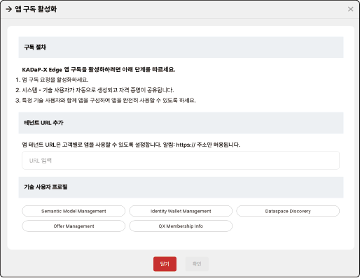

## 앱 관리하기 (등록/구독)

회사 관리자는 마켓 플레이스에 앱을 등록하고 출시한 앱을 관리할 수 있습니다.

>  **참고**

>

> 앱 관리 메뉴는 회사 관리자 권한 사용자가 로그인한 경우에만 표시됩니다.

> - 포털의 다른 권한 사용자는 앱 관리 권한이 없으므로 메뉴가 표시되지 않습니다.

### 앱 구독 관리하기

앱 관리자는 사용자가 신청한 앱 구독 세부 정보를 확인하고 관리할 수 있습니다.

#### 앱 구독 세부 정보 확인

앱 구독 세부 정보를 확인하려면 다음 순서대로 진행하세요.

1. 데이터 교환 시스템 포털의 홈 화면에서 **앱관리** > **앱 구독 관리**를 클릭하세요.

2. 앱 구독 관리 화면에서 앱 항목의 **세부정보 표시**→를 클릭하세요.

- 를 클릭하면 고객별/오퍼별로 목록을 필터링해 표시할 수 있습니다.

- 사용자가 앱 구독 신청을 하면 이 표시되며, 구독 활성화가 완료되면 이 표시됩니다.

3. 구독 세부 정보 및 상태 창에서 앱 구독 세부 정보와 상태를 확인하세요.

- **구독 세부 정보**: 앱 이름, 상태, 고객 정보 등이 표시됩니다.

- **기술 세부 정보**: 앱 사용을 위한 테넌트 URL, 기술 사용자 프로필 등 기술 세부 정보가 표시됩니다.

#### 앱 자동 설정 URL 등록

특정 고객이 앱의 구독을 신청하면 데이터 교환 시스템이 엔드포인트를 자동으로 실행해 바로 앱을 사용할 수 있도록 설정합니다.

앱의 자동 설정 URL을 등록하려면 다음 순서대로 진행하세요.

1. 데이터 교환 시스템 포털의 홈 화면에서 **앱관리** > **앱 구독 관리**를 클릭하세요.

2. 앱 구독 관리 화면에서 **URL 등록**을 클릭하세요.

3. 자동 설정 URL 등록 창이 열리면 고객의 URL을 입력하고 **확인**을 클릭하세요.

#### 앱 구독 활성화

사용자가 구독 신청을 하면 앱 관리자는 해당 고객의 앱 구독 활성화를 위한 실행 정보를 입력해야 합니다. 앱 구독 활성화가 완료되면 사용자가 앱을 정상적으로 사용할 수 있습니다.

앱 구독 활성화를 진행하려면 다음 순서대로 진행하세요.

1. 데이터 교환 시스템 포털의 홈 화면에서 **앱관리** > **앱 구독 관리**를 클릭하세요.

2. 앱 구독 관리 화면의 목록에서 **설정**을 클릭하세요.

3. 앱 구독 활성화 창이 열리면 앱 테넌트 URL을 입력하고 **확인**을 클릭하세요.

- 앱 테넌트 URL을 입력할 때에는 **https://** 로 시작하는 주소를 입력합니다.

- 앱 테넌트 URL이 정상적으로 연동되면 앱에 설정된 클라이언트 정보 및 기술관련 세부정보 창이 표시됩니다.

>  **참고**

>

> 앱이 활성화되면 구독을 신청한 사용자에게 앱 역할을 할당해야 합니다. 역할이 할당된 사용자만 앱을 실행할 수 있습니다. 앱 권한 할당에 대한 자세한 설명은 [포털 앱 사용자 관리](#포털-앱-사용자-관리)을 참고하세요.

