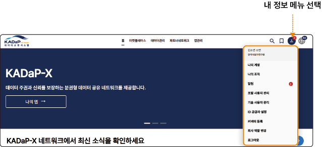
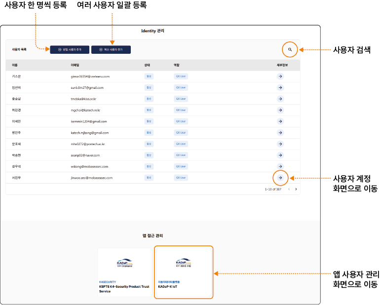
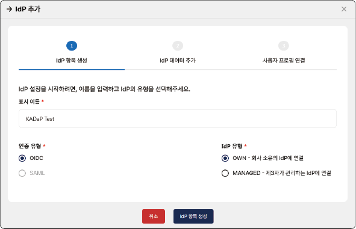
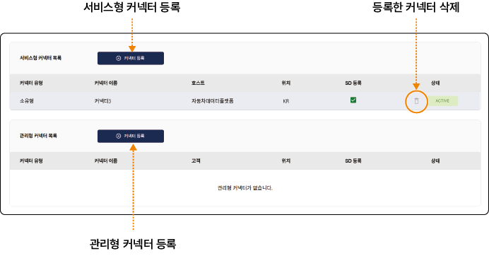

## 내 정보 설정하기 {#내-정보-설정하기}

데이터 교환 시스템 포털의 설정 메뉴에서 사용자 정보를 확인하고 설정할 수 있습니다. 관리자로 할당된 사용자는 관리자 메뉴에서 포털 사용자 및 기술 사용자 등록 등 상세 설정을 할 수 있습니다.

>  **참고**

>

> - 관리자 메뉴는 관리자 역할 사용자가 로그인한 경우에만 표시됩니다.

> - 일반 사용자로 로그인하면 기본 내 정보 메뉴만 확인할 수 있습니다.

### 내 정보 메뉴 확인하기

데이터 교환 시스템 포털의 **내 정보** 메뉴에서 사용자 설정을 할 수 있습니다.

| 번호 | 항목 | 설명 |

| --- | --- | --- |

| 1 | 나의 계정 | 로그인한 사용자 정보를 확인할 수 있습니다.<ul><li>**TOKEN을 클립보드로 복사**: 사용자 계정의 토큰 데이터를 복사합니다. 사용자 토큰은 사용자 인증 시 적용할 수 있습니다.</li><li>**사용자 삭제**: 내 정보를 삭제합니다. 사용자 삭제는 관리자 승인 후 적용됩니다.</li><li>**개인 정보**: 사용자 이름과 이메일주소가 표시됩니다.</li><li>**상태 정보**: 사용자의 상태와 계정 생성일이 표시됩니다.</li><li>**발행 정보**: 조직명과 관리자 정보가 표시됩니다.</li><li>**포털 역할**: 사용자에게 할당된 포털 내 역할이 표시됩니다.</li><li>**앱 권한**: 앱별로 할당된 사용자 역할이 표시됩니다.</li><li>**DEV 전용 (현재 인증 Token)**: 사용자 인증 토큰의 전체 데이터가 표시되며, 앱이나 커넥터 연동 테스트 시 사용할 수 있습니다.</li>|

| 2 | 나의 조직 | 사용자가 속한 회사 정보와 앱 구독 목록을 확인할 수 있습니다.<ul><li>관리자 권한의 사용자는 앱 구독 목록의 **구독 취소**를 클릭해 앱 구독을 취소합니다. 앱 구독 취소는 관리자만 실행할 수 있습니다.</li></ul>|

| 3 | 알림 | 포털의 알림을 확인할 수 있습니다.<ul><li>읽지 않은 알림이 있으면 내 정보 아이콘에 배지가 표시됩니다.</li></ul> |

| 4 | 포털 사용자 관리 | 관리자 권한 사용자는 사용자별로 포털의 권한 및 앱별 접근 권한을 설정할 수 있습니다. 자세한 설명은 [포털 사용자 관리하기](#포털-사용자-관리하기)를 참고하세요. |

| 5 | 기술 사용자 관리 | 관리자 권한 사용자는 앱에 접근을 허용할 기술 사용자를 등록할 수 있습니다. 자세한 설명은 [기술 사용자 관리하기](#기술-사용자-관리하기)를 참고하세요. |

| 6 | ID 공급자 설정 | 관리자 권한 사용자는 회사의 ID 공급자 설정을 입력해 회사 사용자가 데이터 교환 시스템에 인증하는 방법을 관리할 수 있습니다. 자세한 설명은 [ID 공급자 설정하기](#ID-공급자-설정하기)를 참고하세요. |

| 7 | 커넥터 등록 | 관리자 권한 사용자는 서비스형/관리형 커넥터를 등록할 수 있습니다. 자세한 설명은 [커넥터 등록하기](#커넥터-등록하기)를 참고하세요. |

| 8 | 회사 역할 변경 | 관리자 권한 사용자는 포털에서 회사의 역할을 변경할 수 있습니다. 자세한 설명은 [회사 역할 변경하기](#회사-역할-변경하기)를 참고하세요. |

| 9 | 로그아웃 | 사용자 계정에서 로그아웃합니다. |

### 포털 사용자 관리하기 {#포털-사용자-관리하기}

관리자 권한 사용자는 사용자별로 포털 메뉴의 접근 권한과 앱별 접근 권한을 설정할 수 있습니다.

#### 화면 구성

데이터 교환 시스템 포털의 **내 정보** > **포털 사용자 관리** 메뉴에서 포털 사용자를 등록하고 관리할 수 있습니다.

#### 포털 사용자 등록

데이터 교환 시스템 포털에 접근할 수 있는 사용자를 등록할 수 있습니다.

##### 단일 사용자 추가

사용자를 한 명씩 등록하려면 다음 순서대로 진행하세요.

1. 데이터 교환 시스템 포털의 홈 화면에서 **내 정보**>**포털 사용자 관리**를 클릭하세요.

2. 포털 사용자 관리 화면에서 **+ 단일 사용자 추가**를 클릭하세요.

3. 단일 사용자 추가 창이 나타나면 상세 정보를 설정하고 **확인**을 클릭하세요.

- [*]가 표시된 항목은 필수 입력 항목이므로 반드시 입력하세요.

- **사용자 ID**: 등록할 사용자 ID를 입력합니다.

- **이름**: 사용자 이름을 입력합니다.

- **성**: 사용자 성을 입력합니다.

- **이메일**: 사용자 이메일을 입력합니다.

- **KX 포털 사용자 역할 선택**: 데이터 교환 시스템 포털에서 사용자에게 할당할 역할을 선택합니다. 역할에 대한 자세한 설명은 **역할 세부 도움말**을 클릭해 확인할 수 있습니다.

##### 복수 사용자 추가

여러 사용자를 한 번에 등록하려면 다음 순서대로 진행하세요.

1. 데이터 교환 시스템 포털의 홈 화면에서 **내 정보**>**포털 사용자 관리**를 클릭하세요.

2. 포털 사용자 관리 화면에서 **+ 복수 사용자 추가**를 클릭하세요.

3. 복수 사용자 추가 창이 나타나면 **템플릿 다운로드**를 클릭하세요.

4. 사용자 정보를 입력한 템플릿 파일을 업로드하고 **확인**을 클릭하세요.

5. 업로드 파일에 입력한 사용자의 역할을 선택하고 **확인**을 클릭하세요.

- 모든 사용자에게 공통으로 적용할 역할만 선택하여 등록합니다. 사용자별로 개별 할당이 필요한 역할은 사용자 등록 완료 후 추가하는 것을 권장합니다.

  - 포털 사용자 역할은 사용자 계정 화면에서 **포털 역할 변경**을 클릭해 변경할 수 있습니다.

#### 포털 사용자 정보 확인

데이터 교환 시스템 포털에 등록된 사용자 정보를 확인하고 관리할 수 있습니다.

포털 사용자 정보를 확인하려면 다음 순서대로 진행하세요.

1. 데이터 교환 시스템 포털의 홈 화면에서 **내 정보**>**포털 사용자 관리**를 클릭하세요.

2. 포털 사용자 관리 화면에서 정보를 확인할 사용자의 를 클릭하세요.

3. 사용자 계정 화면에서 상세 정보를 확인하세요.

- **사용자 중지**: 사용자 계정을 비활성화합니다. 계정을 비활성화하면 사용자는 포털 메뉴에 접근할 수 없습니다.

- **사용자 삭제**: 사용자 계정을 삭제합니다. 계정을 삭제하면 포털의 로그인 정보가 모두 삭제됩니다.

- **비밀번호 재설정**: 필요한 경우 사용자 계정의 비밀번호를 초기화할 수 있습니다. 비밀번호 재설정을 위한 링크가 사용자 메일로 전송되며 해당 링크에서 비밀번호를 변경합니다.

- **포털 역할 변경**: 포털의 사용자 역할을 변경합니다. 사용자 역할이 변경되면 비밀번호를 재설정해야 정상 로그인할 수 있습니다.

#### 포털 앱 사용자 관리 {#포털-앱-사용자-관리}

마켓 플레이스의 앱에 사용자를 할당하고 권한을 관리할 수 있습니다.

사용자에게 앱 접근 권한을 할당하려면 다음 순서대로 진행하세요.

1. 데이터 교환 시스템 포털의 홈 화면에서 **내 정보**>**포털 사용자 관리**를 클릭하세요.

2. 포털 사용자 관리 화면에서 앱 접근 관리 목록의 앱을 클릭하세요.

3. 앱 사용자 관리 화면에서 **+ 앱 사용자**를 클릭하세요.

4. 앱 사용자 권한 추가 창에서 사용자를 선택하고 역할을 설정한 후 **확인**을 클릭하세요.

- 앱 사용자 목록에서 사용자의 를 클릭해 역할 관리 창에서도 역할을 변경할 수 있습니다.

- 사용자 역할이 변경되면 비밀번호를 재설정해야 정상 로그인할 수 있습니다.

### 기술 사용자 관리하기 {#기술-사용자-관리하기}

관리자 권한 사용자는 앱에 접근을 허용할 기술 사용자를 등록할 수 있습니다.

#### 화면 구성

데이터 교환 시스템 포털의 **내 정보** > **기술 사용자 관리** 메뉴에서 포털 사용자를 등록하고 관리할 수 있습니다.

#### 기술 사용자 등록

데이터 교환 시스템 포털의 기술 사용자를 등록할 수 있습니다. 마켓 플레이스에 등록된 앱이 시스템의 특정 자원에 접근하고 작업을 수행할 수 있도록 실행 범위를 설정합니다.

기술 사용자를 등록하려면 다음 순서대로 진행하세요.

1. 데이터 교환 시스템 포털의 홈 화면에서 **내 정보**>**기술 사용자 관리**를 클릭하세요.

2. 기술 사용자 관리 화면에서 **+ 기술 사용자 생성**을 클릭하세요.

3. 단일 사용자 추가 창이 나타나면 상세 정보를 설정하고 **확인**을 클릭하세요.

- [*]가 표시된 항목은 필수 입력 항목이므로 반드시 입력하세요.

- **사용자 이름**: 등록할 사용자 이름을 입력합니다.

- **설명**: 사용자에 대한 설명을 입력합니다. 여러 개의 기술 사용자 계정이 있어 구분이 어려운 경우 설명에 상세 정보를 입력해 관리할 수 있습니다.

- **기술 사용자 역할**: 앱의 서비스 역할 중 사용자에게 할당할 역할을 선택합니다.

  - Registration External: 외부 시스템에서 기업의 온보딩이나 서비스 등록을 진행합니다.

  - Semantic Model Management: 시맨틱 모델을 생성하고 관리합니다. 데이터를 표준 규격으로 변환하거나 가공하는 앱에 필요한 역할입니다.

  - Identity Wallet Management: 기업 고유의 전자 지갑(Identity Wallet)에 접근하여 자격 증명을 요청하거나 저장하고, 데이터 계약 시 디지털 서명을 수행할 수 있습니다.

  - BPDM Pool: 비즈니스 파트너 데이터 관리 풀(BPDM, Business Partner Data Management)에 접근하여 등록된 기업들의 마스터 데이터(BPN 등)를 조회하거나 관리합니다.

  - Dataspace Discovery: 데이터 스페이스 내에서 활용 가능한 데이터 자산이나 참여자 엔드포인트를 조회합니다.

  - Offer Management: 마켓 플레이스에 데이터 상품이나 앱 서비스를 오퍼링으로 등록하고, 사용자의 구독 요청을 활성화하거나 커넥터를 등록하는 등의 오퍼링 관련 기능을 관리합니다.

  - QX Membership Info: 데이터 스페이스(QX)의 가입 정보 및 자격 상태를 검증하고 관리합니다.

#### 기술 사용자 정보 확인

데이터 교환 시스템 포털에 등록된 기술 사용자 정보를 확인하고 관리할 수 있습니다.

기술 사용자 정보를 확인하려면 다음 순서대로 진행하세요.

1. 데이터 교환 시스템 포털의 홈 화면에서 **내 정보**>**기술 사용자 관리**를 클릭하세요.

2. 기술 사용자 관리 화면에서 정보를 확인할 사용자의 를 클릭하세요.

3. 기술 사용자 세부 정보 화면에서 상세 정보를 확인하세요.

- 기술 사용자 세부 정보 항목에서 를 클릭하면 정보를 복사할 수 있습니다.

- **기술 사용자 삭제**: 기술 사용자 계정을 삭제합니다.

- **기술 사용자 초기화**: 기술 사용자의 인증서 정보를 초기화합니다.

### ID 공급자 설정하기 {#id-공급자-설정하기}

관리자 권한 사용자는 회사의 ID 공급자 설정을 입력해 회사 사용자가 데이터 교환 시스템에 인증하는 방법을 관리할 수 있습니다.

#### 화면 구성

데이터 교환 시스템 포털의 **내 정보** > **ID 공급자 설정** 메뉴에서 ID 공급자를 등록하고 관리할 수 있습니다.

#### IdP 등록

회사의 ID 공급자 정보를 입력하고 사용자 프로필을 연결해 포털에 등록할 수 있습니다.

ID 공급자를 등록하려면 다음 순서대로 진행하세요.

1. 데이터 교환 시스템 포털의 홈 화면에서 **내 정보 > ID 공급자 설정**을 클릭하세요.

2. ID 공급자 설정 화면에서 **+ IdP 추가**를 클릭하세요.

3. IdP 추가 창이 나타나면 등록 단계에 따라 정보를 입력하세요.

- [*]가 표시된 항목은 필수 입력 항목이므로 반드시 입력하세요.

**IdP 항목 생성**

IdP 이름과 유형을 설정하고 **IdP 항목 생성**을 클릭하세요.

&#x20; - **표시 이름**: 사용할IdP 이름을 입력합니다.

&#x20; - **인증 유형**: IdP 인증 프로토콜을 선택합니다.

 - OIDC: OIDC(OpenID Connect)는 OAuth 2.0 프로토콜을 기반으로 한 인증 방식으로 클라우드나 시스템이나 SaaS 앱 연동 시 선택합니다.

 - SAML: SAML(Security Assertion Markup Language)은 XML 기반으로 인증 데이터를 교환하며 온프레미스 환경 연동 시 선택합니다.

&#x20; - **IdP 유형**: 사용할 인증 시스템 유형을 선택합니다.

 - OWN - 회사 소유의 IdP에 연결: 기업이 운영 중인 인증 서버에 직접 연결합니다.

 - MANAGED - 제3자가 관리하는 IdP에 연결: 별도의 서버 없이 플랫폼 운영사나 제3자가 제공하는 인증 서비스를 이용합니다.

**IdP 데이터 추가**

IdP 세부 정보를 입력하고 **Metadata 저장**을 클릭하세요.

&#x20; - Metadata URL, Clietn ID, 비밀번호 입력창을 클릭하면 도움말이 표시됩니다.

**사용자 프로필 연결**

포털에 등록된 사용자 프로필과 연결해 IdP 등록을 완료하세요.

>  **참고**

>

> ID 공급자 등록 단계를 완료하지 않아도 **진행중** 항목이 목록에 추가됩니다.

> - IdP 목록의 **작업** > **설정**을 클릭하면 마지막으로 저장한 단계에 이어서 등록을 완료할 수 있습니다.

#### IdP 관리

데이터 교환 시스템 포털에 등록한 ID 공급자 정보를 확인하고 사용자 계정을 업데이트할 수 있습니다.

등록한 IdP를 관리하려면 다음 순서대로 진행하세요.

1. 데이터 교환 시스템 포털의 홈 화면에서 **내 정보**>**ID 공급자 설정**을 클릭하세요.

2. ID 공급자 설정 화면에서 설정할 항목의 **작업**을 클릭하세요.

3. ID 공급자 관리 메뉴가 나타나면 원하는 항목을 선택하세요.

- **설정**: IdP 추가 창에서 IdP 연결 정보와 사용자 프로필 정보를 변경할 수 있습니다.

- **활성**: 비활성 상태인 IdP 항목을 사용 설정할 수 있습니다.

- **비활성화**: 활성 상태인 IdP 항목을 비활성해 사용을 중지할 수 있습니다.

- **삭제**: IdP 항목을 삭제합니다.

##### 사용자 계정 업데이트

활성화 상태인 IdP 항목의 포털 사용자를 IdP 사용자 정보와 연결할 수 있습니다.

사용자 계정을 업데이트하려면 다음 순서대로 진행하세요.

1. 데이터 교환 시스템 포털의 홈 화면에서 **내 정보**>**ID 공급자 설정**을 클릭하세요.

2. ID 공급자 설정 화면에서 설정할 항목의 **작업**>**사용자 계정 업데이트**를 클릭하세요.

3. 사용자 계정 업데이트/이전 창에서 다운로드할 파일 형식을 선택하고 **사용자 목록 다운로드**를 클릭하세요.

- JSON, CSV 중 원하는 파일 형식을 선택하고 **문서 서식**을 체크해 다운로드합니다.

4. 다운로드한 파일의 **ProviderUserId**, **ProviderUserName**항목에 회사 IdP 정보를 입력하고 저장하세요.

5. 파일을 업로드한 후 **업데이트된 사용자 목록 업로드**를 클릭하세요.

### 커넥터 등록하기 {#커넥터-등록하기}

관리자 권한 사용자는 데이터 교환 시스템 포털에서 사용할 커넥터를 등록하고 관리할 수 있습니다.

#### 화면 구성

데이터 교환 시스템 포털의 **내 정보** > **커넥터 등록** 메뉴에서 커넥터를 등록하고 관리할 수 있습니다.

#### 서비스형 커넥터 등록

회사 네트워크에 구현된 서비스형 커넥터를 등록할 수 있습니다.

서비스형 커넥터를 등록하려면 다음 순서대로 진행하세요.

1. 데이터 교환 시스템 포털의 홈 화면에서 **내 정보**>**커넥터 등록**을 클릭하세요.

2. 커넥터 등록 화면에서 서비스형 커넥터 목록의 **+ 커넥터 등록**을 클릭하세요.

3. 서비스형 커넥터 등록 창에서 커넥터 구성 방법을 확인하고 체크박스를 선택 후 **다음**을 클릭하세요.

4. 서비스형 커넥터 정보를 입력하고 **확인**을 클릭하세요.

- **이름**: 커넥터 이름을 20자 이내로 입력합니다.

- **커넥터 URL/엔드포인트**: HTTPS 프로토콜과 함께 도메인 또는 IP 주소 형식으로 사용할 커넥터 URL을 입력합니다.

- **위치**: 두 자리 국가 코드를 입력합니다. 한국은 KR, 미국은 US 형식으로 입력합니다.

#### 관리형 커넥터 등록

고객/제3자가 제공하는 관리형 커넥터를 등록할 수 있습니다.

관리형 커넥터를 등록하려면 다음 순서대로 진행하세요.

1. 데이터 교환 시스템 포털의 홈 화면에서 **내 정보**>**커넥터 등록**을 클릭하세요.

2. 커넥터 등록 화면에서 관리형 커넥터 목록의 **+ 커넥터 등록**을 클릭하세요.

3. 서비스형 커넥터 등록 창에서 커넥터 구성 방법을 확인하고 체크박스를 선택 후 **다음**을 클릭하세요.

4. 서비스형 커넥터 정보를 입력하고 **확인**을 클릭하세요.

- **이름**: 커넥터 이름을 20자 이내로 입력합니다.

- **커넥터 URL/엔드포인트**: HTTPS 프로토콜과 함께 도메인 또는 IP 주소 형식으로 사용할 커넥터 URL을 입력합니다.

- **위치**: 두 자리 국가 코드를 입력합니다. 한국은 KR, 미국은 US 형식으로 입력합니다.

- **고객 링크**: 고객이 구독하는 앱 링크를 목록에서 선택합니다.

### 회사 역할 변경하기 {#회사-역할-변경하기}

관리자 권한 사용자는 데이터 교환 시스템 포털에서 회사가 수행하는 역할을 변경할 수 있습니다.

> **참고**

>

> - 포털에 등록된 회사는 하나 이상의 역할이 할당되어 있어야 합니다.

> - 역할을 변경하면 포털에서 사용할 수 있는 역할, 권한이 달라집니다. 역할을 변경하기 전에 사용 범위와 권한을 반드시 확인하세요.

회사 역할을 변경하려면 다음 순서대로 진행하세요.

1. 데이터 교환 시스템 포털의 홈 화면에서 **내 정보** > **회사 역할 변경**을 클릭하세요.

2. 회사 역할 변경 화면에서 사용할 역할을 선택하고 **변경**을 클릭하세요.

- **앱 제공자**: 앱 마켓 플레이스에 앱을 등록하고, 출시한 앱의 구독 및 기술 사용자 프로필 등을 관리할 수 있습니다.

- **서비스 제공자**: 데이터 커넥터를 등록하거나 관리하고, 시맨틱 모델이 적용된 데이터를 공유 자산로 등록하고 오퍼링을 관리할 수 있습니다.

- **온보딩 서비스 제공자**: 데이터 스페이스 사용을 위해 기업의 온보딩 서비스를 제공하고 외부 등록 절차를 진행할 수 있습니다.

