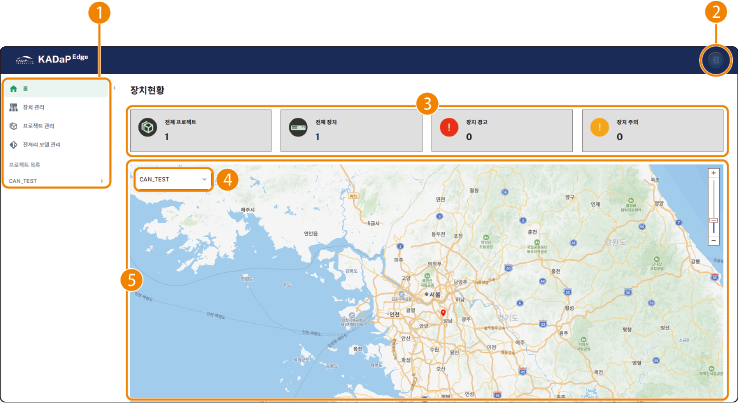

## 홈 화면 구성

데이터 수집 시스템의 홈 화면은 다음과 같이 구성됩니다. 각 항목별 기능을 설명합니다.

| 번호 | 항목 | 설명 |
| --- | --- | --- |
| 1 | 데이터 수집 시스템 메뉴 | 데이터 수집 시스템의 메뉴를 선택합니다.<ul><li>**홈**: 홈 화면으로 이동합니다.</li><li>**장치 관리**: 장치를 등록하고 관리할 수 있습니다.</li><li>**프로젝트 관리**: 프로젝트를 등록하고 관리할 수 있습니다.</li><li>**전처리 모델 관리**: 전처리 모델을 등록할 수 있습니다.</li><li>**프로젝트 목록**: 프로젝트 설정 정보와 장치를 확인하고, 프로젝트 데이터를 관리할 수 있습니다.</li>|
| 2 | 내 정보 | 로그인한 사용자 정보를 확인하고 화면 표시 모드를 설정할 수 있습니다.<ul><li>**Dark mode**: 화면 표시 모드를 선택합니다.</li><li>**로그아웃**: 로그인한 계정에서 로그아웃합니다. |
| 3 | 프로젝트 및 장치 상태 | 전체 프로젝트 수와 전체 장치의 상태를 한 눈에 확인할 수 있습니다. |
| 4 | 프로젝트 목록 | 등록한 프로젝트별로 설정 정보와 장치 정보, 프로젝트 데이터를 확인할 수 있습니다.<ul><li>**프로젝트 설정**: 프로젝트 정보와 할당한 장치를 확인할 수 있습니다.</li><li>**프로젝트 데이터 관리**: root 경로에 저장된 데이터를 확인할 수 있습니다.</li><li>장치 정보: 장치 상세 정보와 모니터링 항목을 확인할 수 있으며, 장치별 데이터 및 CAN 뷰어를 설정할 수 있습니다.</li></ul>|
| 5 | 장치 위치 | 등록한 장치의 위치를 지도에서 확인할 수 있습니다. |

