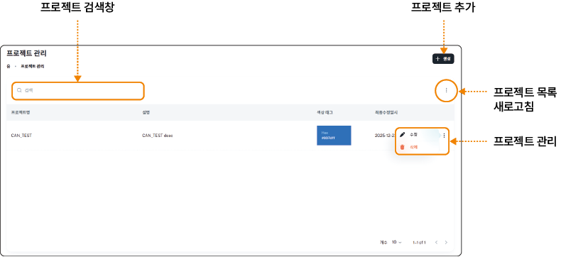

## 프로젝트 관리하기

등록한 장치를 그룹으로 구성하는 프로젝트를 등록하고 관리할 수 있습니다.

### 화면 구성

데이터 수집 시스템의 **프로젝트 관리** 메뉴에서 프로젝트를 등록하고 관리할 수 있습니다.

- 프로젝트 관리 항목에서는 프로젝트를 수정하거나 삭제할 수 있습니다.

&#x20; - **수정**: 프로젝트 편집 화면으로 이동해 프로젝트 정보를 수정할 수 있습니다.

&#x20; - **삭제**: 등록한 프로젝트를 삭제합니다. 삭제한 프로젝트는 복구할 수 없습니다.

### 프로젝트 추가하기

프로젝트를 등록하려면 다음 순서대로 진행하세요.

1. 데이터 수집 시스템의 홈 화면에서 **프로젝트 관리**를 클릭하세요.

2. 프로젝트 관리 화면에서 **+ 생성**을 클릭하세요.

3. 프로젝트 추가 화면에서 상세 정보를 입력하고 **생성**을 클릭하세요.

- **프로젝트명**: 추가할 프로젝트 이름을 입력합니다.

- **설명**: 프로젝트 설명을 입력합니다.

- **색상 태그 정보**: 지도에 표시할 프로젝트 색상을 설정합니다.

> **참고**

>

> 등록한 프로젝트는**프로젝트 목록 > 프로젝트 관리** 항목을 클릭해 정보를 수정하거나 삭제할 수 있습니다.

