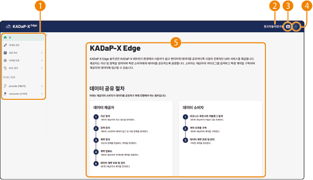

# 3. 데이터 교환 시스템

데이터 교환 시스템(KADaP-X Edge)에서는 데이터 자산과 계약 및 정책 정의, 계약 적용 후 데이터 공유를 실행할 수 있습니다. 데이터 공유 시스템의 제공자/소비자 역할에 따라 편리하게 커넥터를 생성하고 관리할 수 있습니다. 또한, 데이터 교환을 위해 필요한 데이터 자산 및 계약, 정책을 정의하고 관리할 수 있습니다.

> **참고**

>

> 데이터 교환 시스템에는 기관 회원 중 기업 정보 등록이 완료된 사용자만 접속할 수 있습니다.

## 홈 화면 구성

데이터 교환 시스템의 홈 화면은 다음과 같이 구성됩니다. 각 항목별 기능을 설명합니다.

| 번호 | 항목 | 설명 |

| --- | --- | --- |

| 1 | 데이터 교환 시스템 메뉴 | 데이터 수집 시스템의 메뉴를 선택합니다.<ul><li>**홈**: 홈 화면으로 이동합니다.</li><li>**커넥터 관리**: 제공자, 소비자 역할의 커넥터를 등록하고 관리할 수 있습니다.</li><li>**공유 자산**: 데이터 교환을 위해 자산을 업로드하고 자산, 정책, 계약을 등록하고 관리할 수 있습니다.</li><li>**디지털 트윈**: 데이터 교환 시 적용되는 AAS 표준을 기반으로 레지스트리 정보를 확인하고 서브 모델을 등록할 수 있습니다.</li><li>**PCF 관리**: 계약 완료 후 PCF(Product Carbon Footprint, 제품 탄소 발자국) 정보를 제공자에게 요청하고 응답 정보를 확인할 수 있습니다.</li><li>**커넥터 목록**: 제공자/소비자가 등록한 커넥터별로 데이터 교환 단계에서 필요한 정보를 등록하고 확인할 수 있습니다.</li></ul> |

| 2 | 조직 정보 | 로그인한 사용자가 속한 회사나 조직 이름이 표시됩니다. |

| 3 | 언어 설정 | 화면에 표시되는 언어를 한국어/영어 중에 선택할 수 있습니다. |

| 4 | 내 정보 | 로그인한 사용자 정보를 확인하고 로그아웃할 수 있습니다. |

| 5 | 데이터 공유 절차 안내 | 데이터 제공자/소비자가 데이터 공유를 위해 실행할 상세 절차를 설명합니다. |

