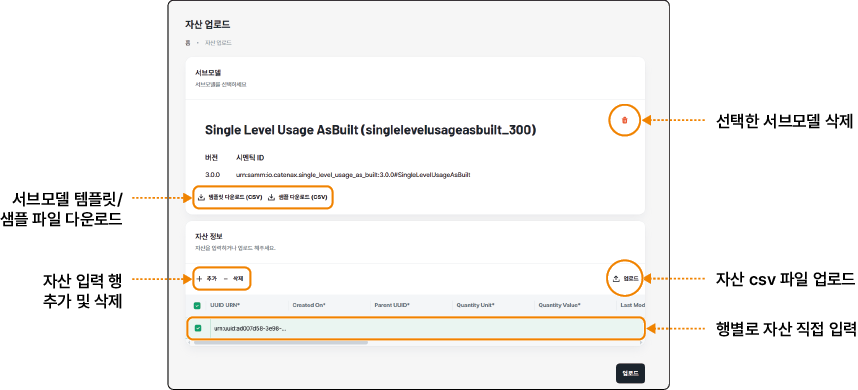
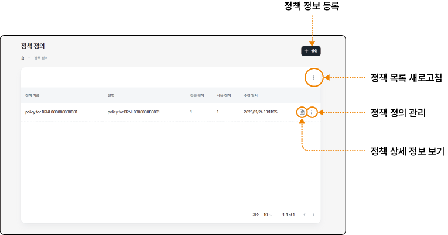

## 공유 자산 관리하기

커넥터를 통해 교환할 데이터를 업로드하고 자산, 정책 및 계약을 정의해 등록할 수 있습니다.

### 자산 업로드하기

AAS 서브모델 템플릿에 맞게 자산을 가공한 후 저장소에 업로드할 수 있습니다.

> **참고**

>

> 서브모델은 국제 표준인 AAS 포맷에 따라 기술 데이터, 탄소 발자국 등 자산의 특정 정보를 표준화된 구조로 정의한 데이터 단위입니다. 모든 참여자가 동일한 필드 구조, 데이터 타입, 의미 정의에 맞춰 데이터를 작성하므로, 서로 다른 시스템과 조직 사이에서도 데이터 품질과 일관성을 유지하면서 데이터 교환을 할 수 있습니다.

공유할 자산을 업로드하려면 다음 순서대로 진행하세요.

1. 데이터 교환 시스템의 홈 화면에서 **공유 자산** > **자산 업로드**를 클릭하세요.

2. 자산 업로드 화면에서 + **생성**을 클릭하세요.

3. 서브모델 선택 창이 나타나면 데이터에 적용할 서브모델을 선택하고 **+ 선택**을 클릭하세요.

- 를 클릭하면 서브모델 상세 창에서 버전 및 상세 정보를 확인할 수 있습니다.

4. 선택한 서브모델이 표시되면 자산 정보를 입력하고 **업로드**를 클릭하세요.

- 서브모델을 선택한 후에만 자산을 입력하거나 업로드할 수 있습니다.

- 자산 정보를 업로드하기 전에 서브모델의 템플릿이나 작성된 샘플 csv 파일을 다운로드해 상세 항목을 확인합니다. 템플릿에 맞게 자산을 입력해 파일을 업로드하면 자산을 일괄 업로드할 수 있습니다.

- 자산 정보의 **+ 추가**를 클릭해 직접 세부 항목을 입력하거나 수정할 수 있습니다.

>  **참고**

>

> 자산 업로드가 완료되면 API 정보를 제공합니다. 실제 서비스 배포 시 해당 URL을 적용할 수 있습니다.

### 자산 정의하기

업로드한 자산 데이터를 데이터스페이스 내에서 식별하고 접근할 수 있도록 자산으로 등록합니다. 자산에 고유 ID, 데이터의 위치(엔드포인트), 유형, 설명 등 메타데이터를 정의하면 소비자가 카탈로그에서 해당 자산을 검색하고 확인할 수 있습니다.

#### 화면 구성

데이터 교환 시스템의 **공유 자산**> **자산 정의** 메뉴에서 자산을 정의하고 관리할 수 있습니다.

- 자산 정의 관리 항목에서는 자산을 수정하거나 삭제할 수 있습니다.

&#x20; - **수정**: 자산 편집 화면으로 이동해 자산 정보를 수정할 수 있습니다.

&#x20; - **삭제**: 등록한 자산을 삭제합니다. 삭제한 자산은 복구할 수 없습니다.

#### 자산 생성

자산의 메타데이터를 등록하려면 다음 순서대로 진행하세요.

1. 데이터 교환 시스템의 홈 화면에서 **공유 자산** > **자산 정의**를 클릭하세요.

2. 자산 정의 화면에서 + **생성**을 클릭하세요.

3. 자산 생성 화면에서 자산의 메타데이터를 입력하고 **생성**을 클릭하세요.

- **자산**: 등록할 자산 이름과 상세 설명을 입력합니다.

- **서브모델**: **+ 생성**을 클릭해 자산에 적용한 서브모델을 선택합니다.

  - 자산 업로드 시 선택한 서브모델과 동일한 항목을 선택해야 합니다.

  - 을 클릭하면 서브모델 창에서 상세 정보를 확인할 수 있으며, 을 클릭하면 서브모델을 다시 선택할 수 있습니다.

- **소스 유형**: REST, CSV 중 소스 유형을 선택합니다.

  - **REST**: 데이터 교환 시스템이 외부 API에서 직접 데이터를 가져올 수 있도록 연결 정보 및 인증 정보를 설정합니다.

  - **CSV**: csv 파일을 직접 업로드한 경우 해당 파일이 실제 데이터 소스로 등록됩니다.

- **소스 정보**: 자산 데이터가 업로드된 저장소에 접속할 때 필요한 엔드포인트 정보와 인증 정보를 입력합니다.

  - **엔드포인트**: 외부 API 호출 방식과 데이터를 가져올 외부 API 서버 URL을 입력합니다.

  - **인증**: 외부 API 서버 접속을 위한 인증 유형을 선택하고 Token URL 및 접속 시 필요한 Client ID와 Client Secret을 입력합니다.

### 정책 정의하기

커넥터에 적용할 접근 정책과 사용 정책을 설정합니다. 데이터 제공자는 데이터 사용자 정보와 사용 범위 조건을 정의해 등록합니다. 이 정책을 적용하면 데이터를 공유하면서도 사용자와 사용 범위에 대한 통제권을 유지하는 데이터 주권을 실현할 수 있습니다.

#### 화면 구성

데이터 교환 시스템의 **공유 자산** > **정책 정의** 메뉴에서 데이터 사용 정책을 정의하고 관리할 수 있습니다.

- 정책 정의 관리 항목에서는 정책을 수정하거나 삭제할 수 있습니다.

&#x20; - **수정**: 정책 편집 화면으로 이동해 정책 정보를 수정할 수 있습니다.

&#x20; - **삭제**: 등록한 정책을 삭제합니다. 삭제한 정책은 복구할 수 없습니다.

#### 정책 생성

커넥터에 적용할 정책을 등록하려면 다음 순서대로 진행하세요.

1. 데이터 교환 시스템의 홈 화면에서 **공유 자산**>**정책 정의**를 클릭하세요.

2. 정책 정의 화면에서 + **생성**을 클릭하세요.

3. 정책 생성 화면에서 정책 상세 정보를 입력하고 **생성**을 클릭하세요.

- **정책 정보**: 등록할 정책 이름과 상세 설명을 입력합니다.

- **접근 정책**: 적용할 접근 정책을 추가합니다.

  - **+ 정책 추가**를 클릭해 유형과 값을 추가합니다. **삭제**를 클릭해 추가한 항목을 삭제할 수 있습니다.

- **사용 정책**: 적용할 사용 정책을 추가합니다.

  - **+ 정책 추가**를 클릭해 유형과 값을 추가합니다. **삭제**를 클릭해 추가한 항목을 삭제할 수 있습니다.

### 계약 정의하기

데이터 제공자는 자산과 정책을 계약으로 묶어 등록합니다. 사전에 등록한 자산과 정책을 설정해 계약을 등록하며, 이 계약 정보가 데이터스페이스 카탈로그에 게시됩니다.

데이터 소비자는 등록된 계약 정보를 확인하고 계약을 요청하게 되며, 계약을 구독한 후에만 실제 데이터에 다운로드할 수 있습니다.

#### 화면 구성

데이터 교환 시스템의 **공유 자산** > **계약 정의** 메뉴에서 계약을 정의하고 관리할 수 있습니다.

#### 계약 생성

커넥터에 적용할 계약을 등록하려면 다음 순서대로 진행하세요.

1. 데이터 교환 시스템의 홈 화면에서 **공유 자산** > **계약 정의**를 클릭하세요.

2. 계약 정의 화면에서 + **생성**을 클릭하세요.

3. 계약 생성 화면에서 계약상세 정보를 입력하고 **생성**을 클릭하세요.

- **계약 정보**: 등록할 계약 이름과 상세 설명을 입력합니다.

- **자산 설정**: 계약을 적용할 자산을 추가합니다.

  - **+ 생성**을 클릭해 사전에 등록한 자산 목록 중 선택한 후 **+ 선택**을 클릭합니다.

  - 자산 추가가 완료되면 상세 정보가 표시됩니다. 자산 이름 오른쪽의 을 클릭하면 추가한 자산을 삭제하고 다시 선택할 수 있습니다.

 - **정책 설정**: 계약을 적용할 정책을 추가합니다.

   - **+ 생성**을 클릭해 사전에 등록한 정책 목록 중 선택한 후 **+ 선택**을 클릭합니다.

   - 정책 추가가 완료되면 상세 정보가 표시됩니다. 정책 이름 오른쪽의 을 클릭하면 추가한 정책을 삭제하고 다시 선택할 수 있습니다.

