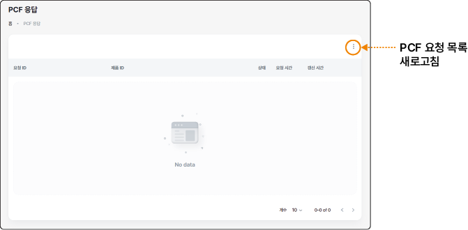

## PCF 관리하기

PCF(Product Carbon Footprint)는 제품의 생산 및 유통 과정에서 발생한 탄소 배출량 데이터입니다. 데이터 소비자는 계약이 완료된 후 부품의 PCF 데이터를 제공자에게 요청할 수 있습니다. PCF 데이터는 계약이 완료된 커넥터를 통해 데이터를 요청하고 다운로드할 수 있습니다.

### PCF 요청하기

데이터 교환 계약이 완료되면 PCF 데이터가 필요한 부품의 경우 데이터 제공자에게 해당 데이터 전달을 요청할 수 있습니다.

#### 화면 구성

데이터 교환 시스템의 **PCF 관리** > **PCF 요청** 메뉴에서 PCF 데이터를 요청할 수 있습니다.

#### PCF 요청 생성

데이터 제공자에게 PCF 데이터를 등록하려면 다음 순서대로 진행하세요.

1. 데이터 교환 시스템의 홈 화면에서 **PCF 관리**>**PCF 요청**을클릭하세요.

2. PCF 요청 화면에서 **+PCF 요청**을 클릭하세요.

3. PCF 요청 화면에서 상세 정보와 커넥터 정보를 입력하고 **요청**을 클릭하세요.

- **PCF 요청 정보**: 계약 정보에 포함되어 있는 BPN, 제품 ID를 확인해 입력하고, 추가로 전달할 메시지를 입력합니다.

- **커넥터 정보**: PCF 데이터 요청을 전송할 커넥터를 선택합니다.

  - **+ 생성**을 클릭해 사전에 등록한 커넥터 목록 중 선택한 후 **+ 선택**을 클릭합니다. 커넥터 이름 오른쪽의 을 클릭하면 추가한 커넥터를 삭제하고 다시 선택할 수 있습니다.

### PCF 응답하기

데이터 계약이 완료된 후, 데이터 소비자가 부품의 PCF 데이터를 요청하면 지정된 커넥터로 전달합니다. 데이터 소비자는 제공자가 데이터 전달을 승인하면 커넥터를 통해 다운로드할 수 있습니다.

#### 화면 구성

데이터 교환 시스템의 **PCF 관리** > **PCF 응답** 메뉴에서 전달한 PCF 데이터 정보와 상태를 확인할 수 있습니다.

#### PCF 응답 확인

데이터 제공자가 전달한 PCF 데이터를 확인하려면 다음 순서대로 진행하세요.

1. 데이터 교환 시스템의 홈 화면에서 **PCF 관리**>**PCF 응답**을 클릭하세요.

2. PCF 응답 화면에서 응답 목록의 항목을 확인하세요.

- 상태 항목에서 **승인 완료**가 표시되면 지정된 커넥터로 PCF 데이터를 다운로드할 수 있습니다.

