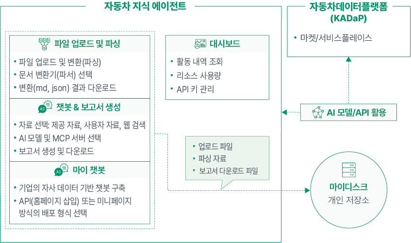

# 자동차 지식 에이전트 KADaP AGENT

자동차 산업 데이터와 사용자 자료를 AI가 분석하여 질의응답, 보고서 생성, 맞춤형 챗봇을 구축합니다.

# 자동차 지식 에이전트 소개

자동차 지식 에이전트에서는 한국자동차연구원에서 제공하는 자동차 산업 데이터와 사용자가 업로드한 자료를 기반으로 질의응답 챗봇 서비스를 제공합니다. 또한 자동차 분야 자료를 기반으로 보고서를 생성할 수 있습니다.

자동차 지식 에이전트에 업로드된 자료는 문서 변환(파싱)을 통해 인공지능이 이해할 수 있는 구조로 추출 및 분석됩니다. 업로드하거나 변환된 파일들은 마이디스크와 동기화되고, 공개 자료로 설정 시 다른 사용자가 질의응답이나 보고서 작성 시 활용할 수 있습니다.

자동차 지식 에이전트에서는 마이 챗봇 기능을 지원합니다. 챗봇이 참조할 자료나 AI 모델, 외부 툴 등을 직접 지정하여 사용자 전용 챗봇을 생성할 수 있습니다. 기업이 자사의 데이터를 기반으로 챗봇을 생성하여 자사의 홈페이지에 삽입(API방식)하거나 독립된 페이지(미니페이지 방식)로 운영할 수 있습니다.

자동차 지식 에이전트에서는 대시보드를 통해 사용자 활동 내역과 리소스(토큰) 사용량을 모니터링할 수 있습니다. 또한 문서의 변환(파싱) 및 분석을 위해 제공되는 기본 리소스(토큰) 외에 사용자의 API 키를 추가하여 사용할 수 있습니다.

## 서비스 소개

자동차 지식 에이전트의 주요 서비스 구성은 다음과 같습니다.

## 주요 기능과 특징

자동차 지식 에이전트가 제공하는 주요 기능과 특징은 다음과 같습니다.

- **보고서 & 챗봇**

&#x20; - **보고서 자동 생성:** 자동차 지식 에이전트에서 제공되는 자료와 사용자가 업로드한 자료를 기반으로 질의에 대한 보고서를 생성할 수 있습니다.

&#x20; - **질의응답:** 자동차 지식 에이전트에서 제공되는 자료와 사용자가 업로드한 자료를 기반으로 챗봇이 질의에 대한 응답을 생성할 수 있습니다.

- **자료 관리**

&#x20; - **파일 변환(파싱)**: 업로드한 파일을 인공지능이 이해 할수 있는 구조와 포맷으로 변환할 수 있습니다.

&#x20; - **자료 관리:** 활용할 데이터 업로드, 제공 및 공개된 데이터를 조회 할 수 있습니다.

 - **내 자료:** 기업 및 개인이 업로드한 자료.

 - **연구원 자료:** 한국자동차 연구원에서 제공하는 공개/비공개 자료.

 - **공개 자료:** 기업 및 개인이 업로드한 자료 중에서 공개 설정한 자동차 산업 자료.한국자동차연구원의 정기 간행물인 모빌리티 인사이트와 한국자동차공학회의 논문 자료들도 확인할 수 있습니다.

- **마이 챗봇**

&#x20; - **제공 정보 지정**: 챗봇이 참조할 자료나 외부 툴을 직접 지정하여 사용자 목적에 맞는 질의응답 챗봇을 생성할 수 있습니다.

&#x20; - **배포 방식 지정**: 기업 홈페이지 적용을 위한 배포 방식을 API 또는 미니페이지 중에서 선택할 수 있습니다.

- **데이터 대시보드**

&#x20; - **활동 내역**: 사용자가 작성한 보고서와 AI 챗봇과의 대화, 업로드한 자료를 확인할 수 있습니다.

&#x20; - **리소스(토큰) 사용량**: 자동차 지식 에이전트의 API 사용량과 비용 현황을 리소스별, API 키별로 확인할 수 있습니다.

&#x20; - **API 키 설정**: 문서의 파싱 및 분석을 위한 카테고리별(LLM 또는 파서) API 키를 개인키로 변경하여 제한없이 계속 사용할 수 있습니다. 관리할 수 있습니다.

