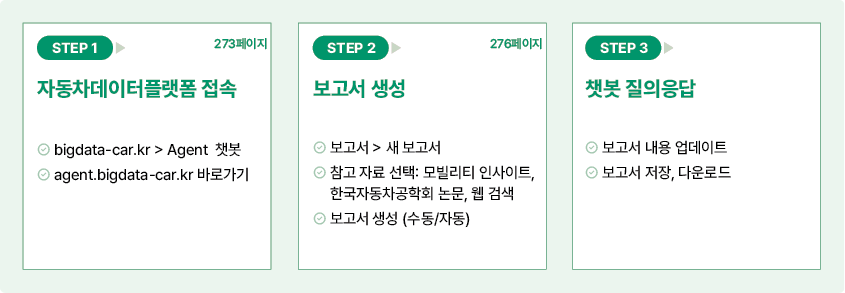
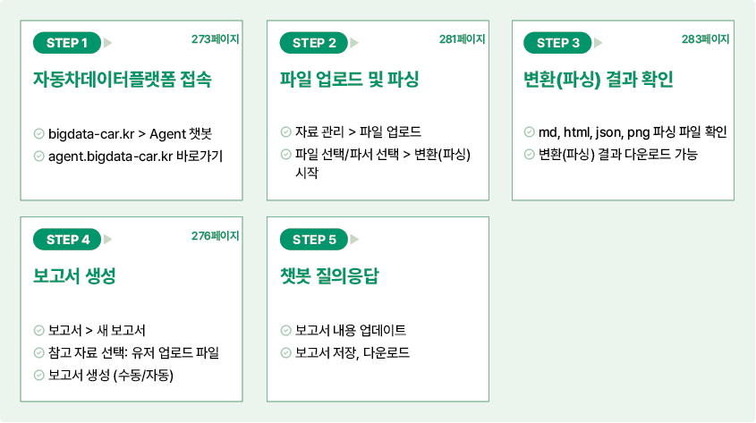

## 빠른 가이드

### 기본 제공 데이터를 활용한 보고서 생성하기

자동차 지식 에이전트에서 기본으로 제공하는 데이터를 활용하여 보고서를 생성하려면 다음 순서대로 진행하세요.

### 사용자 보유 데이터를 활용한 보고서 생성하기

사용자가 보유하고 있는 데이터를 활용하여 보고서를 생성하려면 다음 순서대로 진행하세요.

# 자동차 지식 에이전트 시작

자동차 지식 에이전트에 로그인하면 제공되는 다양한 서비스를 이용할 수 있습니다.

