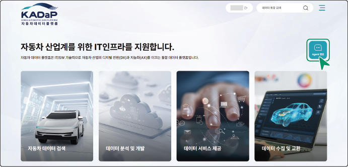

# 자동차 지식 에이전트 시작

자동차 지식 에이전트에 로그인하면 제공되는 다양한 서비스를 이용할 수 있습니다.
## 자동차 지식 에이전트 접속하기

자동차 지식 에이전트를 시작하려면 다음 순서대로 진행하세요.

1. **자동차데이터플랫폼**([www.bigdata-car.kr](https://www.bigdata-car.kr))에 접속하세요.

2. 자동차데이터플랫폼에 로그인하세요.

- 회원가입과 로그인 방법은 [회원 가입하기](KADaPUserManualFrontmatter.md#회원-가입하기)와 [로그인하기](KADaPUserManualFrontmatter.md#로그인하기)를 참고하세요.

3. **Agent 챗봇**을 클릭하세요.

- 자동차 지식 에이전트의 홈 화면으로 이동합니다.

>  **바로가기**

>

> 다음의 경로로 바로 접속할 수 있습니다.

> - **자동차 지식 에이전트**: [agent.bigdata-car.kr](https://www.agent.bigdata-car.kr)

>  **참고**

>

> 자동차 지식 에이전트는 로그인을 하지 않고 일부 기능을 사용할 수 있습니다.단, 활동 내역은 저장되지 않습니다.

