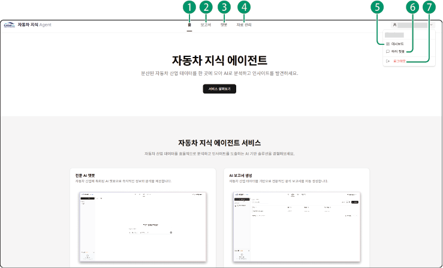

## 메뉴 구성

자동차 지식 에이전트의 메인 화면은 다음과 같이 구성됩니다.

| 번호 | 항목 | 설명 |
| --- | --- | --- |
| 1 | 홈 | 자동차 지식 에이전트의 메인 화면으로 이동합니다. |
| 2 | 보고서 | 보고서 페이지로 이동합니다.<ul><li>보고서를 생성할 수 있고 사용자가 작성한 보고서 목록을 확인할 수 있습니다.</li></ul> |
| 3 | 챗봇 | 챗봇 페이지로 이동합니다.<ul><li>챗봇과 대화를 시작할 수 있고 저장된 대화를 확인할 수 있습니다.</li></ul> |
| 4 | 자료 관리 | 자료 관리 페이지로 이동합니다. |
| 5 | 대시보드 | 대시보드 페이지로 이동합니다.<ul><li>자동차 지식 에이전트 활동 내역을 확인할 수 있습니다.</li></ul> |
| 6 | 마이 챗봇 | 마이 챗봇 페이지로 이동합니다.<ul><li>챗봇이 참조할 자료나 AI 모델, 외부 툴 등을 직접 지정하여 사용자 전용 챗봇을 생성할 수 있습니다.</li></ul> |
| 7 | 로그아웃 | 로그인한 계정에서 로그아웃합니다. |

